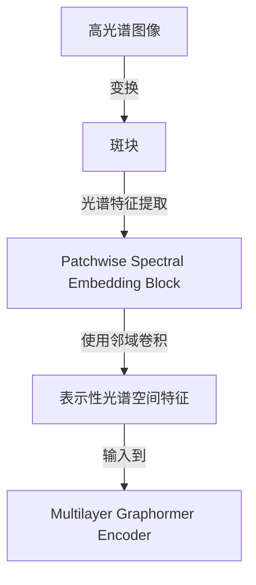

# 快速阅读摘要报告

## 1. 论文核心概要 (Executive Summary)
该论文旨在通过将 Transformer 和图卷积网络(GCN)结合形成名为 S2GFormer 的框架，提高高光谱图像(HSI)分类的准确性。其方法通过引入“follow patch”机制来提取局部空间特征，同时设计了一个多层 Graphormer 编码器，以共同增强全局和局部信息。实验结果表明，该方法在有限标记样本情况下表现优于其他最先进的分类器。

## 2. 研究问题与目标 (Research Question)
这篇论文试图解决的问题是如何有效结合 Transformer 和 GCN 的优势，以提升高光谱图像分类过程中的局部和全局特征提取能力。

## 3. 关键方法与技术 (Methodology)
- **Follow Patch Mechanism**: 将高光谱图像像素转换为局部特征保留的斑块。
- **Patchwise Spectral Embedding Block**: 提取斑块的光谱特征，并进行邻域卷积。
- **Multilayer Graphormer Encoder**: 提取代表性的空间-光谱特征，结合 Transformer 和 GCN 的优点。
  
### 关键模块示例

## 4. 主要结论与贡献 (Key Findings & Contributions)
- 提出了 S2GFormer 框架，在多个高光谱图像数据集上表现良好，特别是在标记样本少的情况下。
- 通过设计的结构，成功地结合了局部和全局信息提取来提高分类准确率。
- 本研究的学术贡献在于将 Transformer 和 GCN 的优势整合至统一框架，增强了特征学习的能力。

## 5. 与我研究的相关性评估 (RelevancetoMyResearch)
- **总体相关度**: 高
- **详细分析**: 论文提出的方法与高光谱海面溢油检测密切相关，因为该领域同样需要对复杂光谱数据进行准确分类。文中所用的空间-光谱特征提取技术可应用于检测覆盖海面的污染物，提升检测精度。

## 6. 创新点与局限性 (Innovations & Limitations)
- **主要创新点**: 将 Transformer 和 GCN 相结合，创造性地设计了多层 Graphormer 编码器来增强空间-光谱特征提取。
- **局限与改进方向**: 论文强调了计算复杂性的挑战，未来可以探索更加优化的卷积结构和更多自监督学习方法以进一步提升性能。

## 7. 精读建议 (Recommendation)
基于以上分析，我推荐您精读这篇论文，因为它提出的创新方法和应用可能对您的研究有重要帮助。建议重点关注以下章节：
- **方法论**: 详细了解 S2GFormer 的结构和实现。
- **实验结果讨论**: 理解不同方法的分类性能评估和比较，以获取具体的应用见解。