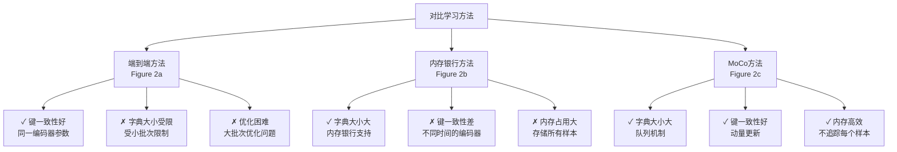
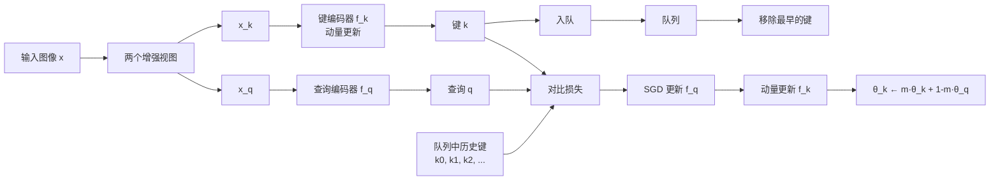

# MoCo: 无监督视觉表示学习的动量对比方法

- infoNCE损失函数:类别太多,无法进行softmmax,改为一个二分类,数据样本和噪声样本分类

  $$
  L_q = =log\frac{exp(qk/ t)}{\sum_{i=0}^Kexp(qk_i/t)}
  $$


  $$


  $$

## 1. Abstract 总结

本文提出了 **Momentum Contrast (MoCo)** 方法用于无监督视觉表示学习。该方法从对比学习作为字典查询的角度出发，通过队列和移动平均编码器构建了一个大规模且一致的动态字典，从而促进了对比无监督学习。

**核心贡献：**

- MoCo 在 ImageNet 线性分类协议上取得了有竞争力的结果
- 更重要的是，MoCo 学到的表示在下游任务中具有很好的迁移性能
- 在 PASCAL VOC、COCO 等数据集的 7 个检测/分割任务中，MoCo 的无监督预训练可以超过其有监督预训练的对应版本，有时性能差距相当大
- 这表明无监督和有监督表示学习之间的差距在许多视觉任务中已经基本消除

---

## 2. Introduction 总结

### 主要背景和动机

在自然语言处理中，无监督表示学习取得了巨大成功（如 GPT 和 BERT），但在计算机视觉中，有监督预训练仍然占据主导地位，无监督方法普遍滞后。根本差异在于：

- **NLP**：具有离散的信号空间（单词、子词等），便于构建标记化字典
- **CV**：处理连续的高维信号空间，不为人类通信所结构化，字典构建面临挑战

### 对比学习的视角

最近的研究表明，基于对比损失的无监督视觉表示学习方法效果显著。从字典查询的角度看：

- "键"（tokens）从数据（如图像或补丁）中采样，由编码器网络表示
- 无监督学习训练编码器执行字典查询：编码的"查询"应与其匹配的键相似，与其他键不相似
- 学习通过最小化对比损失来实现

### MoCo 的核心假设

构建大且一致的字典是关键：

1. **大字典**：更好地采样底层连续高维视觉空间
2. **一致性**：字典中的键应由相同或相似的编码器表示，确保与查询的比较一致

>  ***生成key的编码器全都是一个,为了避免出现捷径***
>
> ***队列的使用:使batchsize与队列(字典)的大小剥离开,在训练时,引入当前batch,去除最老batch***
>
> Q:当前的batch来自当前的编码,之前的来自之前的那不就不一致了吗
>
> A:动量编码器:

---

## 3. Related Work 总结

### 损失函数

**对比损失**（Contrastive Loss）：

- 在表示空间中测量样本对的相似性
- 与重建或预定义分类不同，对比学习中的目标可以在训练过程中动态变化
- 核心概念：在最近的无监督学习工作中广泛使用

**其他方法**：

- 重建损失：自编码器类方法（L1/L2 损失）或跨通道自编码器（着色）
- 对抗损失：用于无监督数据生成
- 与噪声对比估计（NCE）的联系

### 代理任务（Pretext Tasks）

常见的代理任务包括：

- 输入恢复：去噪自编码器、上下文自编码器、着色
- 伪标签形成：单个图像的变换、补丁排序、视频跟踪/分割、聚类

### 对比学习 vs 代理任务

- 实例判别方法与基于范例的任务和 NCE 相关
- CPC（对比预测编码）与上下文自编码相关
- CMC（对比多视图编码）与着色相关
- **MoCo 的焦点**：损失函数机制，与代理任务正交

---

## 4. 文章解决的主要问题

### 问题陈述

现有的对比学习方法在两个关键方面存在限制：

1. **字典大小与编码一致性的权衡**

   - 端到端方法：字典大小受限于小批次大小（GPU 内存限制）
   - 内存银行方法：支持大字典，但键由不同时间步的编码器编码，缺乏一致性
2. **如何在保持编码一致性的前提下构建大规模字典？**

   - 简单复制不行：梯度不传播，编码器变化太快，导致表示不一致
   - 需要一种平衡机制

### 核心难点

- **大字典的需求**：连续、高维的视觉空间需要丰富的负样本来有效学习
- **一致性的需求**：所有键应该用相似的编码器编码，确保有意义的相似性度量

---

## 5. 文章的主要创新点

### 5.1 核心创新：动量对比（MoCo）

MoCo 通过两个关键机制解决了上述问题：

#### （1）队列数据结构（Dictionary as a Queue）

- **作用**：将字典大小从小批次大小中解耦
- **机制**：
  - 当前小批次的编码键被入队
  - 最早的小批次被出队
  - 字典始终表示数据的一个采样子集
  - 字典大小可以独立设置为超参数（不受 GPU 内存限制）
  - 移除最早小批次是有益的（其编码最过时）

#### （2）动量更新（Momentum Update）

- **问题**：使用队列使得通过反向传播更新键编码器变得困难（梯度应传播到队列中所有样本）
- **解决方案**：

  $θ_k ← m·θ_{k-1} + (1-m)·θ_q$

  其中：

  - m ∈ [0,1) 是动量系数
  - 仅θ_q 通过反向传播更新
  - θ_k 进化更平缓
- **优势**：

  - 虽然队列中的键由不同小批次的不同编码器编码，但这些编码器之间的差异很小
  - 保证了字典键之间的一致性
  - 实验显示 m=0.999（默认值）效果远优于 m=0.9
  - m=0 时训练损失震荡，无法收敛

### 5.2 与现有方法的比较



### 5.3 代理任务

采用简单的**实例判别任务**：

- 同一图像的两个随机增强视图形成正样本对
- 其他样本为负样本
- 查询和键由各自的编码器编码

### 5.4 技术细节

**编码器设计**：

- 采用 ResNet 作为编码器
- 最后全连接层（全局平均池化后）输出 128 维固定表示
- 通过 L2 范数进行归一化

**Shuffling Batch Normalization**：

- **问题**：BN 防止模型学习良好表示，模型"欺骗"代理任务
- **原因**：批内通信（BN 导致）泄露信息
- **解决方案**：
  - 多 GPU 训练，在每个 GPU 独立执行 BN
  - 对键编码器，在分发到各 GPU 前打乱样本顺序
  - 编码后恢复原顺序
  - 确保查询和正键来自不同的样本子集

**其他参数**：

- 温度系数 τ = 0.07
- 数据增强：224×224 随机裁剪、随机颜色抖动、随机水平翻转、随机灰度转换

### 5.5 方法流程图



---

## 6. 文章引用格式

**标准格式**（IEEE）：

```
He, K., Fan, H., Wu, Y., Xie, S., & Girshick, R. (2020). 
Momentum contrast for unsupervised visual representation learning. 
In IEEE/CVF Conference on Computer Vision and Pattern Recognition (CVPR).
```

**BibTeX 格式**：

```bibtex
@inproceedings{he2020momentum,
  title={Momentum Contrast for Unsupervised Visual Representation Learning},
  author={He, Kaiming and Fan, Haoqi and Wu, Yuxin and Xie, Saining and Girshick, Ross},
  booktitle={IEEE/CVF Conference on Computer Vision and Pattern Recognition (CVPR)},
  year={2020},
  organization={IEEE}
}
```

**arXiv 引用**：

```
He, K., Fan, H., Wu, Y., Xie, S., & Girshick, R. (2019).
Momentum Contrast for Unsupervised Visual Representation Learning.
arXiv preprint arXiv:1911.05722v3.
```

**期刊/会议信息**：

- **发表会议**：2020 CVPR (IEEE/CVF Conference on Computer Vision and Pattern Recognition)
- **arXiv 版本**：1911.05722v3
- **发表日期**：2020 年 3 月 23 日

---

## 7. 关键实验结果

### 线性分类评估（ImageNet）

- **MoCo (R50)**：60.6% 准确率（竞争力结果）
- **MoCo (R50w4×)**：68.6% 准确率

### 下游任务迁移性能

MoCo 在以下任务中超过监督预训练：

1. PASCAL VOC 目标检测（AP 提升 +0.6～+2.4）
2. PASCAL VOC 语义分割
3. COCO 目标检测和实例分割
4. COCO 关键点检测
5. COCO 稠密姿态估计
6. LVIS 实例分割
7. Cityscapes 实例分割

### 数据规模效应

- **ImageNet-1M**：~128 万图像，均衡分布
- **Instagram-1B**：~9.4 亿图像，真实世界无监督数据，长尾分布

---

## 8. 工作链接

- **代码**：https://github.com/facebookresearch/moco
- **论文**：arXiv:1911.05722v3 [cs.CV]
