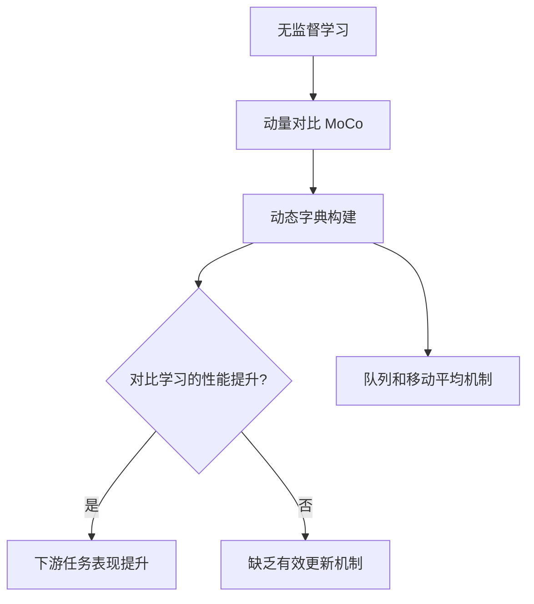

# Momentum Contrast for Unsupervised Visual Representation Learning （动量对比法用于无监督视觉表示学习）

# 前言

## 什么是对比学习

- 识别哪两张图片相似,那两张不想死
- instance discrimination(个体判别):在一堆图片选一张,进行裁剪和数据增广,裁剪结果及其增广认为是正样本,其他都是负样本
- 优点:只要找到一个方法,确定什么是正样本,什么是负样本,具有极高的灵活性

## 什么是momentum contrast(动量对比)

思路:让历史内容参与当前

$$
y_t = my_{t-1} +(1-m)x_t
$$


$$


$$

## 1. Abstract部分的总结

本文提出了一种新的无监督学习方法，称为动量对比（Momentum Contrast, MoCo），旨在提高视觉表示学习的效果。该方法把对比学习视作字典查找的过程，通过构建一个动态字典，结合队列和移动平均编码器，使字典能够实时更新。这种方式能够生成一个大且一致的字典，因而促进了无监督学习的对比过程。实验结果表明，MoCo 在 ImageNet 分类任务中表现出色，提供了与监督学习相媲美的结果。而且，MoCo 学到的表示在多个下游任务中（如目标检测和分割）转移能力较强，甚至在一些任务上超越了其监督预训练的对手。这表明，在许多计算机视觉任务中，无监督与监督学习之间的性能差距已经显著缩小。

## 2. 文章解决的主要问题

- **无监督学习的有效性**：如何在缺少标签的情况下，使用大规模数据集进行有效的视觉表示学习。
- **字典构建机制**：传统对比学习依赖固定的样本集进行学习，而本文提出了一种新的动态字典构建方式，使得学习过程更加灵活与连续。
- **性能比较**：如何量化无监督方法与监督预训练方法在多个视觉任务上的性能，提供定量分析支持。

## 3. 文章的主要创新点

### 3.1 动量对比方法的构建

- **动态字典**：通过一个队列结构，MoCo 实现了在不需要完整数据集的情况下，动态管理样本池。这能够减小内存占用并保持字典的一致性。
- **移动平均编码器**：使用周期性更新的编码器来维护过往实例的信息，以改善学习效果。

### 3.2 实验结果

MoCo 在多个标准数据集（如 PASCAL VOC 和 COCO）上的表现优于许多现有的无监督方法，甚至有所超越其监督学习的基线结果。

### 模块结构示意图



### 3.3 潜在应用

- **下游视觉任务**：MoCo 的表示可以用于目标检测、语义分割等多种视觉任务，提升系统对新任务的适应性。
- **研究新方向**：为无监督学习提供了一种新的思路，推动相关研究的深入和发展。

## 4. 文章的引用格式

在学术论文或文献综述中，可以使用以下格式引用此论文：

```
Kaiming He, Haoqi Fan, Yuxin Wu, Saining Xie, Ross Girshick, Momentum Contrast for Unsupervised Visual Representation Learning, arXiv:1911.05722v3
```
