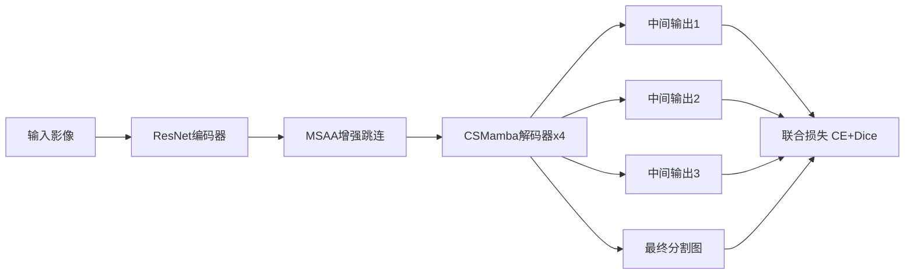

# CM-UNet 快速阅读摘要报告

## 0. 关键词（Keywords）
- 遥感图像语义分割（Remote Sensing Semantic Segmentation）
- UNet
- Mamba / Visual State Space Model（VSSM）
- CNN-Mamba 混合架构
- 长程依赖建模
- 多尺度注意力聚合（MSAA）
- 多输出深监督（Multi-Output Supervision）

## 1. 论文核心概要（Executive Summary）
1. 论文针对遥感大幅面图像中“目标尺度差异大、长程依赖难建模、Transformer 计算复杂度高”的问题，提出了混合式分割网络 `CM-UNet`。  
2. 方法上采用 **ResNet 编码器提取局部多尺度特征**，并在解码器引入 **CSMamba 模块**（Mamba + 通道/空间注意力门控）进行高效全局建模，同时使用 **MSAA** 强化跳连特征。  
3. 在 ISPRS Potsdam、ISPRS Vaihingen、LoveDA 三个基准上，CM-UNet 在 mIoU/mF1/OA 等指标上优于多种对比方法，体现出较好的精度-效率平衡。

## 2. 研究问题与目标（ResearchQuestion）
这篇论文试图回答的核心问题是：  
- 如何在遥感语义分割中，同时高效建模**局部纹理细节**与**全局长程依赖**？  
- 在避免 Transformer 二次复杂度开销的前提下，能否构建一个兼顾精度与计算开销的 UNet 式框架？  
- 如何通过结构设计（多尺度聚合 + 深监督）进一步提升边界质量与类别判别能力？

## 3. 关键方法与技术（Methodology）

- **整体架构：CM-UNet**
  - 编码器：ResNet 提取多层局部特征。
  - 跳连增强：MSAA 对跨层特征做空间+通道聚合。
  - 解码器：堆叠 CSMamba Block 做全局上下文建模。
  - 训练策略：多输出监督（中间层辅助损失）。

- **CSMamba Block（核心）**
  - 第一分支：线性扩维 + 深度卷积 + 2D-SSM（四方向扫描）+ LN。
  - 第二分支：通道注意力 + 空间注意力作为门控条件。
  - 两分支逐元素相乘后线性投影回原维度。

- **关键公式（论文式(1)）**
$$
X_1 = LN(2D\text{-}SSM(SiLU(DWConv(Linear(X)))))
$$
$$
X_2 = SiLU(CS(X))
$$
$$
X_{out} = Linear(X_1 \odot X_2)
$$

- **MSAA（多尺度注意力聚合）**
  - 对相邻层特征先拼接；
  - 空间路径：多卷积核（如 3/5/7）+ 池化聚合；
  - 通道路径：GAP + 1x1卷积生成通道权重；
  - 两路径融合输出更强的跳连特征。

- **多输出监督**
  - 每个解码阶段输出一个预测图，联合 CE + Dice 优化，帮助逐级细化分割。

## 4. 主要结论与贡献（KeyFindings&Contributions）

- **性能结论**
  - Potsdam：mIoU 87.21，优于 UNetFormer（86.80）。
  - Vaihingen：mIoU 85.48，显著领先多数对比方法。
  - LoveDA：mIoU 52.17，优于文中多数基线。

- **方法贡献**
  - 提出 CNN-Mamba 混合 UNet：用 CNN 保局部细节，用 Mamba 高效建模全局依赖。
  - 提出 CSMamba：把通道/空间注意力融入 Mamba 门控，提高全局-局部融合质量。
  - 引入 MSAA + 多输出监督，增强多尺度特征传递与解码稳定性。
  - 在复杂度上提供较好折中：较低 FLOPs/参数下获得更高 mIoU。

## 5. 与我研究的相关性评估（RelevancetoMyResearch）

- **总体相关度：中-高**

- **详细分析**
  - **高度相关点**
    - 你做“高光谱海面溢油检测”，本质也需要像素级分割；该文的分割框架思想（UNet + 全局建模）可直接借鉴。
    - 大场景、细边界、异质背景下的长程依赖建模，对海面溢油斑块识别同样关键。
    - MSAA 和深监督对小目标/细长结构边界优化有参考价值。
  - **相关性较弱点**
    - 本文主要面向 RGB/遥感城市场景，并非高光谱立方体（H×W×C with large spectral bands）专门设计。
    - 未针对高光谱特有问题（谱间冗余、谱-空联合建模、跨传感器谱漂移）给出机制。
    - 任务是通用地物分割，不是海面溢油这种强类别不平衡、弱纹理对比的专门场景。
  - **可迁移建议**
    - 将其 CSMamba 解码器保留，编码端替换为 3D/2D-3D 光谱编码器；
    - 在 MSAA 中加入光谱注意力分支；
    - 损失函数加入 Focal/Tversky 以适配溢油小区域与类别不平衡。

## 6. 创新点与局限性（Innovations&Limitations）

- **创新点**
  - CNN 编码器 + Mamba 解码器的混合式 UNet 设计。
  - CSMamba 中引入通道/空间注意力门控，增强 Mamba 特征筛选能力。
  - MSAA 对跳连特征进行多尺度注意力重构。
  - 多输出监督用于逐层语义约束。

- **局限性（论文与实现层面可见）**
  - 高光谱适配不足：未显式建模光谱维度关系。
  - 验证数据集集中在常见遥感分割，缺少跨域/跨传感器泛化实验。
  - 论文篇幅较短（arXiv v1，5页），理论分析与误差分析不够充分。
  - 复杂场景鲁棒性（噪声、薄云、水体镜面反射等）未系统展开。

## 7. 精读建议（Recommendation）

- **是否推荐精读：推荐（有条件精读）**
  - 如果你当前目标是搭建“高效分割基线”或引入 Mamba 到你的检测网络，这篇值得精读。
  - 如果你重点是“高光谱机理建模”，它更适合作为结构参考，而非直接方案。

- **建议重点关注章节**
  - `Methodology`：重点看 CSMamba 与 2D-SSM 四方向扫描实现细节。
  - `MSAA`：看多尺度聚合如何改善跳连信息质量。
  - `Experiments + Ablation`：重点看模块增益和复杂度表（Tab. IV/V）。
  - `可复现性`：结合其 GitHub 代码核对训练细节与损失组合。
