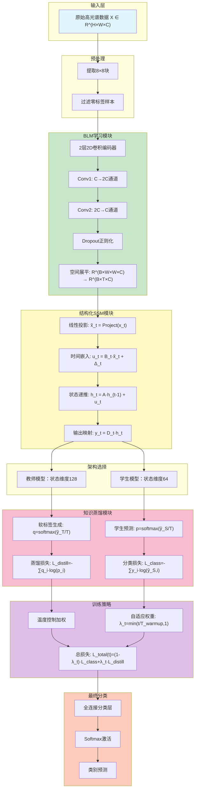

# Byte Latent Mamba With State Space and Knowledge Distillation for Hyperspectral Image Classification 论文总结

## 1. Abstract 总结

本论文提出了一个创新的高光谱图像分类(HSIC)框架 **BLM-KD**,旨在克服现有方法的关键局限性:

### 核心问题
- 高光谱数据具有高维性、空间光谱特征复杂、标记样本稀缺的特点
- 传统基于令牌化(tokenization)的特征提取方法引入人为分割、增加计算成本、导致信息丢失

### 核心创新
- **无令牌化设计**:直接从原始高光谱数据学习字节级空间-光谱表示
- **字节潜在Mamba架构**:通过端到端卷积编码器学习紧凑且富有表现力的字节级特征
- **结构化状态空间模型(SSM)集成**:通过学习的动态状态转移高效建模长距离空间-光谱依赖关系
- **自适应知识蒸馏(KD)**:高容量教师模型选择性地将显著特征转移给轻量级学生模型,采用温度控制的加权策略

### 实验成果
- 在多个真实超光谱基准数据集上的广泛实验表明,BLM-KD在分类准确率和计算效率方面均超越现有最先进方法

---

## 2. Introduction 总结

### 高光谱遥感的重要性
- 高光谱传感器在广泛的电磁波长范围内捕获广泛的光谱信息,相比传统成像技术具有更高的分辨率
- 应用领域广泛:农业、林业、城市规划、环境监测、矿物勘探、法医学、食品加工等

### 深度学习方法的演进

**CNN方法的局限**:
- 虽然在捕获空间和光谱依赖关系方面表现出色,但难以建模长距离依赖和全局上下文关系
- 在复杂HSIC任务中性能欠佳

**Transformer方法的局限**:
- 通过自注意力机制捕获长距离光谱依赖关系
- 但引入了二次复杂度的计算开销,可扩展性受限

**状态空间模型(SSM)的新方向**:
- Mamba模型作为计算高效的替代方案
- 利用隐藏状态转移建模光谱依赖关系
- 多个Mamba变体已推出(MHSSMamba、WaveMamba、MorpMamba等)

**知识蒸馏(KD)的应用**:
- 作为提高深度学习模型泛化能力和效率的有效技术
- 在HSIC中用于从大型教师模型向轻量级学生模型转移知识
- 帮助改进小型模型的性能,同时保持较低的计算开销

### 现存方法的主要挑战
- 依赖令牌化引入的人工分割和预处理成本
- 模型的可扩展性和效率问题
- 对长距离依赖、计算效率和可扩展性的建模困难

---

## 3. Related Work 总结

### CNN方法
- **特点**:有效捕获局部空间特征,具有强归纳偏差
- **局限**:难以建模长距离依赖,在标记样本有限时容易过拟合
- **代表性工作**:
  - 2D CNN:将光谱视为堆叠通道
  - 3D CNN:在(H,W,C)上进行联合卷积以捕获局部光谱-空间模式
  - S3F2Net:结合CNN和图卷积网络(GCN)进行空间关系建模

### Transformer方法
- **特点**:通过自注意力机制捕获全局依赖关系,提供可解释性
- **局限**:二次复杂度限制可扩展性,需要大量标记数据和计算资源
- **代表性工作**:
  - SAT Net:集成自注意力和光谱注意力
  - SST框架:结合CNN和密集Transformer
  - 混合架构(NEHT、DBFFT、TNT等)

### 状态空间模型(SSM)
- **优势**:
  - 相比Transformer具有显著优势,通过状态空间表示固有地降低计算需求
  - 与Transformer的二次复杂度相比,Mamba线性处理光谱序列
  - 参数更少,内存消耗更低
- **代表性工作**:
  - MiM:多尺度学习和特征令牌化
  - MambaLG:光谱-空间自适应Mamba
  - LE-Mamba:局部增强Mamba网络
  - HLMamba:多模态Mamba融合模块

### BLM-KD的独特贡献
相比现有方法,BLM-KD具有以下独特优势:
- 去除对刚性令牌化的依赖
- 嵌入结构化递推以进行高效的空间-光谱建模
- 纳入针对超光谱数据微调的鲁棒蒸馏机制

---

## 4. 文章解决的主要问题

### 问题1: 令牌化引起的信息丢失
**现象**:传统基于令牌化的方法将连续的高光谱数据分割成固定大小的令牌,导致:
- 人为分割引入信息碎片化
- 光谱连续性破坏
- 预处理成本增加

**BLM-KD的解决方案**:直接学习字节级的光谱-空间表示,无需显式令牌化

### 问题2: 长距离依赖建模的困难
**现象**:CNN难以捕获长程依赖,Transformer具有高计算复杂度
**BLM-KD的解决方案**:
- 集成结构化SSM,通过学习的动态状态转移建模长距离空间-光谱依赖
- 保持线性时间复杂度O(T(n²+nd'))

### 问题3: 模型复杂度与性能的平衡
**现象**:高精度模型通常需要大量计算资源,难以部署
**BLM-KD的解决方案**:
- 采用自适应知识蒸馏策略
- 通过温度控制的加权计划将教师知识有效转移给学生模型
- 减少计算开销同时保持高准确率

### 问题4: 高光谱数据的光谱-空间特征融合
**现象**:难以有效融合复杂的空间-光谱关系,特别是处理冗余光谱带和空间不一致
**BLM-KD的解决方案**:
- 面向高光谱学习定制的自适应蒸馏策略
- 教师选择性转移显著的光谱-空间特征
- 降低信息冗余度

---

## 5. 文章的主要创新点

### 5.1 创新点概览

#### 创新点1: BLM学习(Byte Latent Mamba Learning)
**概念**:无令牌化的光谱-空间编码范式

**技术细节**:
- 直接从原始高光谱数据学习压缩潜在表示
- 利用卷积字节编码,提取小型压缩信息单元
- 保留光谱连续性和空间语义
- 端到端优化,学习最具判别性的潜在单元

**优势**:
- 避免令牌化伪影
- 保留光谱连续性和空间结构
- 降低计算冗余度
- 改进特征粒度

#### 创新点2: 结构化SSM集成(Structured State-Space Model)
**概念**:通过动态状态转移高效建模长距离依赖

**技术细节**:
- 与传统仅关注光谱序列的SSM不同,BLM-KD联合学习空间和光谱动态
- 核心递推关系: $h_t = Ah_{t-1} + u_t$
- 包含时间嵌入$\Delta_t$实现位置感知
- 线性输出转换: $y_t = D_t h_t$

**理论保证**:
- 定理1:在||A||=ρ<1条件下,隐藏状态有界且稳定
- 命题1:时间变化的仿射系统等价于增广输入中的线性系统
- 复杂度:O(T(n²+nd')),相比Transformer的二次复杂度为线性

#### 创新点3: 自适应知识蒸馏(Adaptive Knowledge Distillation)
**概念**:教师-学生蒸馏,有温度控制的自适应加权

**技术细节**:
- 软目标: $q = \text{softmax}(\hat{y}_T/T)$, $p = \text{softmax}(\hat{y}_S/T)$
- 蒸馏损失(KL散度): $L_{\text{distill}} = -\sum_{i=1}^N q_i \log(p_i)$
- 自适应加权: $\lambda_t = \min(t/T_{\text{warmup}}, 1)$
- 总损失: $L_{\text{total}}(t) = (1-\lambda_t) \cdot L_{\text{class}} + \lambda_t \cdot L_{\text{distill}}$

**关键特性**:
- 温度参数T控制概率分布平滑度
- 预热阶段依赖地面真实监督,逐步集成软标签指导
- 梯度缩放稳定早期训练: 梯度 = (1/T)(p_T - q_T)

**理论支持**:
- 定理2:加权目标等价于凸组合目标的交叉熵
- 引理1:在预热下,教师影响单调非递减,最终收敛到1
- 命题2:更高温度平滑q_T,按比例缩小梯度幅度

#### 创新点4: 可扩展和正则化训练方法(Scalable and Regularized Training)
**概念**:确保跨数据集大小和分辨率的稳定收敛

**技术细节**:
- Dropout正则化:防止过拟合,作用如权值衰减
- L2正则化:隐式正则化项与 $(1-p)/p \cdot ||W||_F^2$ 成正比
- 预热策略:平衡模型复杂度和性能

**效果**:
- 泛化性能在低数据和高数据场景下均保持稳健
- 适用于实时部署

### 5.2 创新点模块结构图



### 5.3 创新点对比

| 创新点 | 传统方法的局限 | BLM-KD的解决方案 | 对HSIC的影响 |
|--------|-----------------|------------------|-----------------|
| **BLM表示** | 令牌化管道引入空间碎片和预处理成本 | 直接学习字节级编码,无令牌化需求 | 减少预处理成本,保留分类的精细度 |
| **SSM** | CNN仅捕获局部依赖;Transformer模型捕获全局特征但存在高内存[29],[31] | 集成轻量级结构化递推以联合建模空间-光谱上下文 | 以线性时间复杂度实现长距离建模 |
| **自适应KD** | 现有KD方法缺乏动态调整,对空间-光谱域效率低[39]-[41] | 使用温度控制教师导引的蒸馏策略 | 在保持轻量级结构的同时改进学生泛化 |
| **可扩展训练** | 高容量模型易过拟合,泛化能力在数据集间变化[21],[42] | 合并正则化(L2、dropout)和平衡参数化以跨规模稳定 | 确保泛化性和可扩展性 |

---

## 6. 文章的引用格式

### IEEE引用格式

```
M. Ahmad, M. Mazzara, S. Distefano, and A. M. Khan, "Byte latent Mamba with state space and knowledge distillation for hyperspectral image classification," IEEE Trans. Geosci. Remote Sens., vol. 63, 2025, Art. no. 5531815, doi: 10.1109/TGRS.2025.3626861.
```

### BibTeX格式

```bibtex
@article{Ahmad2025ByteLatentMamba,
  author = {Ahmad, Muhammad and Mazzara, Manuel and Distefano, Salvatore and Khan, Adil Mehmood},
  journal = {IEEE Transactions on Geoscience and Remote Sensing},
  title = {Byte Latent Mamba With State Space and Knowledge Distillation for Hyperspectral Image Classification},
  year = {2025},
  volume = {63},
  pages = {5531815},
  doi = {10.1109/TGRS.2025.3626861},
  publisher = {IEEE}
}
```

### 其他格式

**APA格式:**
```
Ahmad, M., Mazzara, M., Distefano, S., & Khan, A. M. (2025). Byte latent Mamba with state space and knowledge distillation for hyperspectral image classification. IEEE Transactions on Geoscience and Remote Sensing, 63, 5531815. https://doi.org/10.1109/TGRS.2025.3626861
```

**Chicago格式:**
```
Ahmad, Muhammad, Manuel Mazzara, Salvatore Distefano, and Adil Mehmood Khan. "Byte Latent Mamba With State Space and Knowledge Distillation for Hyperspectral Image Classification." IEEE Transactions on Geoscience and Remote Sensing 63 (2025): 5531815. https://doi.org/10.1109/TGRS.2025.3626861.
```

### 论文相关信息

- **DOI**: 10.1109/TGRS.2025.3626861
- **刊物**: IEEE Transactions on Geoscience and Remote Sensing
- **期刊号**: Vol. 63, 2025
- **页码/文献号**: 5531815
- **发表日期**: 2025年10月30日
- **在线版本发布日期**: 2025年10月30日
- **当前版本日期**: 2025年11月10日
- **代码可用性**: https://github.com/mahmad000/Byte-Latent-Mamba/tree/main

---

## 7. 主要实验成果

### 数据集与基准
- **WHU-Hi-HanChuan (HC)**
- **WHU-Hi-HongHu (HH)**
- **Salinas (SA)**
- **Pavia University (PU)**
- **University of Houston (UH)**

### 关键性能指标
- **BLM-KD在HC数据集上的性能**:
  - κ = 97.4907%
  - OA = 97.8565%
  - AA = 95.7537%

- **计算效率**:
  - BLM vs Tokenization: 约1.39倍加速
  - 参数数量: 0.66M (适度规模)

### 消融研究结论
1. **知识蒸馏类型**: 基于Logit的KD性能最优(平均OA 98.48%)
2. **BLM vs令牌化**: BLM在准确率(98.17% vs 96.59%)和效率方面都更优
3. **温度范围**: 2-6范围内效果最佳
4. **数据效率**: 仅需5%训练数据即可达到>90% OA

