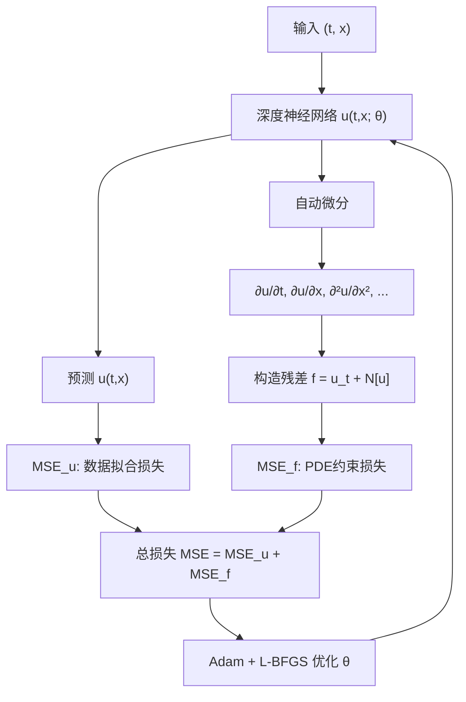

# PINN 快速阅读摘要报告

**论文标题**: Physics-informed neural networks: A deep learning framework for solving forward and inverse problems involving nonlinear partial differential equations

---

## 0. 关键词 (Keywords)

Physics-Informed Neural Networks (PINNs), 数据驱动科学计算, 偏微分方程求解, 正问题 (Forward Problem), 反问题 (Inverse Problem), Runge-Kutta 方法, 自动微分, 非线性动力学

---

## 1. 论文核心概要 (Executive Summary)

1. 本文提出 **物理信息神经网络 (PINNs)**——将物理定律（由非线性偏微分方程描述）直接嵌入神经网络的损失函数中，使网络在拟合稀疏观测数据的同时严格遵循底层物理约束。
2. 针对 PDE 求解和数据驱动的 PDE 发现两大类问题，分别设计了**连续时间模型**（PDE 残差作为正则项的全域约束）和**离散时间模型**（融合 Runge-Kutta 时间步进方案的模块化结构），两者均能利用自动微分高效计算导数。
3. 在 Burgers 方程、Schrödinger 方程、Navier-Stokes 方程、Allen-Cahn 方程和 KdV 方程等一系列经典物理问题上验证了有效性——即使在训练数据极度稀疏（甚至仅需两个时间快照）的情况下，PINNs 仍能准确求解正问题和反问题。

---

## 2. 研究问题与目标 (Research Question)

本文试图回答的核心问题：

> **如何在深度学习框架中系统性地融入物理先验知识，使得神经网络在少量甚至无监督数据的情况下，仍能可靠地求解和发现非线性偏微分方程？**

具体拆解为两个子问题：
1. **数据驱动的 PDE 求解（正问题）**：给定固定的 PDE 参数 λ 和少量的初始/边界观测数据，如何推断整个时空域内系统的隐藏状态 u(t, x)？
2. **数据驱动的 PDE 发现（反问题）**：给定若干系统状态的观测数据，如何确定最能描述这些观测数据的 PDE 参数 λ？

---

## 3. 关键方法与技术 (Methodology)

### 3.1 核心框架总览

PINN 的核心构造流程：

```
输入 (t, x) → 深度神经网络 u_net(t, x; θ) → u(t, x) 近似解
                                              ↓ 自动微分计算 ∂u/∂t, ∂u/∂x, ∂²u/∂x²...
                                              ↓ 代入 PDE 残差 f := u_t + N[u]
                                              ↓
                损失函数: MSE = MSE_u (数据项) + MSE_f (物理约束项)
                                              ↓
                反向传播更新网络参数 θ（同时优化数据和物理一致性）
```

### 3.2 连续时间模型 (Continuous Time Models)

**数学表述**：

对于一般形式的 PDE：
$$
u_t + \mathcal{N}[u] = 0, \quad x \in \Omega, \quad t \in [0,T]
$$

定义残差网络：
$$
f := u_t + \mathcal{N}[u]
$$

用深度神经网络近似 $u(t,x)$，通过自动微分计算 $u_t$ 和 $\mathcal{N}[u]$ 中的空间导数，从而得到 $f(t,x)$。$u(t,x)$ 和 $f(t,x)$ 共享网络参数，但激活函数因微分算子作用而不同。

**损失函数**：
$$
MSE = MSE_u + MSE_f
$$

其中：
- $MSE_u = \frac{1}{N_u} \sum_{i=1}^{N_u} |u(t_u^i, x_u^i) - u^i|^2$ —— 拟合观测数据（初始/边界条件）
- $MSE_f = \frac{1}{N_f} \sum_{i=1}^{N_f} |f(t_f^i, x_f^i)|^2$ —— 强制 PDE 残差为零（配置点约束）

**工作流图示**：



### 3.3 离散时间模型 (Discrete Time Models)

融合经典 **Runge-Kutta 方法**与神经网络，允许在时间步长 $\Delta t$ 很大时仍保持高精度：

对于 $q$ 级 Runge-Kutta 方法：
$$
\begin{aligned}
u^{n+c_i} &= u^n - \Delta t \sum_{j=1}^q a_{ij} \mathcal{N}[u^{n+c_j}], \quad i=1,...,q \\
u^{n+1} &= u^n - \Delta t \sum_{j=1}^q b_j \mathcal{N}[u^{n+c_j}]
\end{aligned}
$$

通过多输出神经网络同时预测 $[u^{n+c_1}, ..., u^{n+c_q}, u^{n+1}]$，上述方程自动施加物理约束。该设计允许：
- **$\Delta t$ 极大**（传统方法受稳定性限制，而该方法可单步跨越整个时间域）
- **可任意增加 Runge-Kutta 级数 $q$** 以保持精度
- 隐式/显式格式均可适配

### 3.4 反问题（PDE 参数发现）

将 PDE 参数 $\lambda$ 也作为可训练变量，与网络参数 $\theta$ 同时优化：

$$
\min_{\theta, \lambda} \left( \frac{1}{N_u}\sum|u_{pred} - u_{data}|^2 + \frac{1}{N_f}\sum|f(t,x; \theta, \lambda)|^2 \right)
$$

### 3.5 网络设置

- 架构：简单的前馈全连接网络
- 激活函数：$\tanh$
- 优化器：先 Adam 后 L-BFGS
- 无额外正则化（无 L1/L2、Dropout 等）

---

## 4. 主要结论与贡献 (Key Findings & Contributions)

### 学术贡献

1. **开创性框架**：首次系统性地提出了将 PDE 物理约束嵌入深度神经网络的通用框架（PINNs），奠定了该领域的研究基础。
2. **连续+离散双模式**：同时设计了适用于连续时空域和离散时间步进的两种模型架构，覆盖了不同数据场景。
3. **极强的小数据能力**：
   - 正问题：仅需少量初始/边界点就能高精度还原整个时空域的解
   - 反问题：仅需 **2 个时间快照**（时间间隔可很大）即可准确识别 PDE 的未知参数
4. **对噪声的鲁棒性**：在训练数据含 1%~10% 噪声时，参数识别仍保持良好精度。
5. **跨领域验证**：在流体力学（Burgers、Navier-Stokes）、量子力学（Schrödinger）、反应扩散（Allen-Cahn）、非线性波（KdV）等多个领域均验证有效。

### 关键数值结果

| 问题 | 数据量 | 关键指标 |
|------|--------|----------|
| Burgers 方程（正问题） | 初始+边界共少量点 | 相对误差 $10^{-3}$~$10^{-4}$ |
| Schrödinger 方程 | 初始+边界数据 | 精确恢复波函数 $|h(t,x)|$ |
| Navier-Stokes（反问题） | 速度场部分采样点 | 精确恢复压力场（无压力训练数据）+ 识别 $\lambda_1, \lambda_2$ |
| Burgers（反问题） | N=2000 随机点 | $\lambda$ 识别误差 < 0.1%（无噪声），1% 噪声仍 < 0.5% |

---

## 5. 与我研究的相关性评估 (Relevance to My Research)

- **总体相关度**：中

- **详细分析**：
  - **高相关方面**：PINN 框架是当前科学计算与深度学习交叉领域最热门的方法之一。如果你的研究方向涉及**溢油扩散/漂移的物理建模**（如油膜在海洋中的 advection-diffusion 过程），PINN 天然适合：只需少量现场观测数据，结合流体动力学 PDE（如浅水方程、对流扩散方程），即可反演扩散系数、流速场等关键参数，这正是 PINN 反问题的核心应用场景。
  - **中等相关方面**：本文的方法论（如何将物理先验嵌入网络）对任何涉及**物理约束的深度学习任务**都具有方法论层面的参考价值。即使不直接使用 PDE 求解，其"物理正则化"的思路也可迁移到其他遥感反演任务中。
  - **低相关方面**：论文本身不涉及遥感影像处理、高光谱数据分析或目标检测等视觉任务。PINN 处理的是欧拉坐标系下的连续物理场（$u(t,x)$），而非图像/光谱数据。如果你的核心任务是**识别而非物理建模**，则本论文的直接参考价值有限。
  - **间接价值**：PINN 框架可与物理模型结合，生成合成训练数据（physics-informed data augmentation），用于增强高光谱溢油检测模型的训练集。

---

## 6. 创新点与局限性 (Innovations & Limitations)

### 主要创新点

1. **简洁优雅的物理嵌入方式**：利用自动微分（而非数值差分）计算 PDE 导数，避免了传统数值方法的精度损失和稳定性约束，且实现极为简洁。
2. **连续时间模型突破小数据瓶颈**：PDE 残差约束本质上提供了一种"无限数据"的 regularization——即使在完全没有内部观测数据的情况下，仅靠边值条件仍可求解。
3. **离散时间模型中的"大步长"能力**：通过融合高阶 Runge-Kutta 格式，单步即可跨越巨大的时间间隔（$\Delta t$ 可接近整个时间域），打破了传统数值方法的时间步长限制。
4. **正问题和反问题的统一框架**：同一套网络架构只需调整损失函数中可训练参数即可同时处理前向和反向问题。

### 局限性

1. **非替代性声明**：作者明确指出 PINN 不应被视为传统数值方法（有限元、谱方法等）的替代品，后者在鲁棒性和计算效率上已有半个世纪的积累。
2. **网络架构敏感性**：在附录表格中可以看到，不同层数/神经元数对参数识别结果有一定变异性（non-monotonic trends），表明 PINN 对超参数选择存在非平凡依赖。
3. **计算开销**：训练过程需要大量配置点（collocation points）和迭代，对于高维问题（$D \gg 3$）面临维度灾难。
4. **缺乏不确定性量化**：该版本 PINN 没有提供预测的不确定性估计（后续工作如 Bayesian PINN 对此进行了改进）。
5. **局限于 PDE 形式已知的场景**：当 PDE 形式完全未知或过于复杂时，PINN 的建模能力受限。

---

## 7. 精读建议 (Recommendation)

**推荐精读** ⭐⭐⭐⭐

### 推荐理由

这是 PINN **奠基性的原始论文**（截至 2026 年已被引用超过 15000 次），是物理信息深度学习领域的必读文献。如果你计划将物理先验引入任何科学计算或工程建模任务，阅读本文可以深入理解：

1. **物理约束嵌入的核心原理**（Section 3.1 连续时间模型）
2. **如何用自动微分处理任意阶 PDE 导数**（Section 2 & 3）
3. **反问题的参数发现机制**（Section 4）
4. **离散时间模型的模块化设计思路**（Section 3.2）

### 建议重点关注

| 章节 | 内容 | 优先级 |
|------|------|--------|
| **Section 2** - Problem setup | 问题形式化定义，PDE 一般形式 | ⭐⭐⭐ 必读 |
| **Section 3.1** - Continuous time models | 核心方法论：损失函数设计、配置点策略 | ⭐⭐⭐⭐⭐ 精读 |
| **Section 3.2** - Discrete time models + Allen-Cahn example | Runge-Kutta 融合神经网络的设计 | ⭐⭐⭐ 相关即可 |
| **Section 4.1** - Navier-Stokes 反问题示例 | 连续时间反问题的完整工作流 | ⭐⭐⭐⭐ 重点参考 |
| **Section 5** - Conclusions | 总结与未来方向 | ⭐⭐⭐ 必读 |
| **Appendix A/B** - 系统参数敏感性分析 | 网络架构、数据量、噪声的影响 | ⭐⭐ 参考 |

### 后续延伸阅读建议

阅读本文后，建议跟进以下 PINN 改进工作：
- **Bayesian PINN** (Yang et al., 2020) —— 加入不确定性量化
- **PINN with adaptive collocation points** (Lu et al., 2021) —— 自适应配置点策略
- **PINN for inverse problems in fluid dynamics** —— 直接相关溢油漂流的反问题建模
- **Physics-informed neural networks for remote sensing** —— 如将 PINN 用于遥感数据同化

---

*报告生成日期: 2026-05-13*
*阅读工具: pypdf / 快速阅读摘要*
