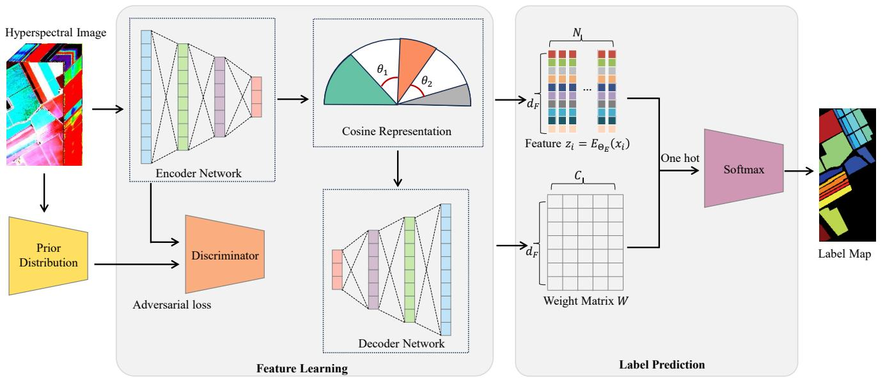
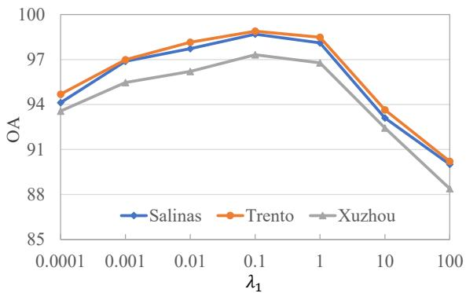
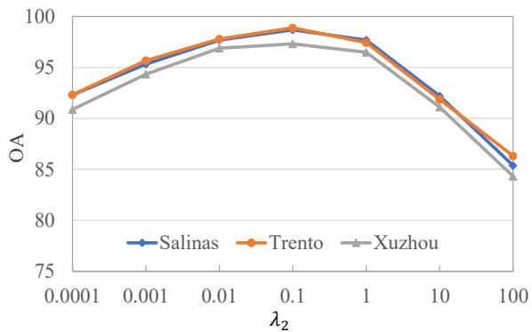
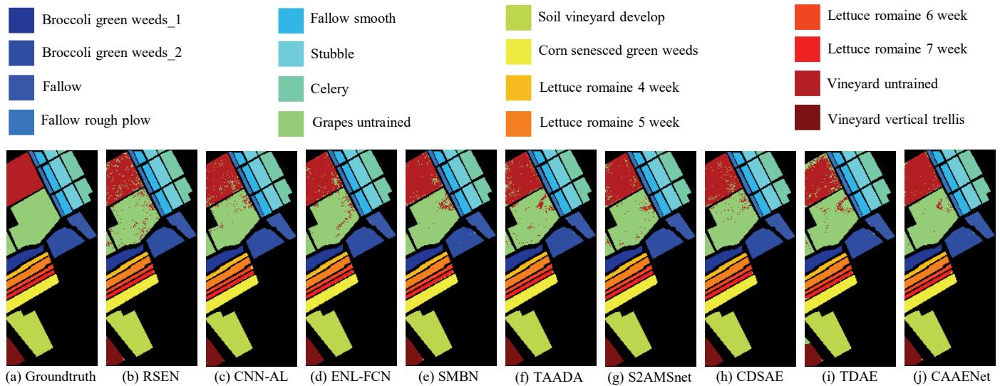
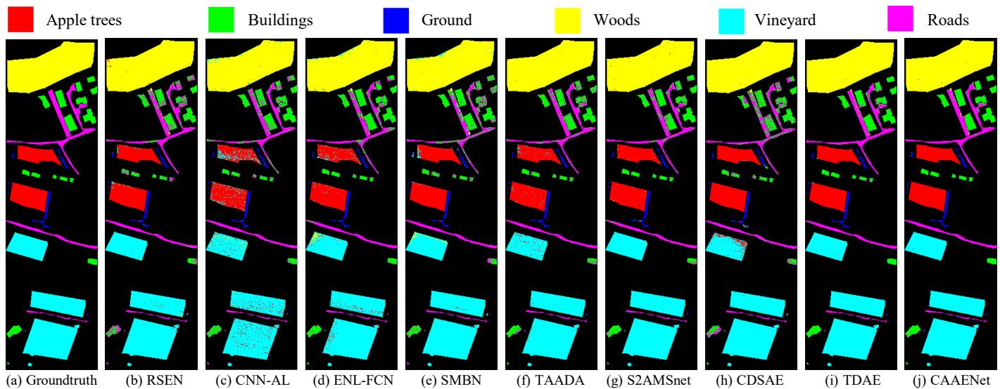
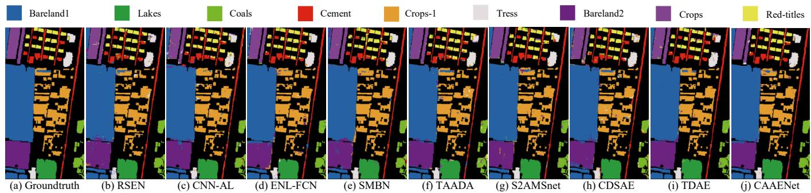
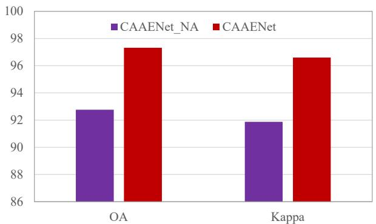
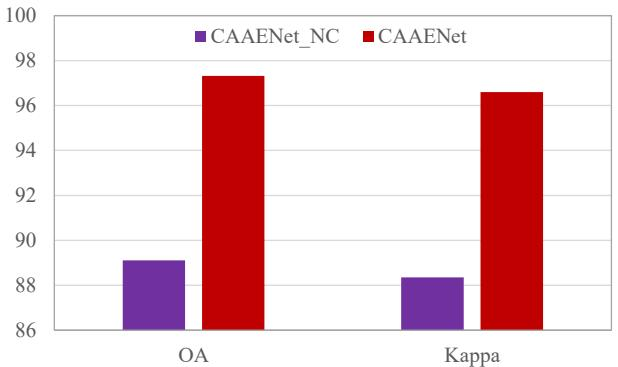

---
tags:
  - papers/高光谱
  - papers/深度学习
  - papers/分类
aliases:
  - CAAENet
  - 余弦驱动对抗自编码器
created: 2026-06-18
---
# CAAENet: Cosine-Driven Adversarial Auto-Encoder Network for Hyperspectral Image Classification

## 核心信息

- **作者**: （匿名审稿中）
- **发表年份**: 2026（审稿中）
- **刊物**: IEEE Transactions on Neural Networks and Learning Systems (TNNLS)
- **DOI**: 暂无（审稿阶段，Submission ID: c9d508db-b7cf-492a-b766-e4874914de78）
- **关键词**: hyperspectral image classification, distribution consistency, feature separability, auto-encoder, cosine loss, adversarial loss
- **类型**: method（方法论文）
- **数据集**: Salinas（16类）、Trento（6类）、Xuzhou（9类）
- **代码**: 未公开

## 原文摘要翻译

各类以自编码器为代表的深度学习网络在高光谱图像分类中取得了众多成就。然而，这些方法大多未考虑特征分布和可分性，导致所获特征难以被预测层有效区分。为弥补这一缺陷，本文提出一种余弦驱动的对抗自编码器网络（CAAENet），将对抗训练风格和余弦表示融入自编码器框架。具体而言：首先以自编码器网络为基础框架；其次，在基础自编码器框架中构建对抗损失，通过判别器在对抗学习过程中持续缩小输入高光谱图像与其特征之间的分布差异；第三，在基础网络中构建余弦损失以提升特征可分性，使类内特征聚合、类间距离扩大；第四，设计交替优化策略求解CAAENet整体损失的最优解；最后，通过对所得解施加独热编码，完成输入高光谱图像的标签预测。与大多数现有方法不同，CAAENet充分考虑特征分布与可分性，捕捉高度可分离且具有判别力的特征。大量实验表明，CAAENet相比若干代表性先进方法取得了更具竞争力的性能。

## 创新点

1. **对抗学习与余弦表示的统一框架**：首次将对抗训练风格和余弦度量表示同时融入自编码器框架中，构建了CAAENet——一个同时关注特征分布一致性和特征空间可分性的端到端网络，而非仅优化单一目标。
2. **对抗损失驱动的分布对齐**：在自编码器的编码器端引入对抗损失，通过编码器与判别器的博弈训练机制，迫使编码器学习到的隐空间特征分布逼近先验分布（标准正态分布），从根本上解决输入域与特征域之间的分布偏移问题。
3. **自适应margin余弦损失**：在标准余弦损失的基础上引入自适应margin机制 $m_i = 1 - \frac{n_i+\epsilon}{\sum n_j+\epsilon}$，使每个样本的角惩罚根据其所属类别的统计特性动态调整。相比固定margin，自适应margin能更有效应对类别不平衡和类内光谱多样性大的问题，增强了特征空间的判别边界。
4. **交替优化策略**：针对CAAENet的多变量非凸整体损失函数，设计了四组参数（$\Theta_P$、$W$、$\Theta_E$、$\Theta_D$）的交替梯度下降优化方案，系统给出了每一步的偏导计算和收敛条件。

## 一句话总结

CAAENet通过在自编码器上同时施加对抗损失（保证分布一致性）和自适应margin余弦损失（保证特征可分性），并配合交替优化策略，在三个高光谱数据集上全面超越8种代表性对比方法，是一篇思路清晰、数学推导完整的方法论文。

---

## 研究问题

高光谱图像分类的核心挑战在于从数百个连续光谱波段中提取具有判别力的特征。现有方法（CNN、Transformer、自编码器等）主要关注网络架构创新，但普遍存在两个被忽视的根本性问题：

1. **分布偏移问题**：隐空间特征分布与输入数据分布不一致。自编码器虽然能通过重构损失保留输入的核心信息，但编码器输出的特征空间缺乏分布约束，导致特征与原始输入之间存在分布偏移，影响后续分类器的泛化能力。
2. **特征可分性不足**：从几何角度看，大多数方法未显式优化特征空间中的类内聚合和类间分离。端到端方法将特征提取和分类器联合优化，但在特征层面缺乏显式的可分性约束，使得分类边界不够清晰。

本文围绕这两个动机，提出CAAENet——将对抗损失用于解决分布偏移，将余弦损失用于增强特征可分性，形成互补的双约束训练框架。

---

## 数据与任务定义

### 任务形式化

给定高光谱图像数据集 $D = \{(x_i, y_i)\}_{i=1}^{N}$，其中 $x_i \in \mathbb{R}^{d_L}$ 为像素光谱向量，$y_i \in \{1, 2, \ldots, C\}$ 为对应的地物类别标签。$W = \{w_1, w_2, \ldots, w_C\} \in \mathbb{R}^{d_F \times C}$ 为分类权重矩阵。目标是学习一个从输入光谱到类别标签的映射函数。

### 数据集

| 数据集  | 传感器     | 空间尺寸 | 波段数          | 类别数 | 训练比例 | 特点                                  |
| ------- | ---------- | -------- | --------------- | ------ | -------- | ------------------------------------- |
| Salinas | AVIRIS     | 512×217 | 204（去水汽后） | 16     | 10%      | 农业场景，类别丰富                    |
| Trento  | AISA Eagle | 600×600 | 63              | 6      | 1%       | 意大利乡村，极低训练比例              |
| Xuzhou  | HYSPEX     | 500×260 | 436             | 9      | 5%       | 中国徐州郊区，超高空间分辨率（0.73m） |

三个数据集的传感器、光谱分辨率、训练比例差异显著，覆盖了低训练样本和类别不平衡等实际场景，评估维度全面。

### 评价指标

- **OA**（Overall Accuracy）：总体分类正确率
- **AA**（Average Accuracy）：各类别平均正确率
- **Kappa**：Kappa系数，修正随机一致性的分类精度

---

## 方法主线

### 动机分析与模型构建

CAAENet的核心思想是将**对抗学习**和**余弦表示**统一融入自编码器框架。其整体损失函数为：

$$
L_{\text{overall}} = L_{\text{recon}} + \lambda_1 L_{\text{adv}} + \lambda_2 L_{\text{cos}} \tag{1}
$$

其中 $L_{\text{recon}}$ 是自编码器重构损失，$L_{\text{adv}}$ 是对抗损失（保证分布一致性），$L_{\text{cos}}$ 是余弦损失（保证特征可分性），$\lambda_1$ 和 $\lambda_2$ 为耦合参数。

*Fig. 1. CAAENet方法总体框图。编码器将输入高光谱图像映射到隐空间特征，判别器通过对抗训练对齐特征分布与先验分布，解码器重构输入保证信息保真度，最后通过余弦度量层完成标签预测。*

### 机制流程

CAAENet的训练和推理分为以下四个核心机制：

**Step 1 — 自编码器重构（信息保真）**

编码器 $E_{\Theta_E}$ 将输入 $x_i$ 映射到特征 $z_i = E_{\Theta_E}(x_i) \in \mathbb{R}^{d_F}$，解码器 $D_{\Theta_D}$ 将其重构为 $\hat{x}_i = D_{\Theta_D}(z_i)$。重构损失为：

$$
L_{\text{recon}}(\Theta_E, \Theta_D) = \frac{1}{N} \sum_{i=1}^{N} \| x_i - D_{\Theta_D}(E_{\Theta_E}(x_i)) \|_F^2 \tag{2}
$$

此损失确保编码特征保留了原始高光谱图像的核心光谱-空间信息。

**Step 2 — 对抗损失（分布对齐）**

编码器同时充当对抗学习中的生成器，判别器 $P_{\Theta_P}$ 负责区分编码特征 $z_i$ 与来自先验分布 $z_i^{\text{prior}} \sim \mathcal{N}(0,1)$ 的样本。

编码器端对抗损失（试图欺骗判别器）：

$$
L_{\text{adv}}^E(\Theta_E, \Theta_P) = \frac{1}{N} \sum_{i=1}^{N} \left[ -\log P_{\Theta_P}(E_{\Theta_E}(x_i)) \right] \tag{3}
$$

判别器端对抗损失（区分真假样本）：

$$
L_{\text{adv}}^P(\Theta_E, \Theta_P) = \frac{1}{N} \sum_{i=1}^{N} \left[ \log P_{\Theta_P}(z_i^{\text{prior}}) + \log(1 - P_{\Theta_P}(E_{\Theta_E}(x_i))) \right] \tag{4}
$$

通过编码器与判别器的交替博弈，特征分布逐渐逼近标准正态分布，从根本上消除了输入域与特征域之间的分布偏移。

**Step 3 — 余弦损失（可分性增强）**

核心创新在于余弦度量空间中的分类损失设计。基础形式来自修改的归一化SoftMax损失：

$$
L_{\text{cos}}(\Theta_E, W) = -\frac{1}{N} \sum_{i=1}^{N} \log \frac{e^{s \cos(\theta_{y_i})}}{\sum_{j=1}^{N} e^{s \cos(\theta_{y_j})}} \tag{5}
$$

其中 $s$ 为缩放因子，$\theta_i = w_i^T z_j$ 衡量特征向量 $z_j$ 与第 $i$ 类权重向量 $w_i$ 之间的余弦相似度。在二维空间中，这意味着特征向量被拉向其所属类别的"轴"方向。

为增强判别边界，引入固定margin $m$：

$$
L_{\text{cos}_f}(\Theta_E, W) = -\frac{1}{N} \sum_{i=1}^{N} \log \frac{e^{s \cos(\theta_{y_i} - m)}}{\sum_{y_j \neq y_i} e^{s \cos(\theta_{y_j})} + e^{s \cos(\theta_{y_i} - m)}} \tag{6}
$$

**关键改进 — 自适应margin**：固定margin无法适应类别间的统计差异，本文提出自适应margin：

$$
m_i = 1 - \frac{n_i + \epsilon}{\sum_{j=1}^{N} n_j + \epsilon}
$$

$$
L_{\text{cos}_a}(\Theta_E, W) = -\frac{1}{N} \sum_{i=1}^{N} \log \frac{e^{s \cos(\theta_{y_i} - m_i)}}{\sum_{j=1}^{N} e^{s \cos(\theta_{y_j} - m_j)}} \tag{7}
$$

自适应margin $m_i$ 根据样本所属类别的样本量 $n_i$ 动态调整：样本量大的类别margin较小（已有足够的类内聚合），样本量小的类别margin较大（需要更强的类内约束）。这有效缓解了类别不平衡问题。

最终的CAAENet整体损失为：

$$
L_{\text{overall}}(\Theta_E, \Theta_D, \Theta_P, W) = L_{\text{recon}}(\Theta_E, \Theta_D) + \lambda_1 L_{\text{adv}}^E(\Theta_E, \Theta_P) + \lambda_2 L_{\text{cos}_a}(\Theta_E, W) \tag{8}
$$

**Step 4 — 交替优化策略**

由于公式(8)包含四组参数（$\Theta_P, W, \Theta_E, \Theta_D$）且为非凸问题，采用交替梯度下降求解：

1. **更新 $\Theta_P$**（固定其余）：$\min_{\Theta_P} L_{\text{adv}}^P(\Theta_E, \Theta_P)$，使用梯度下降 $\Theta_P = \Theta_P - \eta_P \frac{\partial L_{\text{adv}}^P}{\partial \Theta_P}$
2. **更新 $W$**（固定其余）：$\min_W L_{\text{cos}_a}(\Theta_E, W)$，梯度下降 $W = W - \eta_W \frac{\partial L_{\text{cos}_a}}{\partial W}$
3. **更新 $\Theta_E$**（固定其余）：$\min_{\Theta_E} L_{\text{overall}}$，编码器同时接受重构、对抗、余弦三路梯度信号
4. **更新 $\Theta_D$**（固定其余）：$\min_{\Theta_D} L_{\text{recon}}(\Theta_E, \Theta_D)$，仅优化重构损失

收敛条件为四组参数的相邻迭代变化量趋于零：

$$
\|\Theta_P^{t+1} - \Theta_P^t\|_2 \to 0, \quad \|W^{t+1} - W^t\|_2 \to 0, \quad \|\Theta_E^{t+1} - \Theta_E^t\|_2 \to 0, \quad \|\Theta_D^{t+1} - \Theta_D^t\|_2 \to 0
$$

### 标签预测

推理阶段，对于未知样本 $\check{x}$，通过 softmax 函数输出概率分布：

$$
\tilde{y} = \text{softmax}(\mathbf{o}) = \left[ \frac{e^{o_1}}{\sum_{j=1}^C e^{o_j}}, \ldots, \frac{e^{o_C}}{\sum_{j=1}^C e^{o_j}} \right]^T
$$

其中 $o_j = s \cdot \cos(\theta_j) = w_j^T E_{\Theta_E}(\check{x})$。最终预测标签为 $\check{y} = \max_j \tilde{y}_j$。

---

## 关键结果

### 参数分析

 

*Fig. 2. 耦合参数 $\lambda_1$（对抗损失权重）和 $\lambda_2$（余弦损失权重）对分类性能的影响。（a）$\lambda_1$ 分析；（b）$\lambda_2$ 分析。*

两个耦合参数的最优值均为 **$\lambda_1 = 0.1$，$\lambda_2 = 0.1$**。当参数过小（如0.0001）时，对应的损失项权重不足，无法发挥作用；当参数过大（如100）时，会破坏主网络（自编码器）的核心功能，性能急剧下降。这一参数设定在三个数据集上表现一致，展现出良好的泛化稳定性。

学习率设定：$\eta_P = \eta_E = \eta_D = 10^{-5}$，$\eta_W = 10^{-4}$（通过网格搜索从 $10^{-6}$ 到 $10^1$ 确定）。

### 算法对比

CAAENet与8种代表性方法对比：RSEN（自集成）、CNN-AL、ENL-FCN、SMBN（CNN类）、TAADA、S2AMSnet（对抗类）、CDSAE、TDAE（自编码器类）。

*Fig. 3. Salinas数据集（10%训练样本）分类图对比。CAAENet在"Vineyard untrained"等难分区域展现出更少的分类误差。*

*Fig. 4. Trento数据集（1%训练样本）分类图对比。CAAENet在极低训练比例下仍保持较高的分类质量。*

*Fig. 5. Xuzhou数据集（5%训练样本）分类图对比。"Trees"和"Roads"区域的分类准确性显著优于对比方法。*

**Salinas数据集定量结果（Table I 摘要）**：

| 方法              | OA(%)           | AA(%)           | Kappa(%)        |
| ----------------- | --------------- | --------------- | --------------- |
| RSEN              | 97.32           | 97.88           | 97.13           |
| CNN-AL            | 98.27           | 97.77           | 98.04           |
| ENL-FCN           | 97.97           | 98.28           | 97.77           |
| SMBN              | 98.08           | 98.58           | 97.89           |
| TAADA             | 97.69           | 97.96           | 97.47           |
| S2AMSnet          | 98.02           | 98.33           | 97.84           |
| CDSAE             | 97.89           | 98.39           | 97.70           |
| TDAE              | 98.48           | 98.66           | 98.34           |
| **CAAENet** | **98.97** | **99.07** | **98.89** |

**Trento数据集定量结果（Table II）**：

| 方法              | OA(%)           | AA(%)           | Kappa(%)        |
| ----------------- | --------------- | --------------- | --------------- |
| RSEN              | 95.56           | 92.30           | 94.07           |
| CNN-AL            | 91.63           | 89.82           | 88.83           |
| ENL-FCN           | 94.57           | 92.54           | 92.75           |
| SMBN              | 94.43           | 90.29           | 92.56           |
| TAADA             | 96.33           | 94.53           | 95.10           |
| S2AMSnet          | 97.35           | 95.45           | 96.46           |
| CDSAE             | 94.02           | 89.07           | 92.04           |
| TDAE              | 98.39           | 97.07           | 97.85           |
| **CAAENet** | **98.89** | **97.76** | **98.52** |

**Xuzhou数据集定量结果（Table III）**：

| 方法              | OA(%)           | AA(%)           | Kappa(%)        |
| ----------------- | --------------- | --------------- | --------------- |
| RSEN              | 95.95           | 94.66           | 94.86           |
| CNN-AL            | 94.78           | 92.66           | 93.37           |
| ENL-FCN           | 95.63           | 94.50           | 94.45           |
| SMBN              | 95.14           | 94.31           | 93.84           |
| TAADA             | 95.54           | 92.76           | 94.33           |
| S2AMSnet          | 96.63           | 94.74           | 95.72           |
| CDSAE             | 94.82           | 92.51           | 93.41           |
| TDAE              | 96.97           | 95.20           | 96.12           |
| **CAAENet** | **97.32** | **96.98** | **96.46** |

三个数据集上CAAENet在OA、AA、Kappa三个指标上均取得最优。值得注意的是：

- **Trento数据集（1%训练）**上，CAAENet的AA（97.76%）显著高于第二名TDAE（97.07%），说明余弦损失在极低训练比例下的特征可分性优势尤为突出。
- **Xuzhou数据集**上，"Trees"和"Red-tiles"等难分类别的准确率提升尤为明显（Trees: 94.91% vs 第二名SMBN 95.07%但OA全面落后；Red-tiles: 97.52% vs 第二名CDSAE 89.71%，提升近8个百分点）。
- 对比同为自编码器类的CDSAE和TDAE，CAAENet的优势验证了对抗损失和余弦损失的有效性超出了架构本身。

### 消融实验

 

*Fig. 6. 消融实验（Xuzhou数据集）。（a）移除对抗损失（CAAENet_NA）对比完整CAAENet；（b）移除余弦损失（CAAENet_NC）对比完整CAAENet。*

| 变体                      | OA(%)          | Kappa(%)       | 说明                      |
| ------------------------- | -------------- | -------------- | ------------------------- |
| CAAENet_NA（无对抗损失）  | 92.8           | 91.8           | OA下降4.6%，Kappa下降4.7% |
| CAAENet_NC（无余弦损失）  | 89.0           | 88.5           | OA下降8.4%，Kappa下降8.0% |
| **CAAENet（完整）** | **97.4** | **96.5** | —                        |

消融实验揭示了两点关键发现：

1. **对抗损失的贡献**：移除对抗损失后OA从97.4%降至92.8%。缺乏对抗训练时，编码器输出的特征分布无法与先验分布对齐，分布偏移导致分类器在测试数据上泛化能力下降。
2. **余弦损失的贡献更为显著**：移除余弦损失后OA降至89.0%（下降8.4个百分点）。这说明在特征层面显式优化类内聚合与类间分离，比单纯的对抗分布对齐更为关键——即使分布一致，如果特征空间本身不可分，分类器依然难以区分不同类别。

---

## 深度分析

### 方法本质

CAAENet的本质是一个**三目标联合优化的特征学习框架**：

- **重构损失** → 信息保真（无监督，自监督信号来自输入本身）
- **对抗损失** → 分布正则化（迫使特征空间服从标准正态，消除域偏移）
- **余弦损失** → 判别正则化（在角度空间中显式拉大类间距离、压缩类内距离）

三个损失形成互补约束：重构保证特征不丢失信息，对抗保证特征的分布规范性，余弦保证特征的可分性。这种"保真+规范+可分"的三位一体设计，本质上是对自编码器隐空间的多维度正则化。

### 自适应margin的价值

自适应margin $m_i = 1 - \frac{n_i+\epsilon}{\sum n_j+\epsilon}$ 的设计解决了一个实际问题：类别不平衡。标准余弦损失的固定margin对所有类别施加相同的角惩罚，但在高光谱图像中，不同地物类别的样本量可能相差悬殊（如Salinas中"Grapes_untrained"仅占少数像素），且同一类别内部的光谱多样性也不同。

样本量少的类别 → $m_i$ 大 → 更宽松的类内约束（允许更大角度范围，防止过拟合少数样本）

样本量多的类别 → $m_i$ 小 → 更紧致的类内约束（迫使特征更集中，充分利用大量样本的信息）

这种设计在逻辑上与focal loss的加权思想一致，但作用于角度空间而非概率空间，更加直接地影响特征的几何分布。

### 与相关工作的关系

- **vs 标准AAE（Adversarial Autoencoder）**：标准AAE仅使用对抗损失约束隐空间分布，CAAENet在此基础上增加了余弦损失，将分布约束与判别约束解耦。
- **vs CosFace/ArcFace**：人脸识别中的CosFace和ArcFace使用固定margin的余弦损失，CAAENet的**自适应margin**是其在高光谱场景下的关键改进，更适应遥感数据的类别不平衡特性。
- **vs TDAE**：TDAE通过张量分解约束多层输出特征的结构信息，而CAAENet通过余弦度量约束特征的几何可分性，两者互补但不重叠。

### 为什么效果好

CAAENet效果好的核心原因可以归结为**信号完整性**：传统端到端方法将分类误差通过softmax层反向传播，梯度信号经过多层非线性变换后已被高度稀释。CAAENet的对抗损失和余弦损失直接从隐空间（瓶颈层）施加约束，梯度路径更短、信号更强烈，使得特征学习更加有效。

---

## 局限

1. **计算开销未分析**：论文未讨论CAAENet相比baseline的训练时间和推理延迟。交替优化四组参数意味着每轮迭代需要进行四次前向/反向传播，实际训练效率可能低于端到端方法。缺少训练成本的分析使得方法的实用性评估不完整。
2. **网络结构细节缺失**：论文未明确给出编码器、解码器和判别器的具体网络结构（层数、通道数、激活函数等），这对于复现工作是一个障碍。论文仅描述了损失函数层面的设计，而具体的架构实现留白。
3. **超参数敏感性**：虽然论文通过网格搜索确定了 $\lambda_1, \lambda_2$ 和学习率，但自适应margin中的 $\epsilon$ 取值、缩放因子 $s$ 的设定未被讨论。这些参数可能对模型稳定性有影响。
4. **数据集局限性**：三个数据集均为场景级别的高光谱数据（农业、乡村、城郊），缺乏对更复杂场景（如城市密集区、混合像元严重区域）的测试。此外，所有数据集的类别数（6-16类）相对有限。
5. **缺少统计显著性检验**：论文仅给出10次实验的平均值，未报告标准差或进行统计显著性检验（如McNemar检验），无法判断性能提升是否统计显著。
6. **未公开代码**：作为一篇方法论文，代码不可用会影响可复现性和后续研究的引用。

---

## 引用

[1] Y. Zhang, P. Duan, L. Liang et al., "Pfs3f: Probabilistic fusion of superpixel-wise and semantic-aware structural features for hyperspectral image classification," *IEEE Trans. Circuits Syst. Video Technol.*, vol. 35, no. 9, pp. 8723–8737, 2025.

[2] J. Benediktsson, M. Pesaresi, and K. Amason, "Classification and feature extraction for remote sensing images from urban areas based on morphological transformations," *IEEE Trans. Geosci. Remote Sens.*, vol. 41, no. 9, pp. 1940–1949, 2003.

[3] J. Benediktsson, J. Palmason, and J. Sveinsson, "Classification of hyperspectral data from urban areas based on extended morphological profiles," *IEEE Trans. Geosci. Remote Sens.*, vol. 43, no. 3, pp. 480–491, 2005.

[4] Y. Bengio, A. Courville, and P. Vincent, "Representation learning: A review and new perspectives," *IEEE Trans. Pattern Anal. Mach. Intell.*, vol. 35, no. 8, pp. 1798–1828, 2013.

[5] Y. Chen, N. Nasrabadi, and T. Tran, "Hyperspectral image classification using dictionary-based sparse representation," *IEEE Trans. Geosci. Remote Sens.*, vol. 49, no. 10, pp. 3973–3985, 2011.

[6] Z. Chen, X. Wu, and J. Kittler, "Low-rank discriminative least squares regression for image classification," *Signal Process.*, vol. 173, art. no. 107485, 2020.

[7] I. Goodfellow, J. Pouget-Abadie, M. Mirza et al., "Generative adversarial nets," in *Proc. NeurIPS*, 2014.

[8] H. Wang, Y. Wang, Z. Zhou et al., "CosFace: Large margin cosine loss for deep face recognition," in *Proc. IEEE CVPR*, 2018, pp. 5265–5274.

## 我的笔记

### 值得关注的要点

1. **自适应margin是一个简单但有效的trick**：将margin与类别样本量关联，一行公式就解决了类别不平衡问题。这个设计可以轻松迁移到其他使用余弦损失的分类任务中。
2. **三目标联合优化的思路清晰**：重构（无监督）→ 对抗（分布）→ 余弦（判别），三个目标的梯度在编码器端汇合，形成了一个优雅的多任务学习框架。这种"保真+规范+可分"的范式可能适用于其他需要高质量特征表示的任务。
3. **实验设计扎实**：三个不同传感器、不同分辨率、不同训练比例的数据集，8个涵盖CNN、Transformer、AE、对抗等多个流派的baseline，加上参数分析和消融实验，实验结果的可信度较高。

### 可能的改进方向

- 将判别器替换为Wasserstein GAN的critic，可能获得更稳定的对抗训练
- 在自适应margin中引入类内方差先验，而非仅依赖样本量
- 引入空间信息（邻域像素）到编码器输入中，目前方法仅处理单像素光谱
- 考虑对编码器输出进行谱归一化以进一步增强训练稳定性

### 阅读价值

这是一篇写作规范、逻辑清晰的方法论文。方法论部分从问题动机到数学建模再到优化求解一气呵成，实验部分的参数分析→对比实验→消融实验的递进结构也很合理。适合作为高光谱深度学习分类方向的入门精读材料，也适合学习"如何在论文中清晰地表述多目标优化问题"的写作范本。
