Received 9 March 2026, accepted 22 March 2026, date of publication 26 March 2026, date of current version 2 April 2026 Digital Object Identifier 10.1109/ACCESS.2026.3678115

RESEARCH ARTICLE

# LMA-Net: Light-Guided Multi-Scale Attention for Robust Soil Crack Segmentation Under Complex Illumination

GUANG-ZHU ZHANG, CHENXI ZHAO , HONG-FENG LI, AND QIUSHI LI .D School of Civil Engineering and Transportation, Northeast Forestry University, Harbin 150040, China

Corresponding author: Qiushi Li (liqiushi1016@163.com)

This work was supported by the Science and Technology Project of Heilongjiang Transportation Department under Grant HJK2023B019.

ABSTRACT Soil is highly susceptible to cracking under climatic factors such as rainfall and temperature, which degrades mechanical properties and durability and threatens the safety and service life of road infrastructure. Efficient and robust crack segmentation is therefore essential for early damage detection and quantitative condition assessment, thereby supporting timely maintenance and improving infrastructure life-cycle performance. In real-world scenes, complex illumination conditions such as non-uniform lighting and shadows can substantially degrade segmentation accuracy. To address this problem, a light-guided multi-scale attention segmentation network (LMA-Net) is proposed for soil crack segmentation under complex illumination. The proposed model takes soil crack images captured under complex illumination conditions as input and outputs pixel-level crack segmentation maps. The network adopts a U-shaped encoder–decoder architecture and integrates an illumination-guided attention (IGA) module to suppress illumination interference, a multi-scale feature fusion (MSF) module to enhance crack representation across varying widths, and SE-ResBlocks to improve channel discriminability in deeper layers. In addition, a soil crack dataset was constructed under wetting–drying cycles and diverse complex illumination scenarios. A total of 164 raw images were acquired and preprocessed into 164 full-image inputs for model development, from which 1620 crack-containing patches were generated for training and validation. Experimental results show that LMA-Net achieves an IoU of 78.74% and an F1 score of 87.83% on the test set, outperforming the comparative segmentation networks by more than 4.64% in IoU and 3.07% in F1 score. Ablation studies further verify the effectiveness of the proposed modules, and qualitative evaluation on real-world engineering images demonstrates that LMA-Net has strong potential for soil crack segmentation under complex environmental conditions.

INDEX TERMS Attention mechanism, deep learning, multi-scale feature fusion, non-uniform illumination, soil crack segmentation.

## I. INTRODUCTION

In transportation infrastructure construction, soil serves as the primary constituent material of roadbed, and its engineering properties play a decisive role in road stability and service life. Roadbed soil undergoes periodic wetting-drying (WD) cycles due to climatic factors such as temperature and rainfall, which result in volumetric changes and strength degradation,

The associate editor coordinating the review of this manuscript and approving it for publication was Tao Huang

ultimately leading to the development of complex crack networks [1], [2]. These cracks compromise soil continuity and structural integrity, reducing its bearing capacity and deformation resistance [3], [4] thereby inducing differential settlement, through-crack propagation, and overall roadbed instability, ultimately shortening pavement service life and increasing traffic safety risks [5]. As a result, efficient and reliable detection of roadbed cracking is of great importance for improving the whole life-cycle performance of infrastructure. Traditional methods mainly rely on manual inspection and classical image processing techniques, which suffer from low efficiency and strong subjectivity [6]. With the increasing scale and complexity of transportation infrastructure, there is an urgent need for automated soil crack detection methods that are accurate, robust, and adaptable to complex environmental conditions.

With the rapid development of deep learning, convolutional neural networks (CNNs) have been extensively applied to soil crack detection and segmentation [7], [8], [9], [10], [11], [12]. Object detection methods typically provide only coarse localization of cracks using rectangular bounding boxes [13], [14], which hampers accurate capture of pixellevel geometry and thus fails to provide a reliable basis for engineering evaluation. By contrast, semantic segmentation directly outputs pixel-level masks and has therefore become the mainstream approach for soil crack extraction [15], [16]. For example, Dung and Anh [17] proposed an end-to end pixel-level crack segmentation framework based on a fully convolutional network (FCN). Liu et al. [18] employed U-Net for concrete crack detection and achieved higher accuracy than FCN with a relatively small training dataset. Xu et al. [19] introduced a U-Net model with ResNet as the backbone for segmenting soil desiccation cracks. U-Net [20] and its variants [21], [22], [23], [24] integrate low-level and high-level features through an encoder–decoder architecture with skip connections, which effectively alleviates the problem of detail loss encountered in FCNs. To further improve accuracy and robustness, researchers have incorporated strategies such as attention mechanisms and multi-scale context fusion. For instance, Choi and Cha [25] proposed the semantic damage detection network (SDDNet), which integrates depthwise separable convolution and spatial pyramid pooling to achieve real-time crack segmentation while effectively suppressing complex background interference and accommodating diverse crack morphologies. Sun et al. [26] incorporated multi-scale attention into DeepLab-V3+, significantly enhancing its capacity for multi-scale context modeling. Zhu et al. [27] developed a lightweight encoder–decoder network integrating hybrid attention and residual blocks, thereby improving both the accuracy and efficiency of crack detection. Yan et al. [28] introduced a dual-channel multi-scale feature module combined with a hybrid attention mechanism to strengthen deep feature representation, substantially improving crack segmentation accuracy, albeit at the cost of increased model complexity.

In recent years, Transformer-based and hybrid CNN– Transformer models have also been explored for soil crack segmentation and related crack segmentation tasks, motivated by their strong capability in modeling long-range dependencies and global contextual information. Representative Transformer-based frameworks, such as SegFormer, employ hierarchical Transformer encoders to capture multiscale global context with relatively lightweight designs and have demonstrated competitive performance in semantic segmentation tasks [29]. In addition, Swin Transformer, which adopts a shifted window-based self-attention mechanism, has been widely applied in engineering vision applications to improve global feature modeling efficiency [30]. To compensate for the limited local feature extraction capability of pure Transformer models, hybrid architectures such as Swin-Transformer-UNet (ST-UNet) integrate Transformer encoders with U-shaped convolutional decoders, aiming to combine global dependency modeling with local spatial detail extraction, and have shown improved performance in pavement, tunnel lining, and concrete crack segmentation tasks [31], [32], [33]. However, despite their promising results, existing Transformer-based or hybrid architectures generally involve higher computational complexity and stronger dependence on training data, and often remain sensitive to illumination variations and fine-scale crack details when applied to real-world engineering images, which limits their robustness and practical deployment in roadbed inspection scenarios [34].

Although the aforementioned methods have achieved promising performance in soil crack segmentation, their performance under complex illumination conditions still requires further improvement. In real engineering environments, occlusion, shadows, and uneven lighting caused by buildings, vehicles, or trees are common, making it difficult for models to precisely identify crack edges and fine details, which ultimately leads to significant degradation of segmentation performance under such scenarios [35]. To mitigate illumination effects, Xu et al. [36] proposed Attention Res-UNet, which leverages attention mechanisms to handle non-uniform illumination and improves efficiency and accuracy under uneven lighting. Fan et al. [37] introduced a two-stage segmentation method tailored for shadowed environments. This approach first removes shadows from raw images using a luminance-difference-based shadow removal algorithm, and then detects cracks through a feature pyramid and a hierarchical refinement network augmented with a residual feature enhancement module. Zhang and Liu [38] developed a pavement crack segmentation network based on discrete cosine transform, in which a shadow removal module is integrated to enable single-stage segmentation of cracks in shadowed conditions.

However, these methods typically rely on single-module optimization or fixed preprocessing strategies and lack collaborative modeling of illumination distribution, multi-scale crack characteristics, and spatial continuity. Consequently, they struggle to simultaneously achieve illumination robustness, accurate multi-scale feature representation, and preservation of fine crack edges in complex real-world environments.

Overall, existing machine learning-based crack segmentation models still exhibit several limitations, including sensitivity to complex illumination variations, insufficient multi-scale modeling capability, loss of fine crack boundaries, and limited generalization ability, revealing a clear and unresolved knowledge gap.

To address the above challenges, this paper proposes the light-guided multi-scale attention network (LMA-Net) for soil crack segmentation under complex illumination conditions. The proposed method is built upon a U-shaped encoder–decoder framework, where residual blocks are adopted to strengthen deep feature learning. Squeeze-and-Excitation (SE) channel attention is embedded in deeper layers to enhance channel-wise discriminability of crack-related features. To explicitly address the identified knowledge gap, this study introduces two key innovations:

An illumination-guided attention (IGA) module, which leverages illumination priors and dual-attention mechanisms to suppress illumination interference and mitigate feature shift and detail loss caused by shadows and non-uniform lighting, and a multi-scale feature fusion (MSF) module, which enhances multi-scale context modeling capability through parallel dilated convolutions and dynamic weighting, thereby improving the representation and robustness of cracks at different scales.

Accordingly, the objective of this study is to address two fundamental challenges in existing crack segmentation models: (i) reduced detection accuracy under complex illumination conditions and (ii) difficulties in robustly modeling multi-scale cracks with fine structural details. By explicitly targeting these knowledge gaps, LMA-Net aims to achieve robust and accurate soil crack segmentation in real-world engineering environments. To validate the effectiveness of the proposed method, a soil crack dataset was constructed, incorporating complex illumination conditions and crack morphologies after WD cycles, and further evaluated under real engineering scenarios. Experimental results demonstrate that LMA-Net consistently outperforms representative stateof-the-art methods, confirming its robustness and practical applicability. The implementation code of LMA-Net is available at https://github.com/ZCX1113/LMA-Net

## II. METHODOLOGY

The proposed LMA-Net aims to achieve robust soil crack segmentation under complex illumination conditions by integrating illumination-guided attention and multi-scale feature fusion. As shown in Figure 1, the overall methodology follows a step-wise workflow consisting of data preparation, crack semantic segmentation using the proposed LMA-Net, and subsequent performance evaluation and engineering validation. The following subsections detail the architecture and key components of the proposed LMA-Net.

## A. OVERALL NETWORK ARCHITECTURE

This study proposes the light-guided multi-scale attention network (LMA-Net) for soil crack segmentation under complex illumination conditions. The model is built upon the classical U-shaped encoder–decoder architecture and integrates an illumination-guided attention (IGA) module and a multi-scale feature fusion (MSF) module to improve illumination robustness in feature extraction and enhance contextual modeling capability. In addition, residual units combined with a channel attention mechanism are employed to further strengthen feature selection and representation. The network adopts an encoder–decoder architecture, in which the encoder progressively extracts image features and the decoder restores spatial resolution via upsampling with skip connections, enabling accurate pixel-level segmentation of cracks.

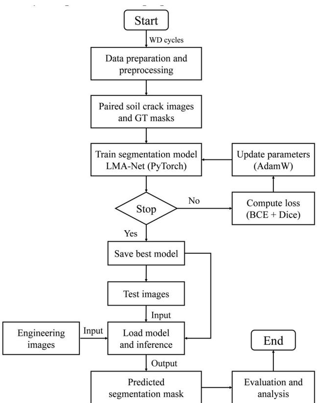  
FIGURE 1. The flowchart of the proposed method.

The overall architecture of LMA-Net is shown in Figure 2 and adopts a symmetric encoder-decoder design. The network takes a crack image $\begin{array} { l l l } { x } & { \in } & { R ^ { B \times 3 \times H \times W } } \end{array}$ as input and outputs a single-channel crack probability map. The encoder comprises four downsampling blocks (E1–E4) that progressively extract image features. At each stage, feature transformation is first performed by a convolutional block, followed by $\textbf { a } 2 \times 2$ max-pooling layer with stride 2 for downsampling, reducing the spatial resolution to 1/2, 1/4,1/8, and 1/16 of the input while increasing channels to 64, 128, 256, and 512, respectively. In the shallow encoder stages (E1 and E2), ResBlocks (Figure 2(a)) replace conventional convolutional blocks, in which residual connections stabilize gradient propagation and improve the discriminability of the learned representations. Each convolutional block is followed by an IGA module, which adaptively recalibrates shallow features with illumination-aware attention, enhancing crack-edge responses and suppressing interference from non-uniform illumination and shadows. To improve contextual modeling of cracks across different scales, the deeper encoder stages (E3 and E4) incorporate the MSF module, which consists of parallel atrous convolution branches with multiple dilation rates to capture multi-receptive-field information, followed by dynamic weighting for adaptive multiscale feature aggregation. Inspired by ResUNet++ [39], SE attention is embedded into residual blocks, forming SE-ResBlocks (Figure 2(b)) that recalibrate feature responses along the channel dimension to emphasize crack-related features while suppressing redundant background, thereby further enhancing deep feature selectivity and discriminability.

The decoder consists of four upsampling stages (D1–D4). Each stage applies a transposed convolution to double the feature-map resolution and performs skip connections with encoder features at the corresponding level to fuse shallow and deep information. At the D4, the upsampled features are concatenated with encoder features and processed by an SE-ResBlock to achieve preliminary fusion of deep semantic information and spatial details. In the intermediate stages, IGA is reapplied to the skip-connected features, ensuring robustness to illumination variations during decoding and reducing feature mismatches caused by inconsistent lighting. In the shallow decoding stages (D1 and D2), basic ResBlocks are used to progressively refine boundaries and fine-grained structures by incorporating more spatial information, restoring the resolution to the original input size. As shown in Figure 2(c), a final 1 × 1 convolution maps the features to a single channel, and a sigmoid activation produces the pixellevel crack-probability map, completing the end-to-end crack segmentation task.

Encoder–decoder architectures with skip connections are widely adopted for dense prediction tasks because they effectively balance local detail preservation and high-level semantic abstraction, which is critical for handling complex and heterogeneous data distributions. Recent studies have demonstrated that such encoder-based representations exhibit strong robustness and generalization capability in environmental and engineering applications involving noisy, multi-scale, and non-stationary data [40], [41], [42]. In addition, residual learning, as implemented through ResNet-style blocks, has been shown to significantly improve training stability and feature robustness by facilitating gradient propagation and mitigating representation degradation in deep networks, particularly in complex engineering image analysis scenarios [43]. Therefore, the adoption of an encoder–decoder architecture with residual blocks in LMA-Net provides a principled and well-established foundation for robust feature extraction in soil crack segmentation. In addition, uncertainty quantification has been increasingly discussed as a reliability-oriented perspective to complement robustness evaluation of machine learning models in heterogeneous and non-stationary environmental data settings [44].

Overall, LMA-Net retains the symmetric design and skipconnection advantages in U-Net, while synergistically integrating the IGA, MSF, and SE modules. This design enhances illumination robustness, multi-scale context modeling, and channel selectivity, thereby improving edge preservation and segmentation accuracy under complex environmental conditions.

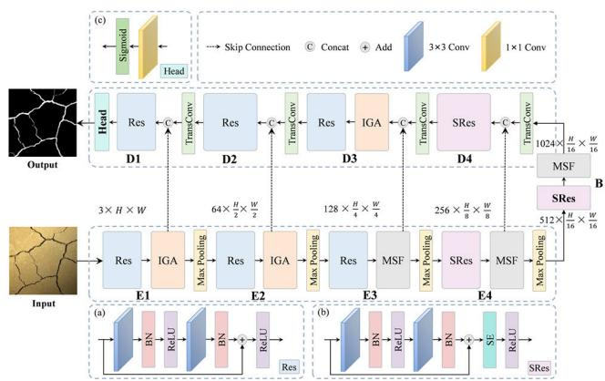  
FIGURE 2. Network structure of LMA-Net (a) ResBlock; (b) SE-ResBlock; (c) Output head.

## B. ILLUMINATION-GUIDED ATTENTION MODULE

Under complex illumination conditions, non-uniform lighting and shadows can significantly degrade the effective representations of segmentation models. Inspired by Retinex theory [45], an observed image can be decomposed into the product of a reflectance component R and an illumination component L:

$$
I (x, y) = R (x, y) \cdot L (x, y)\tag{1}
$$

The proposed IGA module explicitly estimates and exploits illumination priors in feature space to suppress illumination-induced degradation and enhance robustness. As shown in Figure 3, its structure consists of three components: illumination guidance map estimation, illuminationaware adaptive normalization fusion, and illumination-aware dual attention enhancement. The module takes encoder features $F ~ \in ~ R ^ { B \times C \times H \times W }$ as input. It first applies a 1 × 1 convolution for channel compression, followed by a $3 \times 3$ convolution with sigmoid activation, and generates the illumination guidance map $S \in R ^ { B \times 1 \times \bar { H } \times W }$ ,this process can be expressed as:

$$
S = \sigma (C o n v _ {3 \times 3} (C o n v _ {1 \times 1} (F)))\tag{2}
$$

where σ denotes the sigmoid function. The map S provides illumination priors for adaptive normalization fusion by generating the pixel-wise gating map α, and also supports subsequent attention enhancement.

In terms of normalization strategy, batch normalization (BN) normalizes features using batch statistics to improve training stability and feature consistency [46], but it is sensitive to appearance variations such as illumination and contrast. Instance normalization (IN) performs per-sample, per-channel normalization, which can effectively eliminate style variations such as illumination and contrast [47], though it may weaken discriminability. Combining the two allows the model to balance robustness and discriminability [48].

Therefore, IGA generates a pixel-wise gating map $\alpha \in$ $[ 0 , 1 ] ^ { B \times 1 \times H \times W }$ from S and performs adaptive normalization fusion to obtain illumination-robust normalized features $\hat { F }$ The computation can be described as follows:

$$
\alpha = \sigma (C o n v _ {1 \times 1} (S))\tag{3}
$$

$$
\hat {F} = \alpha \otimes I N (F) + (1 - \alpha) \cdot B N (F)\tag{4}
$$

where $\otimes$ denotes element-wise multiplication. In regions with severe illumination variations, a larger α enhances the invariance of IN, whereas in relatively uniform regions BN is emphasized to preserve discriminability. This design achieves a dynamic balance between illumination invariance and feature discriminability.

To further enhance feature selectivity, IGA integrates parallel channel and spatial attention mechanisms inspired by SE [49] and the convolutional block attention mechanism (CBAM) [50]. Specifically, channel attention computes global average pooling (GAP) and illumination-masked pooling, concatenates them, and feeds the result into a multi-layer perceptron (MLP) to obtain the channel attention map $M _ { C }$ Spatial attention concatenates the average map, maximum map of ${ \hat { F } } _ { : }$ , and the illumination map S, which are then processed by a $7 \times 7$ convolution with sigmoid activation to generate the spatial attention map $M _ { S }$ . Finally, the features are modulated element-wise by both channel and spatial attention maps and fused with the input through a residual connection to produce the output $F _ { o u t }$ . The process can be described as follows:

$$
M _ {C} = \sigma \left(M L P (\left[ G A P (\hat {F}), G A P (\hat {F} \cdot (1 - S)) \right])\right)\tag{5}
$$

$$
M _ {S} = \sigma \left(C o n v _ {7 \times 7} (\left[ A v g P o o l (\hat {F}), M a x P o o l (\hat {F}), S \right])\right)\tag{6}
$$

$$
F _ {o u t} = \hat {F} \otimes M _ {C} \otimes M _ {S} + F\tag{7}
$$

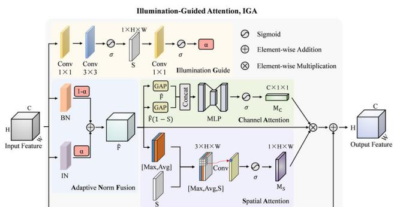  
FIGURE 3. Structure of IGA module.

## C. MULTI-SCALE FEATURE FUSION MODULE

The MSF module improves the network’s contextual modeling capability by extracting features with different receptive fields through parallel branches and adaptively fusing them, thereby enhancing the perception and representation of cracks of varying sizes. DeepLabv3+ [51] uses dilated (atrous) convolutions to enlarge the receptive field without increasing parameter count. Inspired by this design, the MSF module in this work incorporates three parallel dilated convolution branches to strengthen multi-scale feature representation. As illustrated in Figure 4, let the input feature be $F \in R ^ { B \times C \times H \times W }$ . Each branch contains a $3 \times 3$ convolution layer with dilation rates $d _ { i }$ set to 1, 2, and 4, respectively, followed by BN and ReLU activation. The output of each branch $\hat { F } _ { i }$ can be described as:

$$
\hat {F} _ {i} = R E L U (B N (C o n v _ {3 \times 3} ^ {d = d _ {i}} (F))), i = 1, 2, 3\tag{8}
$$

The output features ${ \hat { F } } _ { i }$ from each branch are stacked along the channel dimension, followed by $\textbf { a } 1 \times 1$ convolution to reduce the dimension to C/4 channels and a GELU activation. Another 1 × 1 convolution is then applied to map the features into three branch-weight channels, and softmax normalization is used to generate the weight map $W = [ \alpha _ { 1 } , \alpha _ { 2 } , \alpha _ { 3 } ] \in$ $R ^ { B \times 3 \times H \times W }$

$$
W = \text { Softmax } \left(\text { Conv } _ {1 \times 1} \left(\text { GELU } \left(\text { Conv } _ {1 \times 1} \text { Concat } \left(F _ {1} ^ {\prime}, F _ {2} ^ {\prime}, F _ {3} ^ {\prime}\right)\right)\right)\right)\tag{9}
$$

where, at any spatial location, the constraint $\alpha _ { 1 } + \alpha _ { 2 } +$ $\alpha _ { 3 } = 1$ holds.

Based on these weights, the three branch features are combined through element-wise weighted summation to produce the fused feature:

$$
F _ {f u s e d} = \sum_ {i = 1} ^ {3} \alpha_ {i} \otimes \hat {F} _ {i}\tag{10}
$$

where $\otimes$ denotes element-wise multiplication. To further enhance the representational capacity of the fused feature, a $1 \times 1$ convolution followed by BN and ReLU activation is applied, yielding the final output $F _ { o u t } \in R ^ { B \times C \times H \times W }$ , which can be expressed as:

$$
F _ {o u t} = R E L U (B N (C o n v _ {1 \times 1} (F _ {f u s e d})))\tag{11}
$$

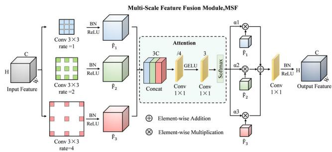  
FIGURE 4. Structure of the MSF module.

## D. RESIDUAL AND SQUEEZE-AND-EXCITATION BLOCKS

Increasing network depth may cause gradient vanishing and representation degradation, which adversely affect training stability and generalization. ResNet [52] introduces identity skip connections between the main and shortcut branches, facilitating information and gradient flow through deep layers. Residual architectures have been widely recognized for their ability to stabilize gradient propagation and improve feature representation in complex visual tasks, making them suitable for crack segmentation under challenging environmental conditions [43]. Residual blocks (ResBlocks) (Figure 5(b)) are adopted as the fundamental building units to replace conventional convolutional layers (Figure 5(a)). Each ResBlock consists of two $3 \times 3$ convolutional layers with stride 1, followed by BN and ReLU activation. This structure ensures strong feature extraction ability while effectively improving the training stability and generalization of deep networks.

However, residual structures treat spatial and channel dimensions equally, without fully considering the varying importance of different channels. In crack segmentation tasks, different channels may exhibit varying sensitivity to crack edges, background regions, or illumination variations. To address this limitation, the SE module (Figure 5(c)) [49] is introduced to achieve channel-wise adaptive recalibration. As illustrated in Figure 5(d), the SE module first applies global average pooling (squeeze) to compress spatial features into a channel descriptor, then passes the descriptor through two fully connected layers with nonlinear activation (excitation) to capture inter-channel dependencies, generating a channel weight vector. Finally, channel-wise weighting (recalibration) is applied to enhance feature representations. This process can be formulated as:

$$
F _ {S E} = \sigma (F C _ {2} \delta (F C _ {1} \cdot G A P (F))) \otimes F\tag{12}
$$

where GAP denotes global average pooling, $F C _ { 1 }$ and $F C _ { 2 }$ represent fully connected layer weights, δ is the ReLU activation, σ is the sigmoid function, and ⊗ indicates channel-wise multiplication.

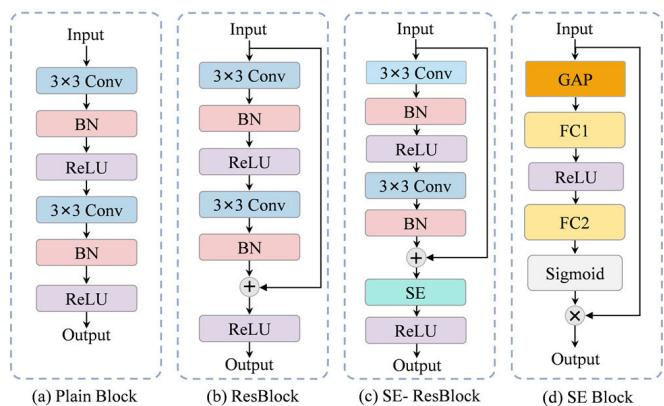  
FIGURE 5. Structure of convolutional and residual blocks: (a) Plain block; (b) ResBlock; (c) SE-ResBlock; (d) SE Block.

## E. LOSS FUNCTION

A hybrid loss function combining binary cross-entropy (BCE) and Dice loss is employed to ensure pixel-level classification accuracy and optimize region overlap under class-imbalance scenarios. BCE improves global probability calibration and background discrimination, whereas Dice is more sensitive to small or slender crack regions, alleviating the imbalance where crack pixels are far fewer than background pixels. Since soil crack segmentation is essentially a binary segmentation task, BCE loss is adopted to optimize the segmentation network. $L _ { B C E }$ is described as follows:

$$
\begin{array}{c} L _ {B C E} = - \frac {1}{h \times w} \sum_ {(x, y)} [ y _ {(x, y)} \times l o g (p _ {(x, y)}) \\ + (1 - y _ {(x, y)}) \times l o g (1 - p _ {(x, y)}) ] \end{array}\tag{13}
$$

where $( h , w )$ is the image size, $( x , y )$ denotes the pixel coordinate, $y _ { ( x , y ) } \in [ 0 ,$ , 1] is the ground truth, and $p _ { ( x , y ) } \in [ 0 , 1 ]$ represents the predicted probability.

Since soil cracks are typically fine and narrow, the number of crack pixels in an image is substantially smaller than that of non-crack pixels, leading to a class imbalance problem. Using L alone may cause the network to prioritize background regions, thereby reducing the accuracy of crack identification. Dice loss is suitable for handling class imbalance, as it calculates the overlap between the predicted region and the ground-truth crack region, effectively improving the model’s recognition accuracy for small crack areas. Particularly under complex illumination conditions, where crack details may be affected, Dice loss function $L _ { D i c e }$ is more sensitive to crack-region details, thus enhancing the model’s segmentation capability for crack pixels. $L _ { D i c e }$ is described as follows:

$$
L _ {D i c e} = 1 - \frac {2 \sum_ {(x , y)} [ p _ {(x , y)} \times y _ {(x , y)} ] + \epsilon}{\sum_ {(x , y)} p _ {(x , y)} + \sum_ {(x , y)} y _ {(x , y)} + \epsilon}\tag{14}
$$

where $\epsilon$ is a smoothing term to avoid division by zero and ensure numerical stability, typically set to $1 0 ^ { - 5 }$ . Therefore, a hybrid loss combining BCE and Dice losses is adopted. The final loss function can be expressed as:

$$
L = L _ {B C E} + L _ {D i c e}\tag{15}
$$

## III. DATASET PREPARATION AND PREPROCESSING A. DATASET PREPARATION

To simulate subgrade soil cracking under natural environmental conditions, expansive soil WD cycles were prepared in the laboratory, with experimental conditions set at different temperatures and cycle numbers to obtain diverse crack patterns [53], [54]. The soil samples used in this study were collected from Harbin, Heilongjiang Province, China. Accordingly, the constructed dataset primarily reflects expansive-soil crack characteristics from this region under laboratory-controlled wetting-drying cycles, and its geographic and environmental coverage is limited. The soil type is expansive soil, with an optimum moisture content of 13.34% and a maximum dry density of $1 . 9 1 \ \mathrm { \ g } / \mathrm { c m } ^ { 3 }$ The crack preparation procedure was designed as follows: the raw soil was first dried, crushed, and sieved through a 2 mm mesh (Figure 6(a)). Water was then added to reach the optimum moisture content, and the soil was uniformly compacted into molds at 90% of the maximum dry density $( 1 . 7 1 9 \mathrm { g } / \mathrm { c m } ^ { 3 } )$ , forming disc-shaped specimens with a diameter of 29 cm and a height of 2 cm (Figure 6(b)). Filter paper was placed at the bottom of the mold to prevent soil particle loss during the experiment. The specimens were sealed and cured for 24 h to ensure uniform moisture distribution.

The WD cycle procedure was conducted as follows: in the wetting stage, simulated rainfall was achieved by spraying misted water onto the specimen surface. After saturation, the specimens were placed in a standard constant-temperature– humidity curing chamber (SHBY-60B) at $2 0 ~ ^ { \circ } \mathrm { C }$ and relative humidity $0 \mathrm { f } 9 0 \pm 5 \%$ for 1 h to allow uniform water diffusion. Subsequently, the specimens were dried in a thermostatic oven to the lower moisture limit, with drying temperatures set to 25 ◦, 35 ◦, and $4 5 ^ { \circ }$ . Once the target weight was reached, the soil specimens were rewetted. Based on previous studies, the number of WD cycles was set to 6, since it has been reported that the influence of WD cycles on soil cracking tends to stabilize after more than 5 cycles [54].

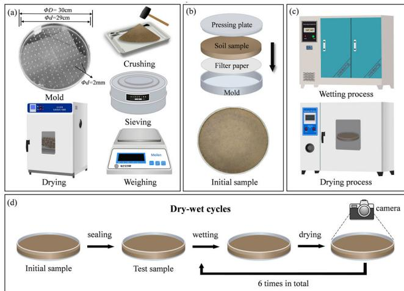  
FIGURE 6. Sample preparation and WD cycles procedure.

To construct a crack image dataset that reflects complex outdoor illumination conditions, multiple illumination scenarios were configured in the laboratory. Crack images were captured using an iPhone 15 Pro Max rear camera with a primary imaging configuration of 24 mm equivalent focal length and an aperture of f/1.78. The original image resolution was 3024 × 3024 pixels, and all images were subsequently cropped and resized to $1 0 2 4 \times 1 0 2 4$ pixels prior to model processing to balance fine-detail preservation and computational efficiency, as higher resolutions would significantly increase GPU memory consumption and training time. The specific illumination settings were as follows: (1) vertical illumination without occlusion (Figure 7(a)); (2) vertical illumination with regular occlusion (Figure 7(b)); (3) vertical illumination with irregular occlusion (Figure 7(c)); (4) oblique illumination with regular occlusion (Figure 7(d)); (5) oblique illumination with irregular occlusion (Figure 7(e)); and (6) oblique illumination without occlusion (Figure 7(f)). The brightness of the light source was adjustable to simulate different illumination intensities, and a standardized capture workflow was adopted by keeping the camera viewpoint and shooting distance consistent within each illumination scenario to reduce unintended variability. Images were captured after the crack patterns became clearly visible, and blurred or low-quality images were excluded during dataset screening.

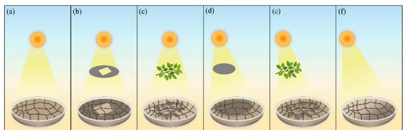  
FIGURE 7. Soil crack image collection under complex illumination conditions.

## B. DATA PREPROCESSING

For soil crack recognition under complex illumination conditions, a total of 164 raw images were captured under various lighting settings and manually annotated using Labelme to generate the corresponding ground-truth masks, where crack regions were labeled as 255 and background regions as 0. After cropping and resizing the raw $3 0 2 4 \times 3 0 2 4$ images, 164 preprocessed full-image inputs of $1 0 2 4 \times 1 0 2 4$ were obtained for model development. These preprocessed full images were then divided at the image level into training, validation, and test sets under a 6:2:2 protocol, yielding 98 training images, 32 validation images, and 34 test images. The 34 test images were reserved exclusively for full-image inference and evaluation, ensuring consistency with practical deployment scenarios.

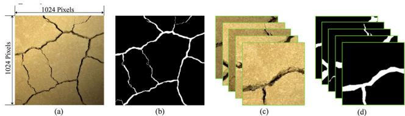  
FIGURE 8. Dataset construction workflow: (a) preprocessed full image, 1024× 1024 pixels; (b) ground truth, 1024 ×1024 pixels; (c) cropped image patches, 256 × 256 pixels;(d) cropped ground truth patches, 256 × 256 pixels.

During the training and validation phases, directly using full-image inputs can substantially increase GPU memory consumption and computational cost, whereas simply downscaling the resolution may lead to the loss of important fine-crack information. To balance efficiency and detail preservation, the training and validation images were randomly cropped into $2 5 6 \times 2 5 6$ patches. Patch extraction was applied only after the image-level split and only to the training and validation subsets. Only crack-containing patches were retained, whereas crack-free patches were discarded. Because only crack-containing patches were retained, the number of retained patches per full image was not fixed. This process resulted in 1,215 training patches and 405 validation patches, while the 34 test images remained as full-image inputs and were not used for patch extraction or data augmentation. This test-set size follows directly from the image-level 6:2:2 split of the 164-image dataset and the labor-intensive nature of manual pixel-level annotation. Although limited in size, the full-image test set covers multiple complex illumination conditions within the current dataset and therefore provides a meaningful benchmark under the present experimental setting. The details of each subset are listed in Table 1.

TABLE 1. Details of image-level dataset splitting and patch extraction fo the soil crack dataset.

<table><tr><td>Dataset split</td><td>Preprocessed full images (1024×1024)</td><td>Extracted patches (256×256)</td><td>Augmentation (online)</td></tr><tr><td>Training set</td><td>98</td><td>1215</td><td>Yes (training only)</td></tr><tr><td>Validation set</td><td>32</td><td>405</td><td>No</td></tr><tr><td>Test set</td><td>34</td><td>0</td><td>No</td></tr><tr><td>Total</td><td>164</td><td>1620</td><td>N/A</td></tr></table>

Note: Raw captured images originally had a resolution of 3024 × 3024 and were cropped and resized to 1024 × 1024 before model development Dataset splitting was performed at the preprocessed full-image level (6:2:2) prior to patch extraction. Extracted patches were derived only from the training and validation sets. Augmentation was applied online during training and did not alter the dataset size reported in this table,

Crack pixels account for only 5.3% of the total pixels in the 1,215 training patches $( 2 5 6 \times 2 5 6 )$ , while background pixels account for the remaining 94.7%, corresponding to an imbalance ratio of approximately 17.9:1 (background:crack). Under such imbalance, pixel accuracy can be misleadingly high because it is dominated by the majority background class. For instance, a trivial all-background prediction would still yield an accuracy of approximately 94.7% while failing to detect cracks. Therefore, overlap-based metrics such as IoU and F1-score are emphasized to provide a more informative assessment of thin-crack segmentation performance under highly imbalanced pixel distributions. In this study, only crack-containing patches were retained after cropping, so as to avoid the training process being dominated by large background-only regions and to ensure sufficient learning of crack-related patterns in patch-based training.

To improve training performance and mitigate overfitting, online data augmentation was applied to training patches only, while the validation and test sets were not augmented to maintain a consistent evaluation protocol. A fixed application order was used. Geometric transformations were applied first, including horizontal flip, random rotation, and random scaling. Photometric adjustment was applied next, including brightness and contrast modification. Cutout was applied last to simulate occlusion. Specifically, horizontal flip was applied with probability $\mathrm { p } = 0 . 5$ . Random rotation was applied with $\mathrm { p } = 0 . 5 ,$ , with the rotation angle uniformly sampled from $[ - 1 5 ^ { \circ } , + 1 5 ^ { \circ } ]$ . Random scaling was applied with $\mathrm { p } = 0 . 5$ , with the scale factor uniformly sampled from [0.8, 1.2]. Brightness and contrast adjustment was applied with $\mathrm { p } = 0 . 5$ , where brightness was adjusted by a factor uniformly sampled from [0.8, 1.2] and contrast was adjusted by a factor uniformly sampled from [0.8, 1.2]. Cutout was applied with p = 0.5 using one square mask per patch, with side length uniformly sampled from [32, 96] pixels and placed at a random location. Geometric transformations were applied synchronously to the input image patch and its corresponding ground truth mask to maintain pixel-wise alignment during training, whereas photometric adjustment and cutout were applied to the image only.

To enable exact replication, the complete preprocessing pipeline is summarized as follows: (1) manual annotation and mask encoding (crack = 255, background = 0); (2) original-image-level dataset split (6:2:2); (3) preparation of model inputs (training/validation: $2 5 6 ~ \times ~ 2 5 6$ patches; testing: $1 0 2 4 \times 1 0 2 4$ full images); (4) training-only online augmentation with a fixed application order, while validation and test data remain unaugmented; (5) tensor conversion and normalization to [0, 1] prior to network input. For implementation consistency, image resizing uses bilinear interpolation, whereas mask resizing uses nearest-neighbor interpolation.

## IV. EXPERIMENTS

## A. IMPLEMENTATION DETAILS

All models were implemented in PyTorch (v2.8.0) using Python 3.12.11. Training was performed on a Windows 10 machine, and AdamW was used for optimization. The detailed configurations are summarized in Table 2. The configurations summarized in Table 2 correspond to the shared training hyperparameters and runtime environment used consistently for the proposed method and all baseline models. To support fair comparison, all methods were trained under the same data split, augmentation policy, optimization setup, and training budget. In addition, encoder–decoder depth and channel-width scaling were standardized across baselines wherever supported by the implementation.

During testing, each full-resolution test image is directly fed into the network at 1024 × 1024 resolution, and the model outputs a pixel-wise prediction map at the same resolution. No sliding-window inference (stride/overlap) or patch-wise aggregation/stitching strategy is used in this study. This direct full-image inference avoids window scanning and prediction stitching, resulting in a simpler and faster inference pipeline, and it better reflects practical engineering scenarios where full images are processed end-to-end.

Early stopping was not used in this study. All models were trained for a fixed budget of 100 epochs. Validation was conducted once per epoch, and the checkpoint achieving the highest validation Dice score was selected as the final model for testing. Baseline fairness was ensured by using identical data splits, identical training-only augmentation, and the same training budget and optimization configuration across all methods, without model-specific hyperparameter tuning beyond the shared setup.

Reproducibility and uncertainty reporting. Each experiment was repeated using five different random seeds (0, 42, 123, 777, and 1000), and all quantitative results reported in this section are presented as mean ± standard deviation across these runs. The random seeds were applied consistently to Python, NumPy, and PyTorch random number generators to control stochastic components such as weight initialization, dataset shuffling, and augmentation sampling. CuDNN was configured in deterministic mode and benchmark mode was disabled.

TABLE 2. Hardware, software, and shared training hyperparameters used across the proposed method and all baseline models.

<table><tr><td>Category</td><td>Item</td><td>Specification</td></tr><tr><td rowspan="3">Hardware</td><td>CPU</td><td>Intel Core i5-13400F</td></tr><tr><td>GPU</td><td>NVIDIA GeForce RTX 4070</td></tr><tr><td>RAM</td><td>32 GB</td></tr><tr><td rowspan="4">Software</td><td>Operating system</td><td>Windows 10</td></tr><tr><td>Python</td><td>3.12.11</td></tr><tr><td>Torch</td><td>2.8.0</td></tr><tr><td>CUDA</td><td>12.6</td></tr><tr><td rowspan="7">Training strategy</td><td>Optimizer</td><td>AdamW</td></tr><tr><td>Batch size</td><td>8</td></tr><tr><td>Scheduler</td><td>CosineAnnealingLR</td></tr><tr><td>Initial learning rate</td><td>2 × 10-4</td></tr><tr><td>Epochs</td><td>100</td></tr><tr><td>Weight decay</td><td>1 × 10-4</td></tr><tr><td>Loss function</td><td>Hybrid loss (BCE + Dice)</td></tr></table>

To further illustrate the convergence behavior of the optimization objective, the training and validation loss curves of LMA-Net are shown in Figure 9. Both curves exhibit an overall downward trend during training and enter a relatively stable phase after approximately 60 epochs, indicating stable convergence under the adopted training setting. Considering that the subsequent loss changes are relatively small, a fixed training budget of 100 epochs was adopted to ensure sufficient convergence while maintaining a consistent and fair training protocol for all compared models. This behavior is also consistent with the metric-based trends observed in the F1-score and IoU curves.

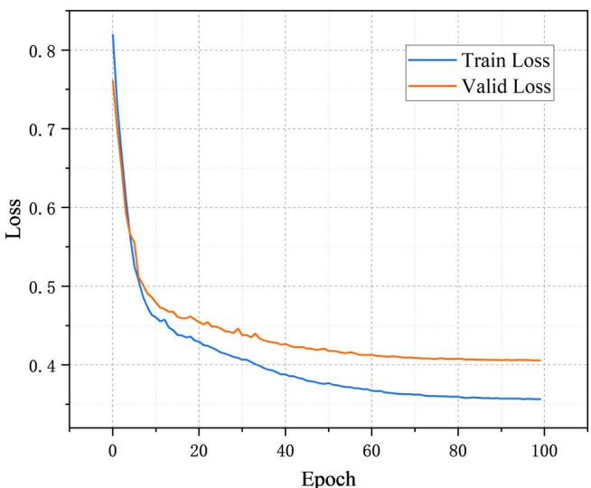  
FIGURE 9. Training and validation loss curves of LMA-Net.

## B. EVALUATION METRICS

To evaluate the performance of the crack image segmentation model, four commonly used evaluation metrics were adopted in this study, namely Precision (Pr), Recall (Re), Intersection over Union (IoU), and F1-score. The formulas of these metrics are defined as follows:

$$
P _ {r} = \frac {T P}{T P + F P}\tag{16}
$$

$$
R e = \frac {T P}{T P + F N}\tag{17}
$$

$$
I o U = \frac {T P}{\substack {T P + F P + F N \\ 2 T P}}\tag{18}
$$

$$
F 1 = \frac {2 T P}{2 T P + F P + F N} = \frac {2 P R}{P + R}\tag{19}
$$

where TP denotes true positives (the number of crack pixels correctly predicted as cracks), FP denotes false positives (the number of non-crack pixels incorrectly predicted as cracks), and FN denotes false negatives (the number of true crack pixels that were not correctly identified).

To compute these metrics, the network outputs a pixelwise probability map, which is converted into a binary mask using a fixed threshold of 0.5. Pixels with predicted probability ≥ 0.5 are classified as cracks, and the remainder as background. This commonly used threshold ensures a consistent evaluation protocol across all compared methods. No post-processing is applied to the predicted masks prior to metric computation.

## C. COMPARATIVE STUDY

To evaluate the effectiveness of the proposed method, several representative pixel-level segmentation networks from recent years were selected for comparison, including U-Net [20], SegNet [16], PSPNet [55], DeepLabv3+ [51], Attention U-Net [21], UNet++ [23], Res-UNet [56], and DeepCrack [57], and TransUNet [58]. These comparison models cover both conventional CNN-based segmentation architectures and a representative hybrid CNN–Transformer framework. These baseline models were selected because they share similar encoder–decoder paradigms or feature extraction hierarchies with LMA-Net, enabling a fair and methodologically consistent comparison within the same modeling framework. These methods represent different network design strategies: U-Net and SegNet adopt the classical encoder–decoder architecture; PSPNet and DeepLabv3+ focus on multi-scale context aggregation; Attention U-Net introduces the attention mechanism; UNet++ and Res-UNet optimize feature fusion through nested skip connections and residual structures, respectively; DeepCrack is a network specifically designed for crack segmentation; and TransUNet combines Transformer-based global context modeling with a U-Net-style decoding structure, serving as a representative hybrid CNN–Transformer baseline.

All models were evaluated under the same experimental conditions to ensure fair comparison. The variation curves of F1-score and IoU with epochs for the ten networks during training are shown in Figures 10 and 11. This convergence trend is also consistent with the loss curves of LMA-Net shown in Figure 9. All models entered a relatively stable phase after about 60 epochs, while 100 epochs was retained as a uniform training budget for fair comparison. After convergence, LMA-Net achieved the highest F1-score and IoU, indicating superior accuracy under the current dataset and evaluation setting.

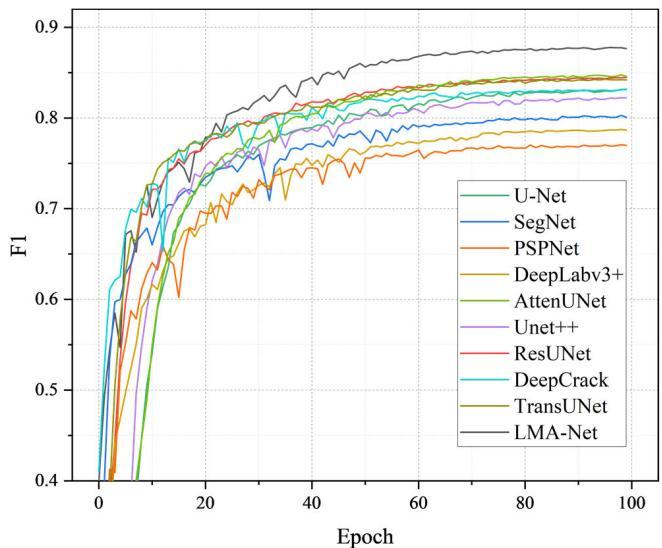  
FIGURE 10. Variation of F1-score during model training.

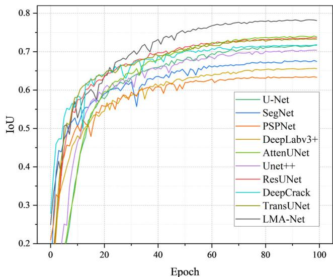  
FIGURE 11. Variation of IoU during model training.

The quantitative comparison results of the above models on the test set are presented in Table 3. The results indicate that the proposed LMA-Net achieved the best performance across all evaluation metrics, outperforming the existing comparative segmentation networks. Specifically, the Precision reached 89.27%, Recall 86.45%, IoU 78.74%, and F1-score 87.83%. Compared with the suboptimal model Attention U-Net, LMA-Net improved the F1-score by 3.07% and IoU by 4.64%, demonstrating stronger stability and accuracy under complex illumination conditions and multi-scale crack scenarios. The inclusion of TransUNet further broadens the comparative scope beyond conventional CNN-based methods and provides a stronger reference for assessing the competitiveness of LMA-Net against a representative hybrid CNN–Transformer segmentation framework.

These comparative results indicate that the added benefit of LMA-Net lies not only in overall accuracy improvement, but also in its enhanced ability to preserve fine crack continuity and suppress illumination-induced false responses, which are common limitations reported in existing crack segmentation studies.

TABLE 3. Performance comparison of different models.

<table><tr><td>Models</td><td>Pr(%)</td><td>Re(%)</td><td>IoU(%)</td><td>F1(%)</td></tr><tr><td>U-Net</td><td>84.50 ± 0.61</td><td>82.20 ± 1.24</td><td>71.88 ± 0.42</td><td>83.28 ± 0.26</td></tr><tr><td>SegNet</td><td>83.61 ± 0.47</td><td>77.34 ± 0.53</td><td>67.71 ± 0.28</td><td>80.28 ± 0.17</td></tr><tr><td>PSPNet</td><td>77.99 ± 1.83</td><td>75.98 ± 1.22</td><td>63.34 ± 1.05</td><td>76.90 ± 0.84</td></tr><tr><td>DeepLabv3+</td><td>80.92 ± 1.79</td><td>76.68 ± 1.18</td><td>65.57 ± 0.98</td><td>78.65 ± 0.77</td></tr><tr><td>AttenUNet</td><td>87.39 ± 1.67</td><td>82.40 ± 1.61</td><td>74.10 ± 1.52</td><td>84.76 ± 0.97</td></tr><tr><td>UNet++</td><td>84.05 ± 0.52</td><td>80.82 ± 0.93</td><td>70.57 ± 0.64</td><td>82.33 ± 0.41</td></tr><tr><td>Res-UNet</td><td>87.49 ± 0.43</td><td>81.86 ± 0.51</td><td>73.68 ± 0.48</td><td>84.51 ± 0.32</td></tr><tr><td>DeepCrack</td><td>85.68 ± 0.97</td><td>80.97 ± 0.56</td><td>71.82 ± 0.39</td><td>83.19 ± 0.33</td></tr><tr><td>TransUNet</td><td>87.42 ± 0.36</td><td>81.39 ± 0.47</td><td>73.28 ± 0.41</td><td>84.22 ± 0.29</td></tr><tr><td>LMA-Net</td><td>89.27 ± 0.29</td><td>86.45 ± 0.26</td><td>78.74 ± 0.43</td><td>87.83 ± 0.22</td></tr></table>

Note: Results are reported as mean ± standard deviation.

Figure 12 shows the visualization results of six soil crack images from the test set under different illumination and shadow conditions. The first row presents the original images, the second row displays the ground truth (GT), and the remaining rows show the segmentation results obtained by different methods. To facilitate a clearer comparison, representative false segmentations and missed detections are explicitly highlighted using red and blue boxes, respectively.

It can be observed that PSPNet and DeepLabv3+ are more prone to false positives near fine cracks adjacent to porous or textured backgrounds, particularly under shadowed conditions. Other comparative models exhibit discontinuities and missed detections on thin cracks, with insufficient structural continuity, and tend to misclassify crack pixels within shadow regions as background. In contrast, LMA-Net produces fewer false positives and false negatives in the highlighted regions, yielding clearer crack edges and more complete crack structures with higher consistency to the GT. The advantage becomes more evident in thin and micro-crack segmentation as well as under non-uniform illumination and shadow interference, where LMA-Net maintains stable crack connectivity and boundary integrity. These highlighted challenging regions make performance differences that are not immediately apparent at the full-image scale more explicit, demonstrating LMA-Net’s superior robustness in thin and shadowed crack scenarios.

To further illustrate the remaining limitations of the proposed method, representative failure cases from the test set are shown in Figure 13. Two typical error scenarios can be observed. In the first case, some crack edges are difficult to distinguish from the surrounding background because local intensity transitions resemble true crack boundaries. In the second case, extremely thin crack branches with very weak contrast are not completely detected, as their responses can be suppressed under complex illumination conditions. Although these situations occur only in a limited number of challenging regions, they indicate that ambiguous crack–background boundaries and very weak crack signals can still affect the segmentation reliability of the proposed method.

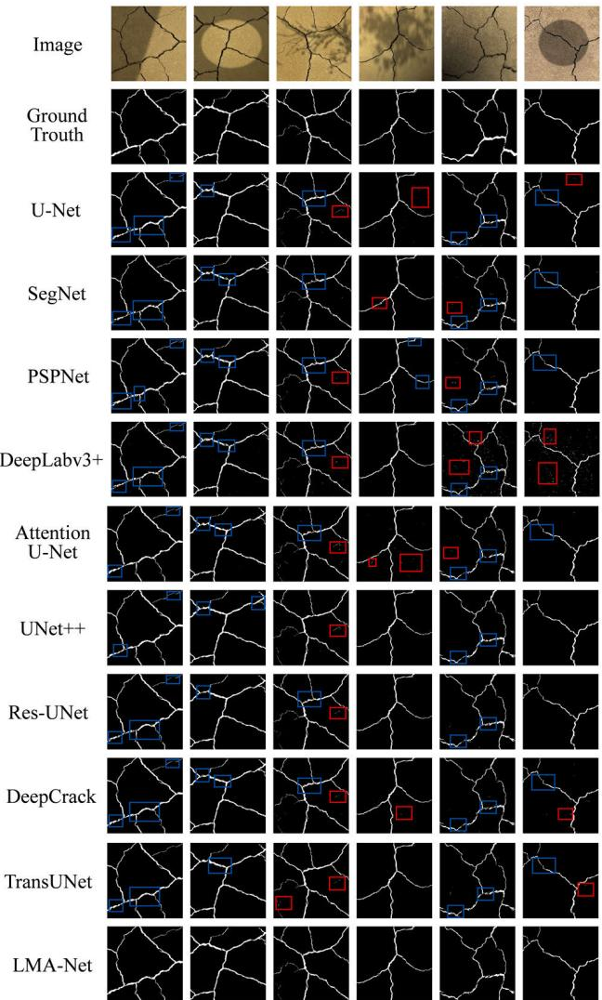  
FIGURE 12. Visual comparisons of different models (Red boxes highlight typical false segmentations, and blue boxes highlight missed segmentations).

These failure cases suggest that the remaining segmentation errors mainly arise from two factors: visual ambiguity between crack boundaries and surrounding background structures, and weak responses from extremely thin crack branches under non-uniform illumination. Although LMA-Net improves robustness under complex lighting conditions, further improvement is still needed in distinguishing ambiguous crack–background boundaries and enhancing sensitivity to very weak crack signals.

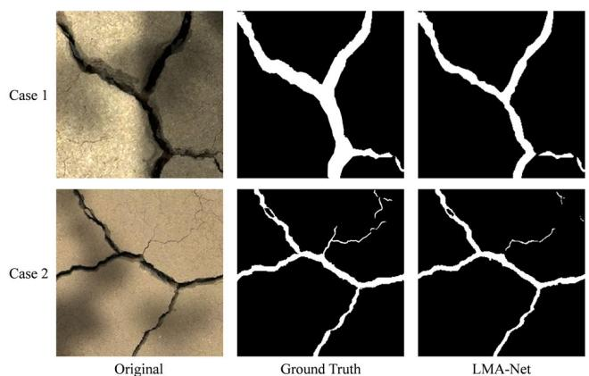  
FIGURE 13. Failure cases of LMA-Net include: (failure case 1) crack edges that are difficult to distinguish from the surrounding background, and (failure case 2) incomplete segmentation of extremely thin crack branches.

## D. MODEL COMPLEXITY

To evaluate the deployment-related efficiency of LMA-Net, the computational complexity of various segmentation models was compared using an input tensor of size 3 × 256 × 256. The evaluation metrics included floating-point operations (FLOPs), parameter count (Params), and inference speed measured in frames per second (FPS). Table 4 summarizes these metrics under the same settings. The FPS values were measured on the NVIDIA GeForce RTX 4070 platform described in Section IV-A using single-image full-resolution inference.

LMA-Net requires 59.973 G FLOPs and has 32.322 M parameters, placing it in the mid-range for compute and size. Compared with PSPNet (65.698 M) and DeepLabv3+ (54.747 M), LMA-Net is more compact in parameter size. In FLOPs, LMA-Net is significantly lower than the computation-intensive models UNet++ (138.661 G FLOPs) and DeepCrack (147.881 G FLOPs), demonstrating superior computational efficiency and deployment-friendliness. In terms of runtime performance, LMA-Net also achieves competitive inference speed while maintaining high segmentation accuracy. The measured FPS values, together with Params and FLOPs, demonstrate that the proposed method provides a favorable balance between segmentation performance and deployment efficiency under the current hardware setting. Compared with U-Net and SegNet, LMA-Net shows slightly higher Params and FLOPs; however, combined with the accuracy improvements reported in Table 3, it achieves more significant performance gains with only a modest increase in complexity. When compared with Attention U-Net, LMA-Net delivers higher IoU and F1 while maintaining nearly equivalent parameter counts and similar FLOPs.

## E. ABLATION STUDY

To systematically verify the effectiveness of each key component of LMA-Net, ablation experiments were conducted on the self-constructed soil crack dataset. The experiments adopted the control variable method, in which specific modules were removed or added to the complete model to ensure that only a single factor was examined at a time. In addition, incremental experiments were performed by starting from the baseline model and sequentially introducing the Residual, SE, IGA, and MSF modules to observe the performance evolution process. All experiments were carried out under the same data split and training configuration, with Pr, Re, IoU, and F1-score used as the main evaluation metrics.

TABLE 4. Comparison of model complexity across different networks.

<table><tr><td>Models</td><td>Params (M)</td><td>FLOPs (G)</td><td>FPS</td></tr><tr><td>U-Net</td><td>31.044</td><td>54.738</td><td>26</td></tr><tr><td>SegNet</td><td>29.444</td><td>40.131</td><td>32</td></tr><tr><td>PSPNet</td><td>65.698</td><td>65.724</td><td>18</td></tr><tr><td>DeepLabv3+</td><td>54.747</td><td>61.000</td><td>22</td></tr><tr><td>AttenUNet</td><td>32.436</td><td>57.499</td><td>22</td></tr><tr><td>UNet++</td><td>36.630</td><td>138.661</td><td>12</td></tr><tr><td>Res-UNet</td><td>31.395</td><td>55.847</td><td>25</td></tr><tr><td>DeepCrack</td><td>30.031</td><td>147.881</td><td>11</td></tr><tr><td>TransUNet</td><td>93.527</td><td>51.683</td><td>9</td></tr><tr><td>LMA-Net</td><td>32.322</td><td>59.973</td><td>24</td></tr></table>

Note: Params are independent of input size; FLOPs are computed using an input tensor of size 3 × 256 × 256; FPS is measured by single-image fullresolution (1024 × 1024) inference on an NVIDIA GeForce RTX 4070.

Unless otherwise stated, the quantitative results in this subsection are also reported as mean ± standard deviation over the five repeated runs described in Section IV-A. Across different ablation settings, the complete model consistently achieves higher mean performance than the corresponding variant models, supporting the positive contribution of the proposed architectural components under the repeated-run protocol used in this study.

## 1) CONTRIBUTION OF RESIDUAL AND SE BLOCKS

To evaluate the contribution of residual connections and deep SE-ResBlocks to model performance, two ablation experiments were conducted based on the complete model. In the first setting, both SE and Residual structures were removed and replaced with standard convolutional blocks. In the second setting, all Residual structures were preserved, but SE modules in the deep residual blocks were removed, i.e., ResBlocks replaced SE-ResBlocks, while other settings remained unchanged. The results are presented in Table 5.

TABLE 5. Effect of residual and SE blocks on model performance.

<table><tr><td>Methods</td><td>Pr(%)</td><td>Re(%)</td><td>IoU(%)</td><td>F1(%)</td></tr><tr><td>w/o SE-Res</td><td>88.89 ± 0.52</td><td>83.58 ± 0.58</td><td>76.11 ± 0.63</td><td>86.12 ± 0.47</td></tr><tr><td>w/o SE</td><td>89.45 ± 0.36</td><td>85.27 ± 0.41</td><td>76.96 ± 0.46</td><td>86.78 ± 0.32</td></tr><tr><td>w/ SE-Res</td><td>89.27 ± 0.29</td><td>86.45 ± 0.26</td><td>78.74 ± 0.43</td><td>87.83 ± 0.22</td></tr></table>

Note: w/ indicates "with", and w/o indicates “without".

After removing the deep SE modules, the F1-score decreased from 87.83% to 86.78% and IoU dropped from

78.74% to 76.96%, indicating that channel recalibration in deeper layers contributes positively to crack feature discrimination. When all residual-SE blocks were replaced with standard convolutional blocks, the F1-score further decreased to 86.12% and IoU to 76.11%, which further demonstrates that residual connections and SE modules jointly improve feature representation and crack segmentation performance. Taken together, these results demonstrate the positive contribution of both residual connections and SE blocks in the final model.

## 2) EFFECT OF IGA MODULE

To verify the effectiveness of the IGA module under complex illumination conditions, experiments with and without IGA were compared, as shown in Table 6. Removing the IGA module reduced the F1-score by 1.86% (from 87.83% to 85.97%) and IoU by 2.90% (from 78.74% to 75.84%). These results demonstrate the effectiveness of the IGA module in alleviating interference caused by illumination variations and improving segmentation performance under the repeatedrun setting used in this study. The qualitative visualizations in Figure 14 are consistent with this quantitative trend.

TABLE 6. Performance comparison with and without the IGA module.

<table><tr><td>Methods</td><td>Pr(%)</td><td>Re(%)</td><td>IoU(%)</td><td>F1(%)</td></tr><tr><td>w/o IGA</td><td>88.53 ± 0.52</td><td>83.61 ± 0.50</td><td>75.84 ± 0.46</td><td>85.97 ± 0.43</td></tr><tr><td>w/ IGA</td><td>89.27 ± 0.29</td><td>86.45 ± 0.26</td><td>78.74 ± 0.43</td><td>87.83 ± 0.22</td></tr></table>

Note: w/ indicates “with", and w/o indicates "without".

To further interpret the contribution of the illuminationguided attention (IGA) module, Figure 14 visualizes the attention maps produced by IGA on representative test images with strong illumination variations, including shadow boundaries, local overexposure, and mottled shading. The illumination attention map in Figure 14(c) clearly responds to the illumination field (e.g., shadow/bright regions), indicating that IGA is able to capture illumination-related patterns and provide an explicit mechanism to suppress illuminationinduced interference. In contrast, the spatial attention map in Figure 14(d) consistently emphasizes crack structures, including thin and low-contrast crack branches, while assigning lower responses to textured or shadowed background regions. Consequently, the IGA-enhanced feature response in Figure 14(e) exhibits stronger and more continuous activations along cracks with reduced background responses, providing visual evidence that IGA improves illumination robustness and supports the quantitative gains observed in the ablation study.

## 3) EFFECT OF MSF MODULE

To evaluate the effectiveness of the MSF module, experiments with and without MSF were conducted, and the results are shown in Table 7. Removing the MSF module reduced the F1-score by 2.04% (from 87.83% to 85.79%) and IoU by 3.10% (from 78.74% to 75.64%), with clear declines observed across all evaluation metrics. These results demonstrate that the MSF module effectively enhances the model’s multi-scale feature representation, enabling better perception of cracks of different sizes and thereby improving the robustness and generalization performance of the segmentation task.

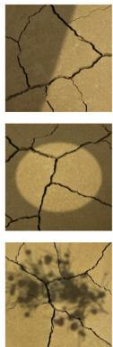  
(a)

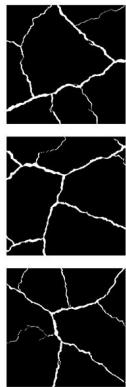  
(b)

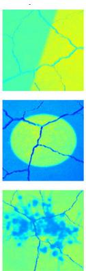  
(c)

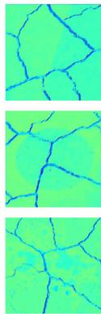  
(d)

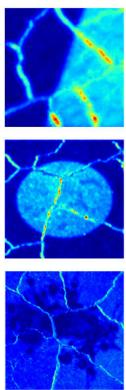  
(e)  
FIGURE 14. Visualization of attention maps generated by the illumination-guided attention (IGA) module. (a) Input image; (b) ground truth; (c) illumination attention map; (d) spatial attention map; (e) feature map with IGA.

TABLE 7. Performance comparison with and without the MSF module.

<table><tr><td>Methods</td><td>Pr(%)</td><td>Re(%)</td><td>IoU(%)</td><td>F1(%)</td></tr><tr><td>w/o MSF</td><td>88.19 ± 0.45</td><td>83.59 ± 0.49</td><td>75.64 ± 0.51</td><td>85.79 ± 0.42</td></tr><tr><td>w/ MSF</td><td>89.27 ± 0.29</td><td>86.45 ± 0.26</td><td>78.74 ± 0.43</td><td>87.83 ± 0.22</td></tr></table>

Note: w/ indicates "with", and w/o indicates "without".

4) PERFORMANCE EVOLUTION OF CUMULATIVE ABLATION To further determine the contribution of each component in the proposed method to segmentation accuracy, this section conducts ablation studies with various network configurations. Building upon the single-factor comparisons described above, an incremental strategy was employed, starting from the U-Net baseline and sequentially introducing the Residual, SE, IGA, and MSF modules to comprehensively illustrate the performance evolution, as shown in Table 8. The results indicate that each module provides stable gains. It should be noted that after introducing SE, the Precision slightly decreased compared with only adding Residual, but the improvement in Recall led to further increases in F1-score and IoU, suggesting that channel recalibration expanded the coverage of potential crack responses. The final complete model achieved an IoU of 78.74% and an F1-score of 87.83%, representing improvements of 6.86% and 4.55% over the baseline, respectively. These results indicate that synergistically combining the modules confers clear advantages under complex illumination and multi-scale crack scenarios.

TABLE 8. Cumulative ablation study: incremental addition of Residual, SE, IGA, and MSF modules.

<table><tr><td>U-Net</td><td>Residual</td><td>SE</td><td>IGA</td><td>MSF</td><td>Pr(%)</td><td>Re(%)</td><td>IoU(%)</td><td>F1(%)</td></tr><tr><td>√</td><td></td><td></td><td></td><td></td><td>84.50±</td><td>82.20±</td><td>71.88±</td><td>83.28±</td></tr><tr><td></td><td></td><td></td><td></td><td></td><td>0.61</td><td>1.24</td><td>0.42</td><td>0.26</td></tr><tr><td>√</td><td>√</td><td></td><td></td><td></td><td>87.42±</td><td>81.40±</td><td>73.28±</td><td>84.23±</td></tr><tr><td></td><td></td><td></td><td></td><td></td><td>0.58</td><td>0.63</td><td>0.55</td><td>0.49</td></tr><tr><td>√</td><td>√</td><td>√</td><td></td><td></td><td>87.27±</td><td>82.52±</td><td>74.08±</td><td>84.75±</td></tr><tr><td></td><td></td><td></td><td></td><td></td><td>0.62</td><td>0.71</td><td>0.58</td><td>0.53</td></tr><tr><td>√</td><td>√</td><td>√</td><td>√</td><td></td><td>88.19±</td><td>83.59±</td><td>75.64±</td><td>85.79±</td></tr><tr><td></td><td></td><td></td><td></td><td></td><td>0.45</td><td>0.49</td><td>0.51</td><td>0.42</td></tr><tr><td>√</td><td>√</td><td>√</td><td>√</td><td>√</td><td>89.27±</td><td>86.45±</td><td>78.74±</td><td>87.83±</td></tr><tr><td></td><td></td><td></td><td></td><td></td><td>0.29</td><td>0.26</td><td>0.43</td><td>0.22</td></tr></table>

Note: “√" indicates that the corresponding module is included.

## F. ENGINEERING APPLICATION VALIDATION

To assess the practical applicability of the model in real-world uncontrolled environments, crack images were collected from engineering sites under different magnifications and illumination conditions. The samples covered complex backgrounds such as alternating strong and weak lighting, shadow occlusion, rough textures, and pore-rich surfaces, while the crack types included both fine cracks and wide structural cracks. All images were fed directly into the model at their original resolution without additional preprocessing or manual annotation. End-to-end inference was performed in this section, followed by qualitative visualization-based evaluation only. No quantitative metrics are reported in this part. Figure 15 shows representative results. LMA-Net produces high-quality binary masks across magnification levels and complex illumination. At high magnification, it accurately delineates branching and fine edges; at low magnification, it preserves the global morphology of large-scale cracks. Under illumination variations and complex backgrounds, both false positives and false negatives are reduced, indicating strong scale adaptability and illumination robustness.

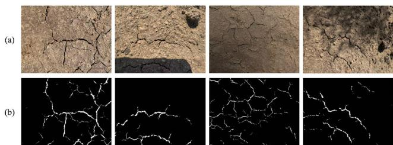  
FIGURE 15. Qualitative LMA-Net segmentation on real-world engineering images: (a) original image; (b) LMA-Net prediction.

Overall, LMA-Net maintains stable segmentation under complex illumination and multi-scale conditions, suppressing background interference and preserving crack continuity. These qualitative results indicate good practical potential within the current evaluation scope, but broader generalization to more diverse field scenarios still requires further verification on larger and more heterogeneous datasets.

## V. CONCLUSION

This study proposes LMA-Net, an illumination-robust semantic segmentation network for soil crack detection under complex outdoor conditions. Comprehensive experiments were conducted, including comparisons with representative state-of-the-art methods, ablation studies, complexity analysis, and engineering validation. The main conclusions are summarized as follows.

(1) A soil crack dataset was constructed to support systematic evaluation under complex illumination conditions. The dataset covers six challenging lighting scenarios, including non-uniform illumination and shadow interference, providing a reliable basis for studying illumination-robust soil crack segmentation. It should be noted that the dataset was generated from expansive soil collected in Harbin, Heilongjiang Province, China under laboratory-controlled wetting-drying cycles and controlled illumination setups; therefore, direct generalization to other regions, soil types, and in-situ field conditions may be limited.

(2) Experimental results demonstrate that LMA-Net achieves a Precision of 89.27%, Recall of 86.45%, IoU of 78.74%, and F1-score of 87.83%, consistently outperforming comparative segmentation networks. Compared with Attention U-Net, LMA-Net improves the F1-score and IoU by 3.07% and 4.64%, respectively, showing clear advantages in segmenting fine cracks and shadow-affected regions.

(3) Ablation studies confirm the effectiveness of the proposed architectural components. Residual connections and SE-based channel recalibration enhance feature stability, the illumination-guided attention (IGA) module improves robustness to non-uniform lighting, and the multi-scale feature fusion (MSF) module strengthens crack representation across different scales. Moreover, LMA-Net maintains a moderate computational cost (32.322 M parameters and 59.973 GFLOPs), achieving a favorable balance between accuracy and efficiency.

(4) Engineering validation on real-world images indicates that LMA-Net maintains stable segmentation performance under strong shadows, reflections, and complex backgrounds, with improved crack continuity and boundary clarity. This part is presented as a qualitative analysis, and no quantitative metrics are reported. These results highlight the practical potential of LMA-Net for soil crack monitoring, roadbed inspection, geotechnical monitoring, and infrastructure maintenance within the current evaluation scope, although broader generalization still requires larger and more diverse validation data.

Despite the promising performance, this study has certain limitations, including moderate computational complexity, a limited full-resolution test set, and limited geographic and environmental coverage of the constructed dataset, and the absence of formal statistical significance testing for the ablation results, which remains an aspect to be addressed in future work. In addition, the patch selection strategy may introduce sampling bias relative to real deployment scenes, which could affect false-positive behavior under complex backgrounds. Moreover, the present study adopts a patch-based training strategy, and a direct comparison with full-image or hybrid training strategies was not included. The relative advantages and trade-offs of these strategies therefore remain to be further evaluated. Therefore, the generalization capability of the proposed method across broader geographic regions and field conditions still requires further verification through larger and more diverse external validation. In addition, a systematic comparison of performance across different inference resolutions will be considered in future work. Future research will focus on addressing these challenges by developing lightweight and deployable variants of LMA-Net, enhancing cross-scenario generalization under more diverse soil and environmental settings, optimizing patch construction strategies to better balance crack and non-crack contexts, and exploring weakly supervised or uncertainty-aware learning strategies. External validation and cross-location experiments under broader field conditions will also be conducted in future work to further assess the robustness and transferability of the proposed method. A systematic comparison between patch-based, full-image, and hybrid training strategies will also be considered in future work. These efforts will further improve the practicality and robustness of soil crack segmentation systems for large-scale and real-time infrastructure monitoring and roadbed condition forecasting projects.

## REFERENCES

[1] C.-S. Tang, Y.-J. Cui, A.-M. Tang, and B. Shi, ‘‘Experiment evidence on the temperature dependence of desiccation cracking behavior of clayey soils,’’ Eng. Geol., vol. 114, nos. 3–4, pp. 261–266, Aug. 2010, doi: 10.1016/j.enggeo.2010.05.003.

[2] C.-S. Tang, C. Zhu, Q. Cheng, H. Zeng, J.-J. Xu, B.-G. Tian, and B. Shi, ‘‘Desiccation cracking of soils: A review of inves tigation approaches, underlying mechanisms, and influencing fac tors,’’ Earth-Science Rev., vol. 216, May 2021, Art. no. 103586, doi: 10.1016/j.earscirev.2021.103586.

[3] C.-S. Tang, Q. Cheng, T. Leng, B. Shi, H. Zeng, and H. I. Inyang, ‘‘Effects of wetting-drying cycles and desiccation cracks on mechanical behavior of an unsaturated soil,’’ CATENA, vol. 194, Nov. 2020, Art. no. 104721, doi: 10.1016/i catena 2020.104721

[4] C.-S. Tang, D.-Y. Wang, B. Shi, and J. Li, ‘‘Effect of wetting– drying cycles on profile mechanical behavior of soils with different initial conditions,’’ CATENA, vol. 139, pp. 105–116, Apr. 2016, doi: 10.1016/j.catena.2015.12.015.

[5] Q. Cheng, C. Tang, D. Xu, H. Zeng, and B. Shi, ‘‘Water infiltration in a cracked soil considering effect of drying-wetting cycles,’’ J. Hydrol., vol. 593, Feb. 2020, Art. no. 125640, doi: 10.1016/j.jhydrol.2020.125640.

[6] A. Akagic, E. Buza, S. Omanovic, and A. Karabegovic, ‘‘Pavement crack detection using Otsu thresholding for image segmentation,’’ in Proc. 41st Int. Conv. Inf. Commun. Technol., Electron. Microelectron. (MIPRO). Oman, Mav 2018, pp. 1092–1097, doi: 10.23919/MIPRO.2018 8400199.

[7] W. Chen, Z. He, and J. Zhang, ‘‘Online monitoring of crack dynamic development using attention-based deep networks,’’ Autom. Construc tion, vol. 154, Oct. 2023, Art. no. 105022, doi: 10.1016/j.autcon.2023. 105022.

[8] Z. Al-Huda, B. Peng, R. N. A. Algburi, M. A. Al-antari, R. AL-Jarazi, O. Al-maqtari, and D. Zhai, ‘‘Asymmetric dual-decoder-U-Net for pavement crack semantic segmentation,’’ Autom. Construction, vol. 156, Dec. 2023, Art. no. 105138, doi: 10.1016/j.autcon.2023.105138.

[9] Q.-C. Hu, W.-M. Ye, W.-J. Pan, Q. Wang, and Y.-G. Chen, ‘‘Deep learning-based segmentation, quantification and modeling of expansive soil cracks,’’ Acta Geotechnica, vol. 19, no. 1, pp. 455–473, Jan. 2024, doi: 10.1007/s11440-023-01889-2.

[10] G. Xu, Q. Yue, and X. Liu, ‘‘Deep learning algorithm for realtime automatic crack detection, segmentation, qualification,’’ Eng. Appl. Artif. Intell., vol. 126, Nov. 2023, Art. no. 107085, doi: 10.1016/j.engappai.2023.107085.

[11] X.-L. Han, N.-J. Jiang, Y.-F. Yang, J. Choi, D. N. Singh, P. Beta, Y.-J. Du, and Y.-J. Wang, ‘‘Deep learning based approach for the instance segmentation of clayey soil desiccation cracks,’’ Comput. Geotechnics, vol. 146, Jun. 2022, Art. no. 104733, doi: 10.1016/j.compgeo.2022.104733.

[12] D. Ai, G. Jiang, S.-K. Lam, P. He, and C. Li, ‘‘Computer vision framework for crack detection of civil infrastructure—A review,’’ Eng. Appl. Artif. Intell., vol. 117, Jan. 2022, Art. no. 105478, doi: 10.1016/j.engappai.2022.105478.

[13] R. Li, J. Yu, F. Li, R. Yang, Y. Wang, and Z. Peng, ‘‘Automatic bridge crack detection using unmanned aerial vehicle and faster R-CNN,’’ Construction Building Mater., vol. 362, Jan. 2023, Art. no. 129659, doi: 10.1016/j.conbuildmat.2022.129659.

[14] Y. Zhang, Z. Zuo, X. Xu, J. Wu, J. Zhu, H. Zhang, J. Wang, and Y. Tian, ‘‘Road damage detection using UAV images based on multi-level attention mechanism,’’ Autom. Construction, vol. 144, Dec. 2022, Art. no. 104613, doi: 10.1016/j.autcon.2022.104613.

[15] E. Shelhamer, J. Long, and T. Darrell, ‘‘Fully convolutional networks for semantic segmentation,’’ IEEE Trans. Pattern Anal. Mach. Intell., vol. 39, no. 4, pp. 640–651, Apr. 2017, doi: 10.1109/TPAMI.2016.2572683.

[16] V. Badrinarayanan, A. Kendall, and R. Cipolla, ‘‘SegNet: A deep convolutional encoder–decoder architecture for image segmentation,’’ IEEE Trans. Pattern Anal. Mach. Intell., vol. 39, no. 12, pp. 2481–2495, Dec. 2017, doi: 10.1109/TPAML 2016.2644615

[17] C. V. Dung and L. D. Anh, ‘‘Autonomous concrete crack detection using deep fully convolutional neural network,’’ Autom. Construction, vol. 99, pp. 52–58, Mar. 2019, doi: 10.1016/j.autcon.2018.11.028.

[18] Z. Liu, Y. Cao, Y. Wang, and W. Wang, ‘‘Computer vision-based concrete crack detection using U-net fully convolutional networks,’’ Autom. Construction, vol. 104, pp. 129–139, Aug. 2019, doi: 10.1016/j.autcon. 2019.04.005.

[19] J.-J. Xu, H. Zhang, C.-S. Tang, Q. Cheng, B. Liu, and B. Shi, ‘‘Automatic soil desiccation crack recognition using deep learning,’’ Géotechnique, vol. 72, no. 4, pp. 337–349, Apr. 2022, doi: 10.1680/jgeot.20. p.091.

[20] O. Ronneberger, P. Fischer, and T. Brox, ‘‘U-Net: Convolutional networks for biomedical image segmentation,’’ in Proc. Med. Image Comput. Comput.-Assist. Intervent., Munich, Germany, 2015, pp. 234–241, doi: 10.1007/978-3-319-24574-4\_28.

[21] O. Oktay, J. Schlemper, L. L. Folgoc, M. Lee, M. Heinrich, K. Misawa, K. Mori, S. McDonagh, N. Y Hammerla, B. Kainz, B. Glocker, and D. Rueckert, ‘‘Attention U-Net: Learning where to look for the pancreas,’’ 2018, arXiv:1804.03999.

[22] Z. Zhang, Q. Liu, and Y. Wang, ‘‘Road extraction by deep residual U-net,’’ IEEE Geosci. Remote Sens. Lett., vol. 15, no. 5, pp. 749–753, May 2018, doi: 10.1109/LGRS.2018.2802944

[23] Z. Zhou, M. M. R. Siddiquee, N. Tajbakhsh, and J. Liang, ‘‘UNet++: A nested U-Net architecture for medical image segmentation,’’ in Proc. Deep Learn. Med. Image Anal. Multimodal Learn. Clin. Decis. Support, Granada, Spain, 2018, pp. 3–11, doi: 10.1007/978-3-030- 00889-5\_1.

[24] Z. Zhou, M. M. R. Siddiquee, N. Tajbakhsh, and J. Liang, ‘‘UNet++: Redesigning skip connections to exploit multiscale features in image segmentation,’’ IEEE Trans. Med. Imag., vol. 39, no. 6, pp. 1856–1867, Jun. 2020, doi: 10.1109/TMI.2019.2959609.

[25] W. Choi and Y.-J. Cha, ‘‘SDDNet: Real-time crack segmentation,’’ IEEE Trans. Ind. Electron., vol. 67, no. 9, pp. 8016–8025, Sep. 2020, doi: 10.1109/TIE 2019.2945265

[26] X. Sun, Y. Xie, L. Jiang, Y. Cao, and B. Liu, ‘‘DMA-Net: DeepLab with multi-scale attention for pavement crack segmentation,’’ IEEE Trans. Intell. Transp. Syst., vol. 23, no. 10, pp. 18392–18403, Oct. 2022, doi: 10.1109/TITS.2022.3158670.

[27] G. Zhu, J. Liu, Z. Fan, D. Yuan, P. Ma, M. Wang, W. Sheng, and K. C. P. Wang, ‘‘A lightweight encoder–decoder network for automatic pavement crack detection,’’ Comput.-Aided Civil Infrastruct. Eng., vol. 39, no. 12, pp. 1743–1765, Jun. 2024, doi: 10.1111/mice.13103.

[28] Y. Yan, J. Sun, H. Zhang, C. Tang, X. Wu, S. Wang, and Y. Zhang, ‘‘DCMA-Net: A dual channel multi-scale feature attention network for crack image segmentation,’’ Eng. Appl. Artif. Intell., vol. 148, May 2025, Art. no. 110411, doi: 10.1016/j.engappai.2025.110411.

[29] E. Xie, W. Wang, Z. Yu, A. Anandkumar, J. M. Alvarez, and P. Luo, ‘‘SegFormer: Simple and efficient design for semantic segmentation with transformers,’’ in Proc. Adv. Neural Inf. Process. Syst., vol. 34, 2021, pp. 12077–12090.

[30] Z. Liu, Y. Lin, Y. Cao, H. Hu, Y. Wei, Z. Zhang, S. Lin, and B. Guo, ‘‘Swin transformer: Hierarchical vision transformer using shifted windows,’’ in Proc. IEEE/CVF Int. Conf. Comput. Vis. (ICCV), Oct. 2021, pp. 9992–10002, doi: 10.1109/ICCV48922.2021.00986.

[31] S. Chen, Z. Feng, G. Xiao, X. Chen, C. Gao, M. Zhao, and H. Yu, ‘‘Pave ment crack detection based on the improved Swin-UNet model,’’ Build ings, vol. 14, no. 5, p. 1442, May 2024, doi: 10.3390/buildings14051442.

[32] Z. Zhou, J. Zhang, and C. Gong, ‘‘Hybrid semantic segmentation for tunnel lining cracks based on Swin transformer and convolutional neu ral network,’’ Comput.-Aided Civil Infrastruct. Eng., vol. 38, no. 17, pp. 2491–2510, Nov. 2023, doi: 10.1111/mice.13003.

[33] H. Zhang, L. Ma, Z. Yuan, and H. Liu, ‘‘Enhanced concrete crack detec tion and proactive safety warning based on I-ST-UNet model,’’ Autom. Construct., vol. 166, Oct. 2024, Art. no. 105612, doi: 10.1016/j.autcon. 2024.105612.

[34] Y. Wu, S. Li, J. Zhang, Y. Li, Y. Li, and Y. Zhang, ‘‘Dual attention transformer network for pixel-level con crete crack segmentation considering camera placement,’ Autom. Construct., vol. 157, Jan. 2024, Art. no. 105166, doi: 10.1016/j.autcon.2023.105166.

[35] Y. Zhang and C. Liu, ‘‘Generative adversarial network based on domain adaptation for crack segmentation in shadow environments,’’ Comput.- Aided Civil Infrastruct. Eng., vol. 40, no. 24, pp. 3997–4013, Oct. 2025, doi: 10.1111/mice.13451.

[36] J.-J. Xu, H. Zhang, C.-S. Tang, Q. Cheng, B.-G. Tian, B. Liu, and B. Shi, ‘‘Automatic soil crack recognition under uneven illumination condition with the application of artificial intelligence,’’ Eng. Geol., vol. 296, Jan. 2022, Art. no. 106495, doi: 10.1016/j.enggeo.2021.106495.

[37] L. Fan, S. Li, Y. Li, B. Li, D. Cao, and F.-Y. Wang, ‘‘Pavement cracks coupled with shadows: A new shadow-crack dataset and a shadow-removal-oriented crack detection approach,’ IEEE/CAA J. Autom. Sinica, vol. 10, no. 7, pp. 1593–1607, Jul. 2023, doi: 10.1109/JAS.2023.123447.

[38] Y. Zhang and C. Liu, ‘‘Crack segmentation using discrete cosine trans form in shadow environments,’’ Autom. Construction, vol. 166, Oct. 2024, Art. no. 105646, doi: 10.1016/j.autcon.2024.105646.

[39] D. Jha, P. H. Smedsrud, M. A. Riegler, D. Johansen, T. D. Lange, P. Halvorsen, and H. D. Johansen, ‘‘ResUNet++: An advanced archi tecture for medical image segmentation,’’ in Proc. IEEE Int. Symp. Multimedia (ISM), San Diego, CA, USA, Dec. 2019, pp. 225–230, doi: 10.1109/ISM46123.2019.00049.

[40] J. Donnelly, A. Daneshkhah, and S. Abolfathi, ‘‘Physics-informed neural networks as surrogate models of hydrodynamic simulators,’ Sci. Total Environ., vol. 912, Feb. 2024, Art. no. 168814, doi: 10.1016/i.scitotenv,2023.168814.

[41] K. Khosravi, A. A. Farooque, M. Karbasi, M. Ali, S. Heddam, A. Fagh fouri, and S. Abolfathi, ‘‘Enhanced water quality prediction model using advanced hybridized resampling alternating tree-based and deep learning algorithms,’’ Environ. Sci. Pollut. Res., vol. 32, no. 11, pp. 6405–6424, Feb. 2025, doi: 10.1007/s11356-025-36062-7.

[42] P. Kent, S. Abolfathi, H. Al Ali, T. Sedighi, O. Chatrabgoun, and A. Daneshkhah, ‘‘Resilient coastal protection infrastructures: Probabilistic sensitivity analysis of wave overtopping using Gaussian process surro gate models,’’ Sustainability, vol. 16, no. 20, p. 9110, Oct. 2024, doi: 10.3390/su16209110

[43] J. Donnelly, A. Daneshkhah, and S. Abolfathi, ‘‘Forecasting global cli mate drivers using Gaussian processes and convolutional autoencoders,’ Eng. Appl. Artif. Intell., vol. 128, Feb. 2024, Art. no. 107536, doi: 10.1016/j.engappai.2023.107536.

[44] K. Khosravi, A. A. Farooque, A. Naghibi, S. Heddam, A. Sharafati, J. Hatamiafkoueieh, and S. Abolfathi, ‘‘Enhancing pan evaporation predictions: Accuracy and uncertainty in hybrid machine learning models,’’ Ecol. Informat., vol. 85, Mar. 2025, Art. no. 102933, doi: 10.1016/j.ecoinf. 2024.102933.

[45] C. Wei, W. Wang, W. Yang, and J. Liu, ‘‘Deep retinex decomposition for low-light enhancement,’’ 2018, arXiv:1808.04560.

[46] S. Ioffe and C. Szegedy, ‘‘Batch normalization: Accelerating deep network training by reducing internal covariate shift,’’ in Proc. 32nd Int. Conf. Mach. Learn. (ICML), Lille, France, 2015, pp. 448–456.

[47] D. Ulyanov, A. Vedaldi, and V. Lempitsky, ‘‘Instance normalization: The missing ingredient for fast stylization,’’ 2016, arXiv:1607.08022.

[48] X. Pan, P. Luo, J. Shi, and X. Tang, ‘‘Two at once: Enhancing learning and generalization capacities via IBN-Net,’’ in Proc. Eur. Conf. Comput. Vis., Munich, Germany, 2018, pp. 484–500, doi: 10.1007/978-3-030-01225- 0\_29.

[49] J. Hu, L. Shen, S. Albanie, G. Sun, and E. Wu, ‘‘Squeeze-and-excitation networks,’’ IEEE Trans. Pattern Anal. Mach. Intell., vol. 42, no. 8, pp. 2011–2023, Aug. 2020, doi: 10.1109/TPAMI.2019.2913372.

[50] S. Woo, J. Park, J.-Y. Lee, and I. S. Kweon, ‘‘CBAM: Convolutional block attention module,’’ in Proc. Eur. Conf. Comput. Vis., Munich, Germany, 2018, pp. 3–19, doi: 10.1007/978-3-030-01234-2\_1.

[51] L.-C. Chen, Y. Zhu, G. Papandreou, F. Schroff, and H. Adam, ‘‘Encoder– decoder with Atrous separable convolution for semantic image segmentation,’’ in Proc. Eur. Conf. Comput. Vis., Munich, Germany, 2018, pp. 833–851, doi: 10.1007/978-3-030-01234-2\_49.

[52] K. He, X. Zhang, S. Ren, and J. Sun, ‘‘Deep residual learning for image recognition,’’ in Proc. IEEE Conf. Comput. Vis. Pattern Recognit. (CVPR), Las Vegas, NV, USA, Jun. 2016, pp. 770–778, doi: 10.1109/CVPR.2016.90.

[53] C.-S. Tang, Y.-J. Cui, B. Shi, A.-M. Tang, and C. Liu, ‘‘Desiccation and cracking behaviour of clay layer from slurry state under wetting– drying cycles,’’ Geoderma, vol. 166, no. 1, pp. 111–118, Oct. 2011, doi: 10.1016/j.geoderma.2011.07.018.

[54] J. Li, H. Chen, X. Gao, Q. Ding, W. Shan, H. Guo, and J. Zhuo, ‘‘Cracks evolution and micro mechanism of compacted clay under wet-dry cycles and wet-dry-freeze-thaw cycles,’’ Cold Regions Sci. Technol., vol. 214, Oct. 2023, Art. no. 103944, doi: 10.1016/j.coldregions.2023.103944.

[55] H. Zhao, J. Shi, X. Qi, X. Wang, and J. Jia, ‘‘Pyramid scene parsing network,’’ in Proc. IEEE Conf. Comput. Vis. Pattern Recognit. (CVPR), Honolulu, HI, USA, Jul. 2017, pp. 6230–6239, doi: 10.1109/CVPR.2017.660.

[56] X. Xiao, S. Lian, Z. Luo, and S. Li, ‘‘Weighted res-UNet for highquality retina vessel segmentation,’’ in Proc. 9th Int. Conf. Inf. Technol. Med. Educ. (ITME), Hangzhou, China, Oct. 2018, pp. 327–331, doi: 10.1109/ITME.2018.00080.

[57] Q. Zou, Z. Zhang, Q. Li, X. Qi, Q. Wang, and S. Wang, ‘‘DeepCrack: Learning hierarchical convolutional features for crack detection,’’ IEEE Trans. Image Process., vol. 28, no. 3, pp. 1498–1512, Mar. 2019, doi: 10.1109/TIP2018.2878966

[58] J. Chen, Y. Lu, Q. Yu, X. Luo, E. Adeli, Y. Wang, L. Lu, A. L. Yuille, and Y. Zhou, ‘‘TransUNet: Transformers make strong encoders for medical image segmentation,’’ 2021, arXiv:2102.04306.

GUANG-ZHU ZHANG was born in Harbin, China, in 1992. He received the B.Eng. degree in civil engineering from Northeast Forestry University, Harbin, in 2015, and the Ph.D. degree in engineering from Kangwon National University, Chuncheon, South Korea, in 2021. His major field of study is transportation infrastructure materials and intelligent construction.

He is currently an Associate Professor with the School of Civil Engineering and Transportation,

Northeast Forestry University. He has authored or co-authored more than 30 peer-reviewed articles in journals, such as Construction and Building Materials and Cement and Concrete Composites. His research experience includes microbial self-healing concrete, 3D-printed repair materials, UAV-based infrastructure inspection, and digital-twin-driven maintenance systems. His current research interests include low-carbon cementitious materials, microbial-induced mineralization, and smart maintenance tech nologies for cold-region transportation infrastructure.

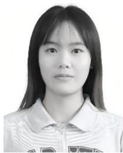

CHENXI ZHAO was born in Xi’an, Shaanxi, China, in November 2001. She received the B.Eng. degree in transportation engineering from Chang’an University, Xi’an, in 2023. She is currently pursuing the M.Eng. degree in transportation engineering with the School of Civil Engineering and Transportation, Northeast Forestry University, Harbin, China. Her main research interests include intelligent construction technology, transportation infrastructure digital-

ization, and UAV-based inspection for road and bridge engineering.

HONG-FENG LI received the M.Eng. and Ph.D. degrees from Northeast Forestry University (NEFU), Harbin, China, in 2005 and 2010, respectively. From 2016 to 2020, he conducted postdoctoral research with NEFU. He is currently an Associate Professor and a Master’s Supervisor with the School of Civil Engineering and Transportation, NEFU. By integrating remote sensing and 3D reconstruction with deep learning, his work aims to achieve rapid identification, localization,

and classification of pavement distresses, promoting informatization and efficiency in the full-cycle management of highway maintenance. He has published more than ten papers indexed by SCI and EI. His research interests include the intelligent and eco-friendly operation and maintenance of transportation infrastructure, including the mechanical enhancement mechanisms of microbially stabilized subgrade soils and UAV-based intelligent detection and decision-support technologies for pavement maintenance.

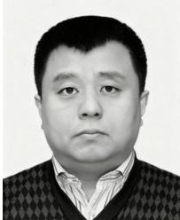

QIUSHI LI received the Ph.D. degree in road and railway engineering from Northeast Forestry University (NEFU), Harbin, China, in 2023.

He was a Visiting Scholar with the University of Minnesota, Minneapolis, MN, USA, from 2018 to 2019. He was a Teaching Assistant with the School of Civil Engineering, NEFU, from 2002 to 2007, a Lecturer, from 2007 to 2016, and has been an Associate Professor and a Master’s Supervisor, since 2016. He is currently with the

School of Civil Engineering and Transportation, NEFU, where he is the Head of the Teaching and Research Office. He teaches engineering surveying and road and bridge engineering surveying. He is the Course Leader for surveying, a Heilongjiang Provincial first-class blended course. He is the author/co-author of four textbooks and several SCI/EI-indexed articles, and holds two invention patents and six utility model patents. He has led or participated in more than ten research projects and multiple teaching-reform projects. His current interests include innovative pavement materials, scientific roadway alignment design, and safety optimization. His main research interests include pavement materials and roadway alignment and safety.