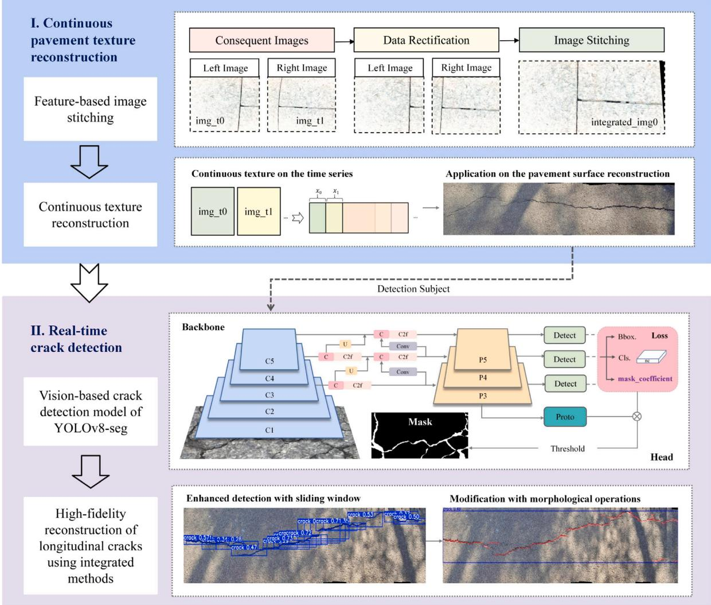
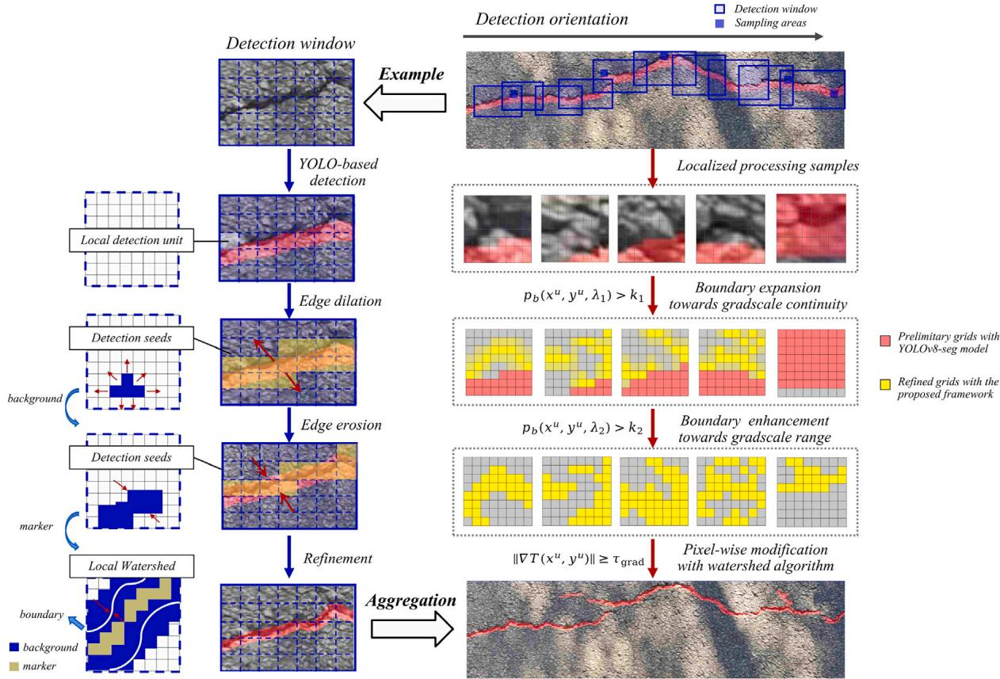
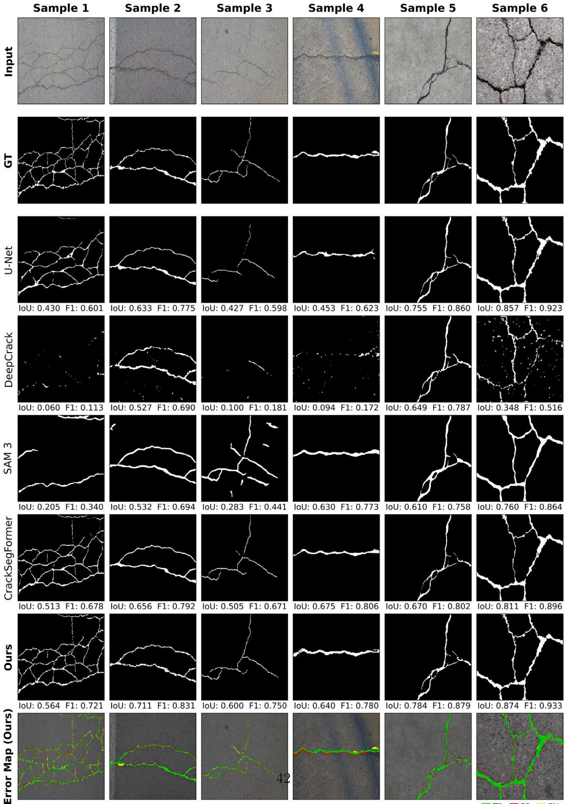
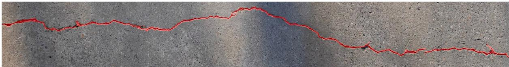
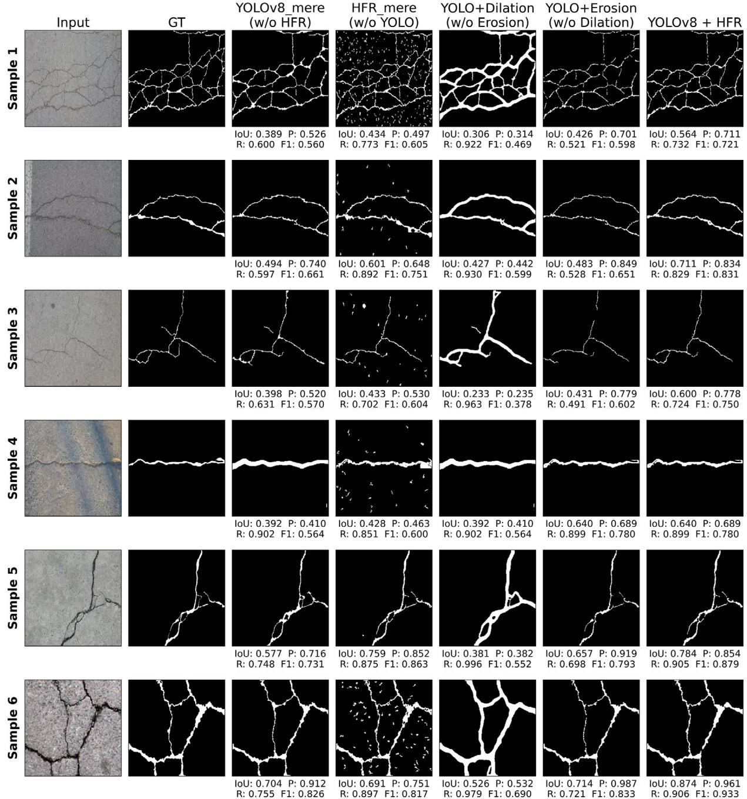
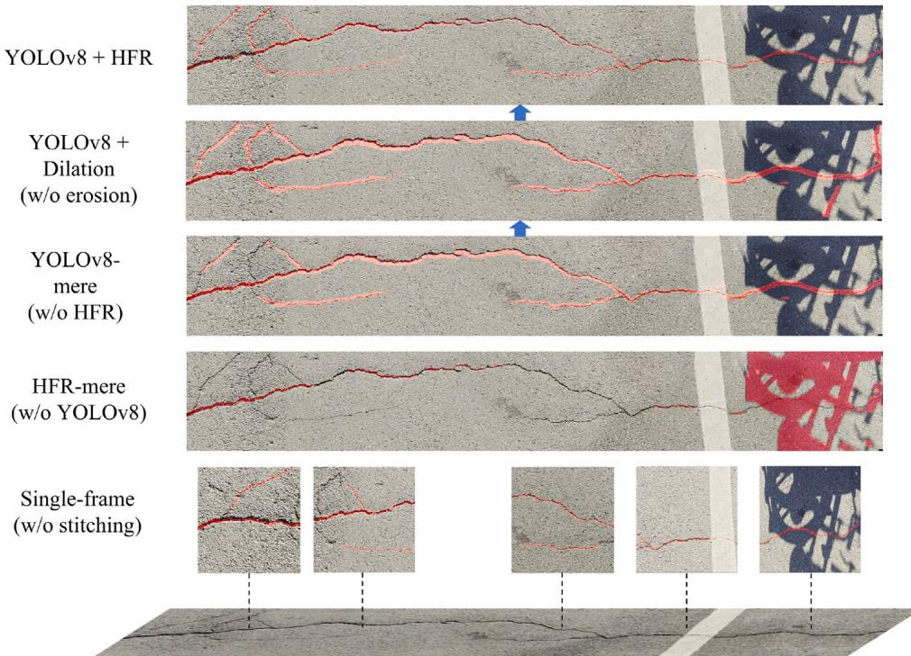
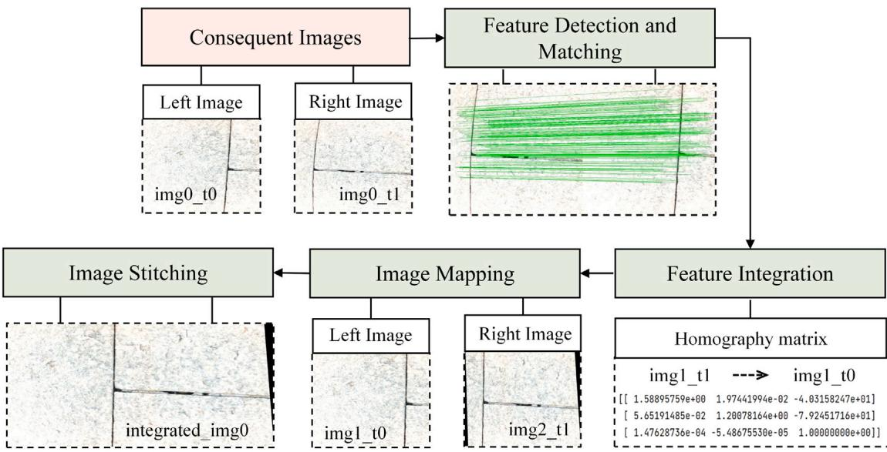
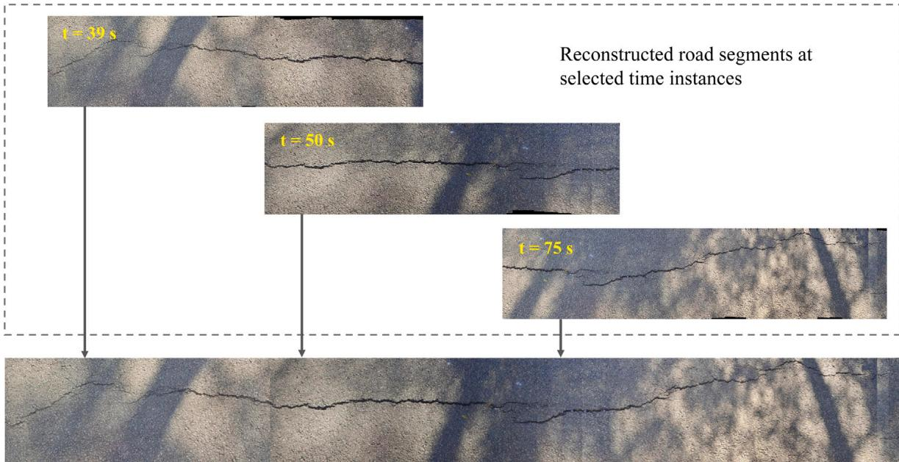

# 基于连续纹理重建与深度分割的纵向裂缝精确检测

## 核心信息

- **标题**: Precise Longitudinal Crack Detection via Continuous Texture Reconstruction and Deep Segmentation
- **作者**: Peng An, Zhengru Ren, Long-Xiang Liu, Jia-Rui Lin, Yantao Yu, Yu-Tao Guo, Chao Hou, Zhen-Zhong Hu
- **机构**: 清华大学深圳国际研究生院、上海交通大学、清华大学土木工程系、香港科技大学、南方科技大学
- **发表时间**: 2026年（Full length article）
- **期刊**: 待确认（原文未明确标注期刊名）
- **代码**: 未公开（Data will be made available on request）
- **领域**: 路面检测 / 图像拼接 / 深度学习 / 裂缝分割

## 原文摘要翻译

路面裂缝是道路基础设施退化的主要形式之一，需要高效且准确的检测以支持及时养护。现有检测方法要么依赖耗时的人工目测，要么依赖受高硬件成本和GPS依赖限制的自动化系统，这制约了它们在连续路面评估中的灵活性和适用性。本文提出了一种双通道裂缝检测模型，该模型将连续路面纹理重建与深度分割和高精度边界细化算法相结合，能够实现在线部署并对纵向裂缝检测进行精度增强。本文开发了一种基于特征的图像拼接算法，从高分辨率图像中重建连续路面纹理，实现无需GPS的裂缝定位。该方法进一步将YOLOv8-seg模型与自适应形态学操作相结合，实现像素级裂缝重建。对比实验表明，与基线模型相比，该混合方法在更精细的边界刻画和改进的分支恢复方面均取得了更优的分割性能。本文为纵向裂缝的自动化检测和高保真重建提供了一种实用方案，能够有效支持路面养护规划。

## 创新点

1. **GPS-free连续纹理重建与裂缝检测的双通道融合框架**：将基于特征的图像拼接（SIFT + 单应性矩阵 + Bundle Adjustment）与深度分割集成到同一管线中，使裂缝检测从"离散帧级"升级到"连续纹理级"，实现了无需高精度GPS/DMI的裂缝空间定位。这是从导航逻辑到测量逻辑的范式转换。

2. **"先扩展-后剪枝"（extend-then-prune）的高保真重建（HFR）管线**：YOLOv8-seg先提供语义定位，然后用自适应滑动窗口 + 概率成员函数 + 两阶段形态学操作（膨胀→腐蚀）+ 标记控制分水岭，实现裂缝边界的亚像素级恢复。关键创新在于膨胀和腐蚀的权重系数（$\lambda_1, \lambda_2$）由局部结构张量自适应调节，而非固定参数。

3. **裂缝宽度加权Dice损失与方向感知原型损失**：在YOLOv8-seg的训练中引入距离中心线的指数加权（$w(p) = 1 + \exp(-\alpha D_T(p))$），使模型对细裂缝中心线更敏感；同时引入方向滤波器加权的原型损失，强调线性裂缝形态的空间一致性。

4. **自建大规模复合数据集CRACK10000**：整合5个公开数据集（CRACK500, DeepCrack, CFD, Concrete Crack, GAPs）共6800张高质量图像，并进行人工重标注以保证像素级标注质量。

5. **边缘-云端解耦部署策略的验证**：在真实移动平台上验证了"轻量YOLOv8-seg边缘端实时粗检测（>10 FPS）+ HFR服务端异步高保真重建（~1 FPS）"的工程可行性。

## 一句话总结

这篇论文的核心贡献不在于提出新的网络架构，而在于将图像拼接、YOLOv8-seg实例分割、自适应形态学后处理三个相对成熟的技术有机整合为一个从"连续纹理重建"到"高保真裂缝精修"的完整工程管线，在13个真实路面场景上达到92.3%的检测成功率，证明了"先定位-后精修"策略在无GPS路面检测中的实用价值。

## 研究问题

### 为什么现有方法不够

路面裂缝检测领域已有大量工作，但存在一个根本性的矛盾：

1. **低成本的代价是碎片化**：人工巡检和固定点采样效率低、主观性强。低成本自动化系统（无高端IMU/GPS）产生的是**离散帧级检测结果**——裂缝在图像边界处被截断，长距离纵向裂缝的拓扑连续性无法保证。

2. **高精度系统的代价是高成本**：多功能检测车（MMS）虽然能实现连续检测，但依赖DMI和高精度GNSS，在隧道、城市峡谷等GPS受限环境中失效，且硬件成本高昂。

3. **检测和分割之间的gap**：YOLO系列检测器快速但边界粗糙；U-Net等分割网络边界更准但推理更慢。现有方法缺乏一个明确、可工程化的"检测→精修"解耦策略。

4. **"从离散帧到连续纹理"的技术鸿沟**：SLAM框架（如ORB-SLAM3）擅长定位但生成的稀疏/低分辨率地图不足以支持像素级裂缝量化。缺少专为路面平面特性优化的高保真纹理重建方案。

### 这是一个什么类型的问题

这是一个**系统工程问题**而非纯算法创新问题。论文所做的是将多个成熟技术组件（SIFT拼接、YOLOv8分割、形态学处理、分水岭算法）按照"路面检测"的物理约束和工程需求重新编排，填补了从"实验室单图分割"到"实地连续检测"之间的工程空白。

## 数据与任务定义

### 自建数据集（实地采集）

- **采集地点**：北京（清华大学）和深圳（南山区大学城）
- **采集平台**：Raspberry Pi控制的小型移动车辆 + 倾斜安装的单目相机（固定角度$\theta_0$）
- **行驶参数**：直线路径，恒定航向，速度 $v = 0.5\text{ m/s}$
- **数据集规模**：13个检测数据集，涵盖不同天气（晴天11组 + 雪后2组）、光照（强光/斑驳光照）、路面类型（沥青/混凝土）、裂缝类型（纵向/横向/龟裂/细纹）
- **单段长度**：10-30米
- **辅助数据**：实时速度日志、机械臂姿态角、总运行时间

### 训练数据：CRACK10000复合数据集

| 数据集 | 来源 | 数量 | 特征 |
|--------|------|------|------|
| CRACK500 | 路面 | 500 | 像素级标注，变化光照和复杂背景 |
| DeepCrack | 路面 | 537 | 多尺度裂缝，具有挑战性的非裂缝背景纹理 |
| CFD | 路面 | 118 | 城市路面，含阴影和井盖等噪声 |
| Concrete Crack | 混凝土 | ~3,700 | 高分辨率混凝土表面图像 |
| GAPs | 路面 | 1,969 | 高质量沥青路面图像 |

从10,000+张图像中筛选6,800张高质量子集，按85%:10%:5%划分为训练/验证/测试集。所有公开数据集的标注经过LabelMe人工检查和修正。

### 任务定义

**子任务1 — 连续纹理重建**：
- 输入：时间序列路面图像 $\mathcal{I} = \{I_i \mid i=1,\ldots,N\}$
- 输出：连续长条纹理图 $\mathcal{T}$（BEV视角，统一坐标系）
- 约束：GPS-free、实时增量式更新

**子任务2 — 纵向裂缝检测与高保真重建**：
- 输入：重建的连续纹理 $\mathcal{T}$
- 输出：裂缝像素区域集合 $\mathcal{C} = \{C_m \mid m=1,\ldots,M\}$，每个裂缝配备空间坐标
- 目标：长度 > 0.3m 的纵向裂缝

### 评价指标

**传统指标**：Precision, Recall, mAP, IoU, F1-Score, FPS

**自定义几何描述符**（用于连续裂缝评估，非传统像素级IoU）：
- **Continuity（平均连续长度）**：总裂缝长度 / 逻辑裂缝数，值越大表示碎片化越少
- **SCI（空间连通性指数）**：最长连通分量的长度 / 总长度，接近1表示由单一主干裂缝主导
- **Branches（分支数）**：骨架化后的分支节点数，衡量细裂缝网络的恢复能力

### 数据限制

- 采集速度固定为0.5 m/s，未测试不同速度下的性能
- 仅沿单一直线路径采集（纵向贯通裂缝），横向往复扫描未覆盖
- 测试集仅340张（5%的CRACK10000子集），虽经过人工重标注但原始标注质量问题可能仍有残留

## 方法主线

### 整体双通道框架

整个系统分为两个并行协作的通道：

**通道1（纹理重建通道）**：图像增强 → 径向畸变校正 → BEV透视变换 → SIFT特征提取与匹配 → RANSAC单应性估计 → Laplacian金字塔融合 → 增量式纹理拼接 → 周期性Bundle Adjustment全局优化

**通道2（裂缝检测通道）**：YOLOv8-seg实例分割 → 置信度加权裂缝种子聚合 → 自适应滑动窗口定位 → 两阶段形态学条件化（膨胀+腐蚀）→ 标记控制分水岭精修 → 最终裂缝图

> [!figure] Fig. 3 双通道框架总览
> 建议位置：方法主线开头
> 放置原因：展示特征基连续建模的双通道框架全貌
> 当前状态：

### 机制流程

**纹理重建通道的完整链路：**

1. **图像预处理与几何校正**：高斯平滑抑制环境噪声 + Laplacian算子放大强度梯度 → 径向畸变校正 → 通过预标定的单应性矩阵 $H^{\text{rect}}$ 将图像映射到BEV平面，消除透视缩短效应，输出校正后的BEV图像
2. **特征匹配与帧间对齐**：SIFT提取128维关键点描述子 → 基于描述子相似度的特征匹配 → DLT + RANSAC估计帧间单应性矩阵 $H^{\text{mos}}$ → 将新帧变换到当前纹理坐标系 → Laplacian金字塔融合处理重叠区域
3. **增量式拼接与全局优化**：自适应alpha融合权重确保拼接前沿的空间一致性，逐帧增量式更新纹理图 → 周期性Bundle Adjustment联合优化单应性序列，最小化重投影误差并保持运动连续性
4. **输出**：生成覆盖完整检测路段的连续BEV纹理长条图 $\mathcal{T}$，作为裂缝检测的统一空间基准

**裂缝检测通道的完整链路：**

1. **YOLOv8-seg粗检测与种子聚合**：在连续纹理上进行实例分割，输出裂缝bounding box + 原型mask → 按置信度和面积加权融合时间序列中的裂缝片段 $C^{\text{merged}} = \frac{\sum A_v C_v}{\sum A_v}$，形成初始裂缝种子区域 $\mathcal{C}_m^{(0)}$
2. **自适应滑动窗口定位与形态学精修**：将检测窗口对齐到梯度最强的裂缝结构 → 膨胀阶段以概率阈值 $p_b > k_1$ 将边界向低对比度邻域扩展（$\lambda_1$偏重灰度连续性） → 腐蚀阶段以更严阈值 $p_b > k_2$ 剪枝低置信度像素（$\lambda_2$偏重像素强度），得到 $\mathcal{C}_m^{(2)} \subset \mathcal{C}_m^{(1)}$
3. **标记控制分水岭精修**：以膨胀后的 $\mathcal{C}_m^{(1)}$ 为 flooding 源、腐蚀后的 $\mathcal{C}_m^{(2)}$ 为高置信度标记 → 沿梯度场 $\nabla \mathcal{T}$ 精确确定裂缝边界 → 输出高保真裂缝区域 $\mathcal{C}_m$
4. **空间定位输出**：通过IPM逆透视映射将纹理坐标转换到全局物理坐标，输出带有空间位置信息的裂缝检测结果

> [!figure] Fig. 6 高保真裂缝重建管线
> 建议位置：裂缝检测通道
> 放置原因：展示滑动窗口+形态学操作+分水岭精修的三阶段策略
> 当前状态：

### 关键的数学建模

**概率成员函数（控制形态学扩展/收缩的核心）**：

$$p_b(x^u, y^u, \lambda) = (\varLambda(x^u, y^u))^{\lambda} \cdot (\varPsi(x^u, y^u))^{1-\lambda}$$

其中：
- $\varLambda$：灰度连续性项，$\varLambda = \exp(-\frac{|\varPhi(x^u, y^u) - \bar{\varPhi}|}{\sigma_{\varPhi}})$，衡量局部灰度沿裂缝方向的连续性
- $\varPsi$：强度符合度，衡量像素强度在自适应裂缝强度区间 $[\eta_{\min}, \eta_{\max}]$ 内的归一化成员度
- $\lambda$：平衡参数，由局部结构张量的相干性 $C_{coh} = (\frac{\mu_1 - \mu_2}{\mu_1 + \mu_2})^2$ 动态调节

这个公式是整个HFR模块的核心——它统一了"沿裂缝方向扩展"和"沿强度边界剪枝"两个冲突目标。

**裂缝宽度加权Dice损失**：

$$\mathcal{L}_{\text{mask}} = 1 - \frac{2 \sum_p w(p) (\mathbf{M}_k)_p (\widehat{\mathbf{M}}_k)_p}{\sum_p w(p) (\mathbf{M}_k)_p + \sum_p w(p) (\widehat{\mathbf{M}}_k)_p}$$

$$w(p) = 1 + \exp(-\alpha D_T(p))$$

与传统Dice损失的区别：距离裂缝中心线越近的像素权重越高，强制模型关注裂缝骨架而非边界。

### 训练配置

| 项目 | 配置 |
|------|------|
| 模型 | YOLOv8-seg |
| 图像尺寸 | 640×640（训练），512×512（推理） |
| GPU | NVIDIA RTX 4090 |
| 优化器 | SGD, lr=0.01, momentum=0.937 |
| Epoch | 150 |
| 数据增强 | 随机翻转、旋转、亮度调整 |
| Mosaic增强 | 最后10 epoch自动禁用（YOLOv8默认策略） |

### 部署策略

边缘-云端解耦：轻量YOLOv8-seg在移动平台（Raspberry Pi）上实时粗检测（>10 FPS），计算密集的HFR精修在后台服务器异步执行（~1 FPS）。

## 关键结果

### SOTA对比实验（Table 3，340张测试集）

| 方法 | IoU | Precision | Recall | F1 | FPS |
|------|-----|-----------|--------|-----|-----|
| U-Net | 0.5123 | 0.7114 | 0.6426 | 0.6752 | 3.97 |
| DeepCrack | 0.2728 | 0.4986 | 0.3924 | 0.4390 | 2.94 |
| SAM 3 | 0.4400 | 0.5073 | 0.7680 | 0.6110 | 0.43 |
| CrackSegFormer | 0.5452 | 0.6915 | 0.7152 | 0.7000 | 3.92 |
| **YOLOv8+HFR (Ours)** | **0.6128** | **0.7489** | **0.7781** | **0.7632** | 1.71 |

**关键发现**：
- 对比次优模型CrackSegFormer：IoU提升12.4%，F1提升9.0%
- SAM 3的Recall（0.7680）接近本文方法（0.7781），但Precision仅0.5073——过度分割严重
- 纯YOLOv8-seg推理仅65.16ms/图（15.5 FPS），HFR增加约504ms的额外处理时间
- 速度-精度trade-off：本文方法1.71 FPS虽慢于U-Net和CrackSegFormer，但在精度上的增益远超过速度代价，且支持边缘-云端分离部署

> [!figure] Fig. 16 六个代表性样本的定性对比
> 建议位置：SOTA对比
> 放置原因：展示不同方法在复杂纹理、变化光照、分支裂缝等场景下的分割差异
> 当前状态：

### 真实场景泛化评估（13个实地数据集，Table 5-6）

| 指标 | 平均值 | 解读 |
|------|--------|------|
| 总裂缝长度 | 11,647 px | - |
| 平均宽度 | 14.87 px | - |
| SCI | 0.70 | 主裂缝占主导 |
| Continuity | 3732.42 px | 裂缝以长连续结构为主，非碎片化 |
| **成功率** | **92.3%** (12/13) | 仅1例遗漏（样本13：浅层网状龟裂+斑驳光照+碎片） |

对比其他方法在同样13个场景上的表现（Table 6）：

| 方法 | Success | Omission | Noise | Failure | Continuity |
|------|---------|----------|-------|---------|------------|
| U-Net | 53.8% | 30.8% | 7.7% | 7.7% | 2948.13 |
| DeepCrack | 15.4% | 23.1% | 23.1% | 38.5% | 781.12 |
| SAM 3 | 84.6% | 15.4% | 0% | 0% | 2609.37 |
| CrackSegFormer | 53.8% | 7.7% | 7.7% | 30.8% | 1874.92 |
| **Ours** | **92.3%** | **7.7%** | **0%** | **0%** | **3732.42** |

> [!figure] Fig. 17 六个代表性真实场景的检测结果可视化
> 建议位置：泛化评估
> 放置原因：展示不同路面类型、光照条件、裂缝类型下的检测效果
> 当前状态：

### 消融实验

**基准数据集消融（Table 7）**：

| 消融变体 | IoU | Precision | Recall | F1 |
|----------|-----|-----------|--------|-----|
| YOLOv8 (基线) | 0.4328 | 0.5592 | 0.6645 | 0.6073 |
| HFR Only | 0.4789 | 0.5810 | 0.7380 | 0.6502 |
| YOLOv8 + Dilation | 0.3802 | 0.3950 | 0.9180 | 0.5524 |
| YOLOv8 + Erosion | 0.4651 | 0.7955 | 0.5320 | 0.6376 |
| **YOLOv8 + HFR** | **0.6128** | **0.7489** | **0.7781** | **0.7632** |

**关键信号**：
- 纯HFR（无语义引导）：Recall高（0.7380）但Precision低（0.5810），对纹理敏感但缺乏语义判别力
- 纯膨胀：Recall极高（0.9180）但Precision崩溃（0.3950），裂缝过度增厚
- 纯腐蚀：Precision极高（0.7955）但Recall骤降（0.5320），细分支被错误剪除
- **完整HFR在膨胀和腐蚀之间取得平衡**：Recall 0.7781 + Precision 0.7489

**部署场景消融（Table 8-9）**：

HFR的"extend-then-prune"机制的量化效果：
- 膨胀阶段：裂缝长度 +12.81%，宽度 +10.97%
- 腐蚀阶段：裂缝宽度 -30.35%（大幅瘦身），长度仅微降 -1.59%
- **净效应：长度+11.02%，宽度-22.71%** → 更长、更细、更精确

> [!figure] Fig. 19 基准数据集消融可视化
> 建议位置：消融实验
> 放置原因：直观对比不同消融变体在6个样本上的分割质量
> 当前状态：

> [!figure] Fig. 20 部署场景消融可视化
> 建议位置：消融实验
> 放置原因：展示stitching→YOLOv8→dilation→erosion的逐步效果演变
> 当前状态：

### 拼接质量

- UDIS-D数据集评估：平均对齐误差 0.85像素，特征匹配成功率 96.4%
- 对比Patch-NetVLAD：对齐误差低0.27像素，匹配成功率高7.7%

> [!figure] Fig. 7 特征基图像拼接管线
> 建议位置：拼接实验
> 放置原因：展示从原始帧到拼接结果的中间步骤
> 当前状态：

> [!figure] Fig. 9 时间序列纹理重建
> 建议位置：拼接实验
> 放置原因：展示t=39s, 50s, 75s三个时间点的增量式拼接效果
> 当前状态：

## 深度分析

### 真正贡献是什么

1. **工程系统级的"填补空白"**：这篇论文最大的贡献不是某个模块的算法创新，而是证明了一条完整的技术路线是可行的——低成本单目相机 + 视觉拼接定位 + 深度学习粗检测 + 形态学后精修 = 可部署的连续裂缝检测系统。这使得路面检测从"高端检测车专属"下沉到"低成本移动平台可用"。

2. **"extend-then-prune"策略的明确化和量化**：HFR的核心思想——先膨胀恢复连通性、再腐蚀回收精度——并不新颖，但论文通过消融实验精确量化了每个阶段的贡献（膨胀 +12.81%长度、腐蚀 -30.35%宽度），以及权重参数的自适应调节机制，使其从经验trick升级为可复现的工程模块。

3. **拼接作为裂缝检测前置步骤的价值验证**：在消融中直接展示了"有拼接 vs 无拼接"的定性差异——无拼接时长裂缝在图像边界被截断，低对比度区域裂缝完全丢失。这为"先拼接后检测"的范式提供了直观证据。

### 为什么结果成立

- **HFR有效的根本原因**：YOLOv8-seg提供了高质量语义先验（"这是裂缝"），HFR在此基础上进行几何精修（"裂缝的精确边界在哪里"）。这种"语义定位→几何精修"的解耦使得两个阶段各司其职、互补增强。
- **自适应权重 $\lambda$ 的必要性**：固定参数的膨胀/腐蚀在单一场景下可能有效，但面对从细纹到宽缝、从高对比度到低对比度的多样裂缝形态时必然顾此失彼。结构张量相干性驱动的 $\lambda$ 调节是HFR泛化能力的关键。
- **Continuity指标的合理性**：对于纵向贯通裂缝（本论文的目标类型），Continuity > 1000px作为成功判据是合理的。但对于龟裂等自然非连续裂缝，追求高Continuity反而会产生虚假连接。

### 哪些地方容易被误读

1. **"不需要GPS" ≠ "不需要任何定位信息"**：系统仍然依赖车辆的速度和航向信息（来自车载导航系统），以及相机的固定安装角度。论文所说的"GPS-free"是指不需要高精度GPS用于裂缝的空间坐标分配——定位是通过拼接轨迹重建实现的，但基本运动参数仍然需要。

2. **FPS数字的上下文**：15.5 FPS是纯YOLOv8-seg推理速度，1.71 FPS是YOLOv8+HFR端到端速度，10.60 Hz是部署场景下YOLOv8-mere的处理速度。这三个数字对应不同的评估条件，不能直接比较。

3. **92.3%成功率的严格性**：成功判据（Continuity > 1000px + 人工验证 > 60%覆盖）相对宽松，且仅1例失败/遗漏。这个成功率在当前13个数据集上成立，但数据集全部来自北京和深圳的特定路段，泛化性有待更多样化的外部验证。

4. **CRACK10000的"6800张"≠全部用于裂缝分割训练**：原始的Concrete Crack数据集（~3700张）主要是分类任务图像，尽管经过了重标注，其标注质量和对分割训练的适用性可能与专门的分割数据集存在差异。

### HFR的成功条件和边界

HFR有效的前提条件：
- YOLOv8-seg成功检测到裂缝种子（至少一个连通分量）
- 裂缝在物理上是连通的（HFR无法凭空创造连接）
- 裂缝与背景之间存在可检测的灰度差异

HFR容易失效的场景：
- 完全碎片化的龟裂（无连通主干，HFR缺乏传播路径）
- 被泥土/除冰剂覆盖的裂缝（灰度差异消失）
- 极强光照导致的表面过度曝光（对比度丧失）

### 消融到底说明了什么

- "语义引导"是不可或缺的：纯HFR（无YOLOv8）虽然Recall高达0.738，但输出被噪声支配——形态学方法缺乏对"什么是裂缝"的语义理解
- 膨胀和腐蚀各自单独使用时都会导致灾难性失败（Precision崩溃或Recall崩溃），但组合使用时产生了远超单独贡献的协同效应
- Mosaic增强在最后10 epoch禁用导致的过拟合现象（训练loss骤降但验证seg loss上升）暗示：该数据集上fine boundary modeling仍是瓶颈

## 局限

1. **速度瓶颈（≤ 0.5 m/s）**：运动模糊在速度超过0.8 m/s时成为主要干扰，系统严格限定在低速运行。这与常规检测车30-50 km/h的速度存在数量级差距。论文承认这是低成本方案的固有trade-off——高保真 vs 高速度不可兼得。

2. **仅支持直线路径**：当前部署假设恒定航向 $\phi = \phi_0$，不考虑转弯，因此系统无法处理弯曲路段的连续检测。

3. **仅覆盖纵向裂缝**：单次直线扫描只覆盖车辆正下方的路面条带，横向裂缝和超出单次扫描宽度的缺陷无法有效检测。论文明确指出系统当前针对的是"纵向贯通裂缝及其分支"。

4. **表面遮挡问题**：光学系统无法穿透积水、碎片、除冰剂等表面覆盖物，这些区域必然产生分割断点。

5. **数据传输瓶颈**：边缘-云端策略依赖稳定的网络带宽传输未压缩高分辨率图像。在偏远巡检区域，上行链路延迟可能限制高保真结果的实时同步。

6. **自定义指标的可比性问题**：Continuity和SCI是论文自定义指标，虽然合理，但无法与其他已发表方法的指标直接对比——这限制了外部比较的公平性。

7. **缺少对裂缝严重等级的量化**：论文止步于裂缝检测和分割，没有进一步评估裂缝宽度、长度等工程参数的绝对测量精度。

8. **代码和数据未公开**：仅声明"Data will be made available on request"，无GitHub仓库链接，限制了可复现性。

## 我的笔记

### 可复用的工程思路

- **"先拼接后检测"的范式**可以作为任何长距离连续表面检测任务的基础框架（隧道衬砌裂缝、管道内壁缺陷等）
- **"extend-then-prune"策略**适用于任何"粗检测+精细边界"的场景——关键是权重参数的自适应调节而非固定阈值
- **SIFT + RANSAC + Bundle Adjustment**的组合在平面场景（路面、墙面）中是成熟且可靠的，不需要深度学习匹配方法也能达到0.85像素的对齐精度

### 值得警惕的设计选择

- **训练和推理的分辨率不同**（640×640训练 vs 512×512推理 vs 高分辨率纹理）可能是导致YOLOv8边界粗糙的根本原因——如果直接用高分辨率微调或许能减少对HFR的依赖
- **仅保留含裂缝patch训练**的策略（论文1的LMA-Net也用了类似策略）可能系统性低估了实际部署中的假阳性率——真实路面大部分区域是无裂缝的

### 与LMA-Net（裂缝分割1）的对比

| 维度 | LMA-Net | YOLOv8+HFR |
|------|---------|------------|
| 核心贡献类型 | 网络架构创新 | 系统工程集成 |
| 光照处理 | 显式光照建模（IGA） | 隐式（数据增强+形态学自适应） |
| 裂缝类型 | 土基干缩裂缝（网状） | 路面纵向裂缝（线状） |
| 连续性保证 | 跳跃连接+多尺度特征 | 拼接纹理+形态学扩展 |
| 部署考虑 | 单模型端到端 | 边缘-云端解耦 |
| 可复现性 | 代码公开 | 代码未公开 |

两者互补性很强：LMA-Net的IGA模块可以作为YOLOv8+HFR框架中YOLOv8-seg的backbone增强，而HFR的后处理策略同样可以用于提升LMA-Net输出的边界精度。

---

## 引用

- An P, Ren Z, Liu L-X, Lin J-R, Yu Y, Guo Y-T, Hou C, Hu Z-Z. Precise longitudinal crack detection via continuous texture reconstruction and deep segmentation[J]. 2026.
- 项目资助: 国家重点研发计划 (2022YFC3801100); 深圳市科技计划 (SGDX 20240115110503006)

---

*笔记生成时间: 2026-07-01*
*基于: full paper (2026)*
