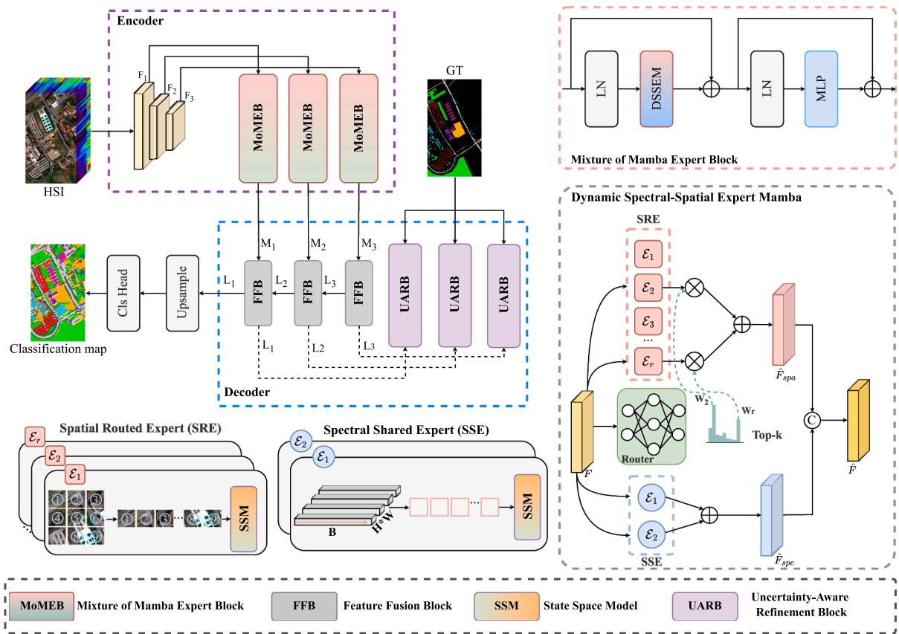
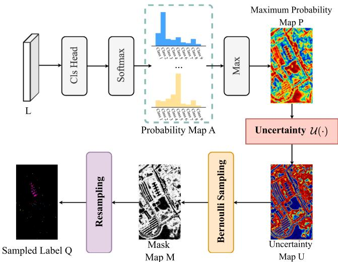
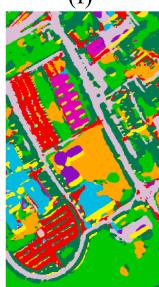
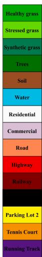
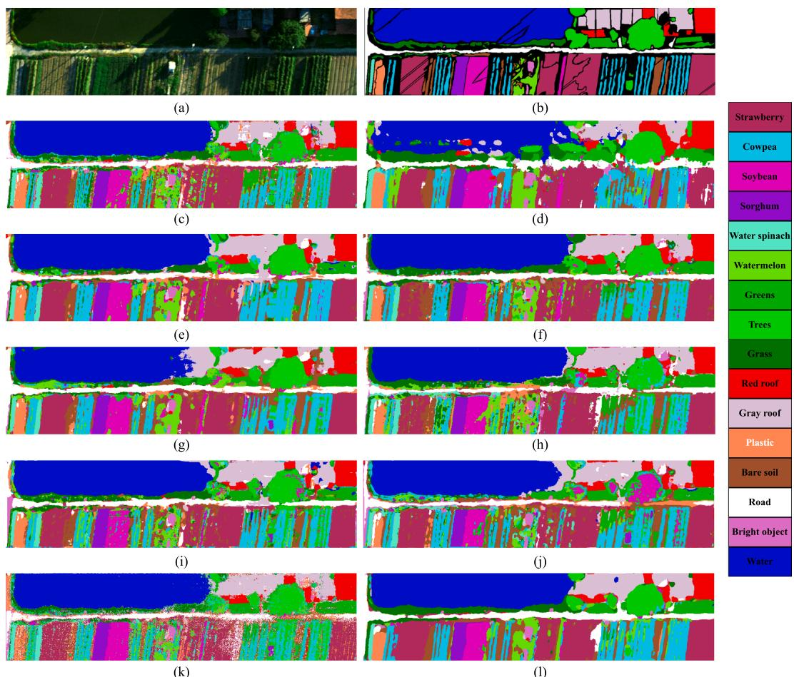
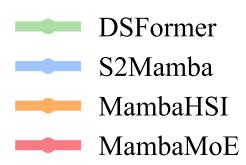
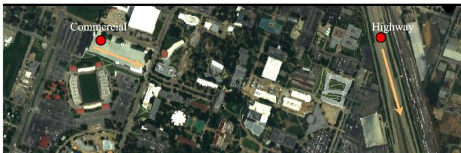
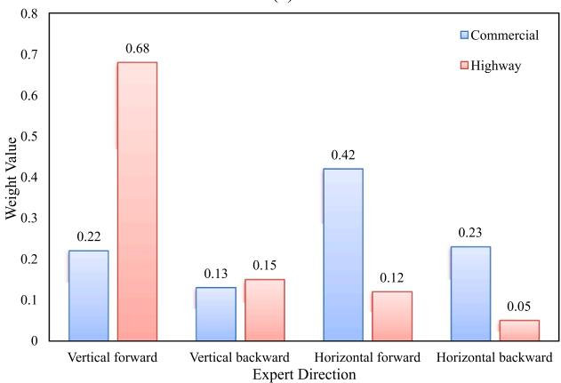

---
tags:
  - papers/remote-sensing
aliases:
  - MambaMoE
  - MoE HSI classification
---

# MambaMoE: Mixture-of-spectral-spatial-experts state space model for hyperspectral image classification

## 核心信息

- **标题**: MambaMoE: Mixture-of-Spectral-Spatial-Experts State Space Model for Hyperspectral Image Classification
- **作者**: Yichu Xu, Di Wang, Hongzan Jiao, Lefei Zhang (通讯), Liangpei Zhang
- **单位**: 武汉大学计算机学院 / 城市设计学院, 河南省科学院航空信息研究所
- **年份**: 2025 (预印)
- **代码**: https://github.com/YichuXu/MambaMoE
- **领域**: 遥感图像处理 / 高光谱图像分类
- **论文类型**: 方法论文（AI method）

## 原文摘要翻译

基于 Mamba 的模型近期在高光谱图像分类中展现出显著潜力，主要归因于其以线性计算复杂度进行上下文建模的能力。然而，现有基于 Mamba 的方法往往忽视了不同地物覆盖类型之间的方向性建模异质性，导致分类性能受限。为解决这些局限，我们提出 MambaMoE，一种新颖的谱-空间混合专家（Mixture-of-Experts）框架，这也是高光谱图像分类领域中首个基于 MoE 的深度网络。具体而言，我们设计了混合 Mamba 专家模块（MoMEB），通过稀疏专家激活机制实现自适应谱-空间特征建模。此外，*我们引入了不确定性引导的矫正学习（UGCL）策略，促使模型关注易产生预测歧义的复杂区域*。该策略从高预测不确定性区域动态采样监督信号，引导模型自适应地优化特征表示，从而增强其对困难区域的建模能力。在多个公开高光谱基准数据集上的大量实验表明，MambaMoE 在分类精度和计算效率方面均达到了当前最优水平，特别是相较于现有基于 Mamba 的方法。

## 创新点

1. **首次将 MoE 引入高光谱图像分类领域**：此前 MoE 主要在 NLP 和通用视觉任务中使用，MambaMoE 是第一个在高光谱分类中引入稀疏 MoE 架构的工作，实现了针对不同地物类型的自适应谱-空间联合特征学习。
2. **空间路由专家 + 频谱共享专家的双路设计（DSSEM）**：空间路由专家采用四个方向的 Mamba SSM 扫描路径加可学习路由器动态选择，频谱共享专家则用前向/后向双方向扫描提取共享频谱表示——两者互补，解决了 Mamba 方向性建模的固有局限。
3. **不确定性引导的矫正学习（UGCL）**：基于置信度动态估算像素级不确定性，通过伯努利采样从高不确定区域抽取监督标签，形成训练时的阶段性辅助监督，迫使模型自适应地修正困难区域的预测，且推理时不引入额外计算。
4. **端到端图像级分割架构**：区别于多数 Mamba 高光谱方法采用的 patch 分类范式，MambaMoE 采用编码器-解码器分割网络，端到端输出全图逐像素分类结果。

## 一句话总结

MambaMoE 将混合专家架构引入高光谱图像分类，通过空间路由专家 + 频谱共享专家的双路设计和不确定性引导矫正学习，在多个基准数据集上超越现有 Mamba 方法，同时保持线性复杂度的效率优势。

## 研究问题

高光谱图像（HSI）分类是遥感领域的核心任务，目标是给图像中每个像元分配语义标签。现有基于 Mamba 的方法虽然以线性复杂度实现了长程上下文建模，但存在一个关键缺陷：**Mamba 的序列化扫描方向是固定的，而不同地物（如道路、建筑、农田）在空间上具有不同的方向性特征分布**。这意味着单一扫描方向无法同时为所有地物类型提取最优的空-谱表征。此外，复杂区域（如类别边界、小目标、混合像元）的预测歧义问题在现有方法中也未得到充分解决。

## 数据与任务定义

### 数据集

论文在三个公开高光谱基准数据集上评估：

| 数据集 | 光谱波段数 | 空间尺寸 | 类别数 | 分辨率 | 来源 |
|---|---|---|---|---|---|
| Pavia University | 103 | 610×340 | 9 | — | ROSIS 传感器, 2001 |
| Houston | 144 | 349×1905 | 15 | 2.5m | 2012 年采集 |
| Whu-HanChuan | 274 | 1217×303 | — | 厘米级 | 无人机载, Zhong 等 |

### 任务定义

- **任务类型**：全监督像素级多类别语义分割（图像级分类）
- **输入**：原始高光谱数据 $\mathbf{X} \in \mathbb{R}^{B \times H \times W}$（不作 PCA 降维等预处理）
- **输出**：每个像元的类别预测 $\in \{1, \dots, n_{class}\}^{H \times W}$
- **训练设置**：Pavia / Houston 每类随机选 15 个样本训练，Whu-HanChuan 每类 30 个

### 评估指标

总体精度（OA）、平均精度（AA）、Kappa 系数（$\kappa$），每组实验重复 10 次取均值与标准差。

## 方法主线

### 整体架构

### 机制流程

MambaMoE 采用经典的编码器-解码器分割架构，推理流程如下：

1. **层次化特征提取与 MoE 编码**：原始 HSI 经 Conv+ReLU+AvgPool 逐级下采样产生三层特征图 $\mathbf{F}_1, \mathbf{F}_2, \mathbf{F}_3$。每层特征输入 MoMEB 模块：先 LayerNorm，再沿通道维拆分为空间视图和频谱视图，分别送入 SRE（4 方向空间专家 + 可学习路由器 top-k 激活）和 SSE（双向频谱共享专家），拼接后经 $1 \times 1$ 卷积融合，残差连接 + MLP 完成一个完整 MoMEB 的前向过程，输出 $\mathbf{M}_1, \mathbf{M}_2, \mathbf{M}_3$。

2. **多尺度解码融合与不确定性矫正**：从最深层的 $\mathbf{M}_3$ 经残差块产生 $\mathbf{L}_3$；$\mathbf{L}_3$ 上采样后与 $\mathbf{M}_2$ 相加并残差 → $\mathbf{L}_2$；继续上采样与 $\mathbf{M}_1$ 融合 → $\mathbf{L}_1$。训练时 UARB 在每层额外激活：对中间特征做分类 → Softmax → 最大概率 → 不确定性估计 $\mathbf{U} = -\log(\mathbf{P}+\epsilon) \cdot \mathbf{P}$ → 伯努利采样生成监督掩码，为困难区域提供阶段性的辅助监督信号。

3. **分类输出**：最终特征 $\mathbf{L}_3$ 经全连接分类头输出逐像素语义预测。推理时仅走 FFB 融合 + 分类头，UARB 零额外开销。

### MoMEB：混合 Mamba 专家模块

MoMEB 模仿 Transformer Block 结构，但用 DSSEM 替代自注意力：

1. **LayerNorm** → 输入归一化
2. **通道拆分** → 沿通道维均分为空间视图 $\mathbf{F}_{spa} \in \mathbb{R}^{(C/2) \times h \times w}$ 和频谱视图 $\mathbf{F}_{spe}$
3. **DSSEM** → 空间分支走 SRE，频谱分支走 SSE，拼接后 $1 \times 1$ 卷积融合
4. **残差连接 + LayerNorm + MLP + 残差连接**

### DSSEM 内部机制

**空间路由专家（SRE）**：
- 4 个 Mamba 专家，分别对应 4 个标准扫描方向：左上→右下、右下→左上、右上→左下、左下→右上
- 每个专家将空间特征按各自扫描路径展平为 1D 序列，经 SSM 建模：$h_j^t = \bar{\mathbf{A}}^{spa} h_j^{t-1} + \bar{\mathbf{B}}^{spa} f_j^t$，$y_j^t = \mathbf{C}^{spa} h_j^t + f_j^t$
- **路由网络** $\mathcal{G}$（两层 MLP）根据输入特征动态生成专家权重 $\mathbf{w} = \text{softmax}(\mathcal{G}(\mathbf{F}_{spa}))$
- 最终输出：$\hat{\mathbf{F}}_{spa} = \sum_{j=1}^4 \mathbf{w}_j \cdot \mathcal{E}_j(\mathbf{F}_{spa})$
- **关键机制**：训练时全部专家参与，推理时仅激活 top-k（k=3 最优）专家，实现稀疏推理以保持效率

**频谱共享专家（SSE）**：
- 沿频谱维度构造前向和后向双方向扫描序列
- 每个空间位置 $(h \cdot w \text{ 个})$ 的频谱序列经双向 SSM 独立处理
- 前向 + 后向输出做加性融合：$\hat{\mathbf{F}}_{spe} = \mathbf{y}^{forward} + \mathbf{y}^{backward}$
- 不设路由机制，所有频谱位置共享同一组 SSM 参数 → 提取一致性的频谱模式

### UGCL：不确定性引导的矫正学习

核心思想：量化模型在中间阶段的预测不确定性，从高不确定区域动态采样标签进行额外监督。

**UARB 工作流程**：
1. 解码器中间特征 $\mathbf{L}$ 经分类头输出原始分数 $\mathbf{S}$
2. Softmax → 类别概率图 $\mathbf{A}_k$
3. 最大概率图 $\mathbf{P}_{r,c} = \max_k \mathbf{A}_{k,r,c}$
4. 不确定性估计：$\mathbf{U}_{r,c} = -\log(\mathbf{P}_{r,c} + \epsilon) \cdot \mathbf{P}_{r,c}$
5. 伯努利采样生成二值掩码：$M_{r,c} = 1$ 若 $r_{r,c} < \mathbf{U}_{r,c}$
6. 掩码 × 真值标签 → 采样监督标签 $\mathbf{Q}_i$

**训练损失**：
$$\mathcal{L} = \sum_{i=1}^{3} \mathcal{L}_{ce}(\mathbf{Q}_i, \mathbf{A}_i) + \mathcal{L}_{ce}(\mathbf{GT}, \mathbf{A}_3)$$

即三个中间阶段各用一个不确定性引导的辅助损失，加上最终输出的标准交叉熵损失，权重均为 1。

> [!figure] Fig. 1 — MambaMoE 整体架构图
> 建议位置：方法主线 / 机制流程
> 放置原因：展示编码器-解码器结构、MoMEB 内部组成与 UARB 在解码器中的位置，是理解整体 pipeline 的核心图示
> 当前状态：已嵌入

> [!figure] Fig. 2 — UARB 模块概览
> 建议位置：方法主线 / UGCL
> 放置原因：展示不确定性估计、伯努利采样与监督标签生成的完整流程，UGCL 是论文的核心创新之一
> 当前状态：已嵌入

## 关键结果

### 消融实验（Table 1）

| 配置 | Pavia University OA | Houston OA | Whu-HanChuan OA |
|---|---|---|---|
| 基线（无 MoMEB + 无 UARB） | 91.53 | 89.47 | 89.17 |
| +MoMEB | 93.86 (+2.33) | 90.49 (+1.02) | 90.86 (+1.69) |
| +UARB | 92.78 (+1.25) | 90.25 (+0.78) | 89.55 (+0.38) |
| +MoMEB+UARB（完整） | **95.20 (+3.67)** | **91.18 (+1.71)** | **92.67 (+3.50)** |

MoMEB 贡献最大（2.33% / 1.02% / 1.69%），UARB 独立也有收益（1.25% / 0.78% / 0.38%），两者结合有累积增益。

### DSSEM 内部消融（Table 2）

| 配置 | Pavia | Houston | Whu-HanChuan |
|---|---|---|---|
| 无 SRE（仅 SSE） | 93.17 (-2.03) | 90.56 | 91.44 |
| 无 SSE（仅 SRE） | 94.24 (-0.96) | 90.31 | 91.78 |
| SRE + SSE（完整） | **95.20** | **91.18** | **92.67** |

SRE 和 SSE 互补性强：Pavia 上去掉 SRE 比去掉 SSE 损失更大（-2.03 vs -0.96），说明空间方向性建模在该场景中更为关键。

### Top-k 专家数选择（Table 3）

| k | Pavia | Houston | Whu-HanChuan |
|---|---|---|---|
| k=1 | 94.86 | 89.67 | 91.60 |
| k=2 | 95.03 | 90.54 | 91.71 |
| **k=3** | **95.20** | **91.18** | **92.67** |
| k=4 | 94.97 | 90.79 | 92.28 |

k=3 最优，k=4 性能下降——全专家聚合引入了冗余特征并丧失 MoE 的稀疏性优势。

### 与其他方法的对比

**Pavia University 数据集（Table 4，每类 15 样本）**：MambaMoE 在 OA 上超越全部 9 个对比方法，包括 MambaHSI（图像级输入）、S2Mamba、DSFormer 等。**平均 OA 约 95.20%（领先次优方法 S2Mamba 约 3%）**。

**Houston 和 Whu-HanChuan 数据集**：一致领先，尤其在类别多样性高的 Houston（15 类）和空间分辨率极高的 Whu-HanChuan 上表现突出。

**少样本鲁棒性（Fig. 6）**：在训练样本从每类 5 个到 15 个的渐变设置中，MambaMoE 始终保持领先优势。

### 计算效率

| 方法 | 参数量 (M) | FLOPs (M) | 训练时间 (s) |
|---|---|---|---|
| MambaHSI | 0.03 | 5.35 | 95.86 |
| MambaLG | 0.13 | 30.96 | 955.01 |
| S2Mamba | 0.14 | 24.79 | 42.06 |
| **MambaMoE** | **0.28** | **12.13** | **~20** |

虽然参数量略高于极简设计的 MambaHSI，但 FLOPs 和训练时间在 Mamba 方法中排名最优或次优，且精度大幅领先。

> [!figure] Fig. 3 — Pavia University 数据集各类方法的分类图可视化
> 建议位置：关键结果
> 放置原因：直观对比 10 种方法在 9 类地物上的分类效果，MambaMoE 在边界和复杂区域更干净，是核心定性证据
> 当前状态：已嵌入

> [!figure] Fig. 6 — 少样本训练下不同方法的性能对比
> 建议位置：关键结果
> 放置原因：展示 MambaMoE 在不同训练样本量（每类 5/10/15）下的鲁棒性优势，验证方法的实用价值
> 当前状态：已嵌入

## 深度分析

### 为什么 MoE 对高光谱分类特别有效？

高光谱图像的核心特点是"同物异谱、同谱异物"——相同地物可能因光照、角度等原因呈现不同光谱特征，不同地物又可能在局部光谱上相似。MoE 的稀疏激活机制恰好适配这种异构性：不同的地物类别被路由到不同的空间专家，同时 SSE 提供一致的频谱基础表示。Fig. 7 中不同地物的专家权重分布的明显差异直观证实了这一点。

### Mamba 方向性限制的本质

Mamba 的 SSM 建模本质上是单向因果扫描——从左到右、从上到下。这对自然语言（天然有时序依赖）是合理的，但对空间图像则存在问题：一个像元的上下文不仅来自左上方的邻居，还应来自所有方向。MambaMoE 用 4 个方向的专家覆盖了主要的空间方向性模式，SRE 的路由机制让模型为每个像元或区域选择最合适的扫描方向组合，有效地将"单向建模"扩展为"多向自适应建模"。

### UGCL 的设计亮点

UGCL 的关键在于**采样而非加权**——不是给不确定区域的损失乘一个权重（可能导致训练不稳定），而是通过伯努利采样生成二值掩码来选择性地提供监督信号。这种做法：
- 避免了对所有不确定像素一视同仁地加权，可能造成噪声放大
- 采样过程的随机性天然具有正则化效果
- 在多阶段解码器中逐级应用，形成从粗到细的纠错机制
- **推理时零开销**是最大的实用价值

### 一个值得注意的局限

论文在 k=4 时的性能下降归因于"失去 MoE 的稀疏性"。但 k=4 实际上等价于所有专家加权求和（因为 softmax 后权重之和恒为 1），这意味着稀疏激活机制并未限制模型容量——它更像是一种蒸馏式的训练正则化，让推理时可以用少量专家逼近全专家效果。如果这个解释正确，那么 MoE 的核心价值主要在推理效率而非建模能力。

## 局限

1. **实验设置偏保守**：每类 15/30 个训练样本的设置虽然在遥感领域常见，但与现代深度学习的规模化训练有差距。更大训练量下的 MoE 行为（如专家负载均衡、collapse 风险）未被考察。
2. **仅探索了 4 个标准方向**：实际地物的方向性远比 4 个方向复杂（如弯曲道路、不规则农田边界），增加更多方向或使用可学习方向是否能进一步提升值得研究。
3. **UGCL 的采样策略缺乏理论分析**：伯努利采样虽然直觉合理，但采样率与不确定性之间是否是最优耦合未被讨论，也未对比其他采样策略（如 Gumbel-Softmax、Top-K 采样等）。
4. **SSE 不设路由机制**：频谱共享专家对所有空间位置共享参数，对于存在明显频谱差异的场景（如阴影 vs. 阳光直射），这种共享可能不够灵活。
5. **未涉及多模态融合或跨场景迁移**：实际遥感应用中常需结合 SAR、LiDAR 等多模态数据，论文未讨论 MoE 在此类场景下的扩展性。

## 我的笔记

这篇论文的价值在于**用一个干净的设计同时解决了 Mamba 在高光谱分类中的两个核心问题**：方向性建模受限和困难区域预测歧义。MoE 的引入不是简单的"套壳"——空间路由专家的方向性设计直接针对 Mamba 的固有局限，UGCL 则是对 MoE 输出的自适应纠错。

从复现角度看，架构相对简洁（编码器-解码器 + MoE Block + UARB），关键超参（k=3, 4 个方向, 双方向 SSE）都在消融中明确了。代码已开源。

值得关注的点：
- MoE 在遥感领域中还处于早期阶段，后续可能看到更多结合 Mamba + MoE 的工作（如 3D Mamba、跨模态 MoE）
- UGCL 的思路（不确定性引导的动态采样监督）不限于 HSI 分类，也可以迁移到其他语义分割任务
- 如果能在更大规模训练下验证 MoE 的扩展性（更多专家、更深的 MoE 层级），价值会更高

## 引用

Xu Y, Wang D, Jiao H, et al. MambaMoE: Mixture-of-spectral-spatial-experts state space model for hyperspectral image classification[J]. 2025.

代码: https://github.com/YichuXu/MambaMoE
