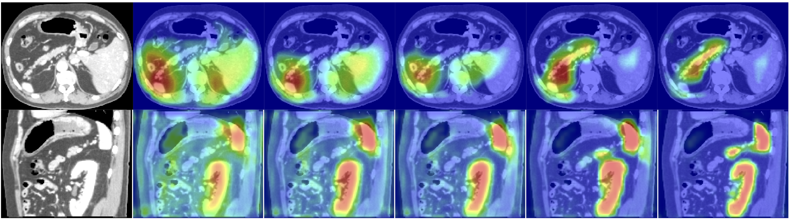
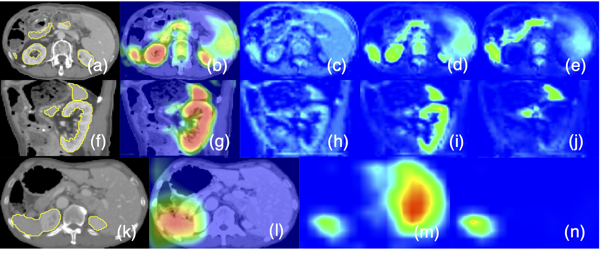
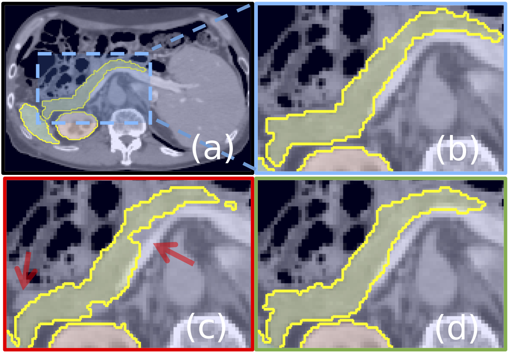

# Abstract

## 问题:
- 现有的分割框架在处理目标器官形状和大小变化大时,需要依赖多阶段级联CNN
- 级联框架需要先提取感兴趣区域(ROI),然后在该ROI上进行密集预测
- 这种方法导致计算资源和模型参数的过度和冗余使用
- 例如,所有级联模型都重复提取相似的低级特征

## 创新
1. 提出新颖的注意力门(Attention Gate, AG)模型用于医学成像
2. AG能够自动学习聚焦于不同形状和大小的目标结构
3. 使用AG训练的模型隐式学习抑制输入图像中的无关区域,同时突出对特定任务有用的显著特征
4. 可以消除使用显式外部组织/器官定位模块的必要性
5. AG可以轻松集成到标准CNN架构(如U-Net)中,计算开销最小,同时提高模型敏感性和预测准确性

## 实验结果
- 在两个大型CT腹部数据集上进行多类图像分割评估
- AG在不同数据集和训练规模下一致地改善U-Net的预测性能
- 同时保持计算效率

# Introduction

## 研究背景
- 自动化医学图像分割在图像分析社区中被广泛研究
- 手动密集标记大量医学图像是一项繁琐且容易出错的任务
- 需要准确可靠的解决方案来提高临床工作流程效率

## 现有方法的局限性
1. 尽管FCN和U-Net表现优异,但当目标器官在形状和大小方面表现出大的患者间差异时,这些架构依赖多阶段级联CNN
2. 级联框架提取ROI并在该特定ROI上进行密集预测
3. 应用领域包括心脏MRI、心脏CT、腹部CT分割和肺部CT结节检测
4. 这种方法导致计算资源和模型参数的过度和冗余使用
5. 例如,所有级联模型内的模型都重复提取相似的低级特征

## 论文的主要贡献
1. 将注意力方法进一步推进,提出基于网格的门控,使注意力系数更特定于局部区域
2. 提出软注意力技术在医学成像任务的前馈CNN模型中的首批用例之一
3. 提出标准U-Net模型的扩展,以提高模型对前景像素的敏感性,无需复杂的启发式方法
4. 实验观察到在不同成像数据集上,U-Net的准确性改进是一致的

# Related Work

## A. CT胰腺分割
- 早期工作使用统计形状模型或多图谱技术
- 在TCIA数据集等公共基准中,基于图谱的框架的Dice相似系数(DSC)范围从69.6%到73.9%
- 最近提出了级联多阶段CNN模型,在TCIA基准上达到最先进的性能(81.2%-82.4% DSC)
- 不使用级联框架时,性能下降2.0%到4.4%

## B. 注意力门
- AG在自然图像分析、知识图谱和语言处理中常用于图像字幕、机器翻译和分类任务
- 可训练注意力分为硬注意力和软注意力
- 硬注意力通常不可微,依赖强化学习进行参数更新
- 软注意力是概率性的,利用标准反向传播,无需蒙特卡洛采样
- 在图像分类中,自注意力技术用于执行类特定池化

# Methodology(方法论)

## A. 全卷积网络(FCN)

### 1. CNN的优势
- CNN在医学图像分析中优于传统方法
- 比图割和多图谱分割技术快一个数量级
- 优势包括:
  - (I) 使用随机梯度下降(SGD)优化学习领域特定图像特征
  - (II) 学习的核在所有像素之间共享
  - (III) 图像卷积操作很好地利用医学图像中的结构信息

### 2. 卷积层特征提取
- 卷积层通过逐层处理局部信息逐步提取更高维的图像表示($x^l$)
- 最终根据语义在高维空间中分离像素
- 特征激活可以表示为:
$$
x_c^l= \sigma_1 \left(  \sum_{c' \in F_l}  x_{c'}^{l-1} * k_{c' , c} \right)
$$
- 其中$*$表示卷积操作,$\sigma_1(x_{i,c}^l) = max (0, x_{i,c}^l)$是ReLU激活函数

### 3. U-Net架构
- U-Net因其良好的性能和高效的GPU内存使用而常用于图像分割任务
- 优势主要与在多个图像尺度上提取图像特征有关
- 粗特征图捕获上下文信息并突出前景对象的类别和位置
- 在多个尺度上提取的特征图通过跳跃连接合并,结合粗级和细级密集预测

## B. 图像分析的注意力门

### 1. 动机
- 为了捕获足够大的感受野和语义上下文信息,在标准CNN架构中逐渐下采样特征图网格
- 粗空间网格级别的特征在全局尺度上建模组织之间的位置和关系
- 然而,对于显示大形状变化的小对象,仍然难以减少假阳性预测
- 当前分割框架依赖额外的前置对象定位模型来简化任务

### 2. 注意力门的作用
- 通过将注意力门(AG)集成到标准CNN模型中可以实现相同的目标
- 这不需要训练多个模型和大量额外的模型参数
- 与多阶段CNN中的定位模型不同,AG逐渐抑制无关背景区域中的特征响应,无需在网络之间裁剪ROI

### 3. 注意力系数
- 注意力系数$\alpha_i \in [0,1]$识别显著图像区域并修剪特征响应,仅保留与特定任务相关的激活
- AG的输出是输入特征图和注意力系数的逐元素乘法:
$$
\hat{x}_{i,c}^l = x_{i,c}^l \,\cdot\, \alpha_{i}^l
$$
- 在默认设置中,为每个像素向量$x_{i}^l \in \mathbb{R}^{F_l}$计算单个标量注意力值
- 对于多个语义类,提出学习多维注意力系数

### 4. 门控向量
- 门控向量$g_i \in \mathbb{R}^{F_g}$用于每个像素$i$以确定焦点区域
- 门控向量包含上下文信息,用于修剪低级特征响应

## C. 加法注意力机制

### 1. 加法注意力公式
使用加法注意力来获得门控系数,虽然计算成本更高,但实验证明比乘法注意力获得更高的准确性:

$$
q^l_{att} = \psi^T \left(\, \sigma_1\,(\,W_x^T x_i^l + W_g^T g_i + b_g\,)\,\right) + b_{\psi}
$$

$$
\alpha_i^l = \sigma_2 (\, q^l_{att}(x_{i}^l\,,\, g_i \,;\, \Theta_{att}) \,)
$$

其中$\sigma_2(x_{i,c}) = \frac{1}{1+exp(-x_{i,c})}$对应sigmoid激活函数

### 2. AG参数
- AG由一组参数$\Theta_{att}$表征,包含:
  - 线性变换$W_x \in \mathbb{R}^{F_l \times F_{int}}$
  - $W_g \in  \mathbb{R}^{F_g \times F_{int}}$
  - $\psi \in \mathbb{R}^{F_{int} \times 1}$
  - 偏置项$b_{\psi} \in \mathbb{R}$和$b_{g} \in \mathbb{R}^{F_{int}}$

### 3. 网格注意力技术
- 提出网格注意力技术
- 门控信号不是所有图像像素的全局单向量,而是条件于图像空间信息的网格信号
- 更重要的是,每个跳跃连接的门控信号聚合来自多个成像尺度的信息,增加查询信号的网格分辨率并实现更好的性能

## D. U-Net模型中的注意力门

### 1. 集成方式
- 将提出的AG集成到标准U-Net架构中,以突出通过跳跃连接传递的显著特征
- 从粗尺度提取的信息用于门控中,以消除跳跃连接中无关和噪声响应的歧义
- 这在连接操作之前执行,仅合并相关激活

### 2. 前向和反向传播
- AG在前向传递期间以及反向传递期间过滤神经元激活
- 来自背景区域的梯度在反向传递期间被降权
- 这允许较浅层的模型参数主要基于与给定任务相关的空间区域进行更新

### 3. 梯度更新规则
卷积参数在层$l-1$的更新规则可以表述为:

$$
\frac{\partial (\hat{x}_i^l)}{\partial \, (\Phi^{l-1})}= \frac{\partial \left(\alpha_i^l \, f(x_i^{l-1}; \Phi^{l-1})\right)}{\partial \, (\Phi^{l-1})} 
= \alpha_i^l \, \frac{\partial(f(x_i^{l-1}; \Phi^{l-1}))}{\partial \, (\Phi^{l-1})} + \frac{\partial (\alpha_i^l)}{\partial \, (\Phi^{l-1})} \, x_i^l
$$

右侧的第一个梯度项用$\alpha_i^l$缩放

### 4. 深度监督
- 使用深度监督强制中间特征图在每个图像尺度上具有语义判别性
- 这有助于确保不同尺度的注意力单元能够影响对大量图像前景内容的响应
- 因此防止密集预测仅从跳跃连接的小子集重建

[Attention U-Net架构图](figure4.pdf)

# 实验结果

## A. 评估数据集

### 1. CT-150数据集
- 150个腹部3D CT扫描,来自诊断为胃癌的患者
- 在所有图像中,胰腺、肝脏和脾脏边界由三名训练有素的研究人员半自动描绘,并由临床医生手动验证
- 用于在胰腺分割中基准测试U-Net模型

### 2. CT-82数据集
- 82个对比增强3D CT扫描,逐片进行胰腺手动注释
- 该数据集(NIH-TCIA)公开可用,常用于基准测试CT胰腺分割框架
- 由于图像尺寸大和硬件内存限制,两个数据集的图像都下采样到各向同性2.00 mm分辨率

## B. 实现细节

### 1. 模型架构
- 提出3D模型以捕获足够的语义上下文
- 使用小批量大小(2到4个样本)计算梯度更新
- 对于更大的网络,在多个前向和后向传递上使用梯度平均

### 2. 训练设置
- 所有模型使用Adam优化器、批归一化、深度监督和标准数据增强技术(仿射变换、轴向翻转、随机裁剪)进行训练
- 强度值线性缩放以获得正态分布$N(0,1)$
- 模型使用在所有语义类上定义的Sorensen-Dice损失进行训练,实验证明对类别不平衡不太敏感

### 3. 初始化
- 门控参数被初始化,使得注意力门在所有空间位置传递特征向量
- 不需要像硬注意力方法中那样的多个训练阶段,因此简化了训练过程

## C. 注意力图分析

- 从测试图像获得的注意力系数相对于训练时期进行可视化
- 通常观察到AG最初具有均匀分布并在所有位置传递特征
- 这逐渐更新并定位到目标器官边界
- 此外,在较粗的尺度上,AG提供器官的粗略轮廓,在更细的分辨率上逐渐细化
- 通过在每个图像尺度训练多个AG,观察到每个AG学习聚焦于特定器官子集

## D. 分割实验

### 1. CT-150数据集结果

| 方法 (训练/测试分割) | U-Net (120/30) | Att U-Net (120/30) | U-Net (30/120) | Att U-Net (30/120) |
|---------------------|----------------|-------------------|----------------|-------------------|
| 胰腺 DSC | 0.814±0.116 | **0.840±0.087** | 0.741±0.137 | **0.767±0.132** |
| 胰腺 Precision | 0.848±0.110 | 0.849±0.098 | 0.789±0.176 | **0.794±0.150** |
| 胰腺 Recall | 0.806±0.126 | **0.841±0.092** | 0.743±0.179 | **0.762±0.145** |
| 胰腺 S2S距离 (mm) | 2.358±1.464 | **1.920±1.284** | 3.765±3.452 | 3.507±3.814 |
| 脾脏 DSC | 0.962±0.013 | 0.965±0.013 | 0.935±0.095 | **0.943±0.092** |
| 肾脏 DSC | 0.963±0.013 | 0.964±0.016 | 0.951±0.019 | 0.954±0.021 |
| 参数量 | 5.88 M | 6.40 M | 5.88 M | 6.40 M |
| 推理时间 | 0.167 s | 0.179 s | 0.167 s | 0.179 s |

- 胰腺预测结果表明注意力门(AG)通过改善模型的表达能力增加召回值($p = .005$)
- 在第二个实验中,使用更少的训练图像(30)训练相同的模型,以显示性能改进在不同大小的训练数据下是一致的和显著的($p = .01$)

### 2. 模型容量分析
- 通过向标准U-Net添加8%的额外容量,可以改善2-3%的DSC性能
- 实验结果表明,添加AG比简单地增加网络所有层的模型容量贡献更多($p=.007$)
- 因此,当使用AG来减少训练多个独立模型的冗余时,应该将额外容量用于AG来定位组织

### 3. TCIA CT-82数据集结果

| 方法 | Dice Score | Precision | Recall | S2S距离 (mm) |
|------|-----------|-----------|--------|-------------|
| **BFT (迁移前)** | | | | |
| U-Net | 0.690±0.132 | 0.680±0.109 | 0.733±0.190 | 6.389±3.900 |
| Attention U-Net | **0.712±0.110** | 0.693±0.115 | **0.751±0.149** | **5.251±2.551** |
| **AFT (微调后)** | | | | |
| U-Net | 0.820±0.043 | 0.824±0.070 | 0.828±0.064 | 2.464±0.529 |
| Attention U-Net | **0.831±0.038** | 0.825±0.073 | **0.840±0.053** | **2.305±0.568** |
| **SCR (从头训练)** | | | | |
| U-Net | 0.815±0.068 | 0.815±0.105 | 0.826±0.062 | 2.576±1.180 |
| Attention U-Net | 0.821±0.057 | 0.815±0.093 | **0.835±0.057** | **2.333±0.856** |

- 在公共TCIA CT胰腺基准上评估提出的架构,以比较其与最先进方法的性能
- 最初,在CT-150数据集上训练的模型直接应用于CT-82数据集
- 这些模型后来在TCIA数据集的子集(61训练,21测试)上进行微调
- 使用Attention U-Net在CT-82数据集上进行5折交叉验证,达到$81.48\pm6.23$ DSC的胰腺标签

### 4. 与最先进方法的比较

| 方法 | 数据集 | 胰腺 DSC | 训练/测试 | 折数 |
|------|--------|---------|----------|------|
| Hierarchical 3D FCN | CT-150 | 82.2±10.2 | Ext/150 | - |
| Dense-Dilated FCN | CT-82 & Synapse | 66.0±10.0 | 63/9 | 5-CV |
| 2D U-Net | CT-82 | 75.7±9.0 | 66/16 | 5-CV |
| Holistically Nested 2D FCN Stage-1 | CT-82 | 76.8±11.1 | 62/20 | 4-CV |
| Holistically Nested 2D FCN Stage-2 | CT-82 | 81.2±7.3 | 62/20 | 4-CV |
| 2D FCN | CT-82 | 80.3±9.0 | 62/20 | 4-CV |
| 2D FCN + Recurrent Network | CT-82 | 82.3±6.7 | 62/20 | 4-CV |
| Single Model 2D FCN | CT-82 | 75.7±10.5 | 62/20 | 4-CV |
| Multi-Model 2D FCN | CT-82 | 82.2±5.7 | 62/20 | 4-CV |

- 提出的3D Attention U-Net模型与最先进方法表现相似,尽管输入图像下采样到较低分辨率
- 更重要的是,与基于单模型的分割框架相比,该方法显著改善了结果
- 不需要多个CNN模型来定位和分割对象边界

# 讨论与结论

## 主要贡献
1. 提出新颖的注意力门模型应用于医学图像分割
2. 消除了应用外部对象定位模型的必要性
3. 提出的方法是通用的和模块化的,可以轻松应用于图像分类和回归问题

## 实验结果
- 实验结果表明,提出的AG对组织/器官识别和定位非常有益
- 这对于可变小尺寸器官(如胰腺)尤其如此
- 对于全局分类任务,预期会有类似的行为

## 未来工作
1. AG的训练行为可以从迁移学习和多阶段训练方案中受益
2. 可以使用预训练的U-Net权重来初始化注意力网络
3. 随着GPU计算能力和内存的改进,可以训练更大容量的3D模型,使用更大的批量大小,无需图像下采样
4. 通过利用精细分辨率输入批次,可以进一步增强Attention U-Net的性能,无需额外的启发式方法

## 代码可用性
- 提出的架构的源代码公开可用: https://github.com/ozan-oktay/Attention-Gated-Networks

