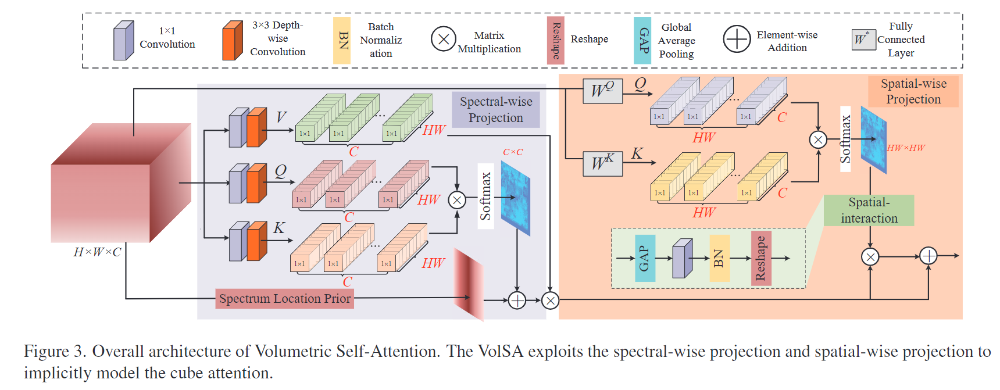

## volblock

- 利用光谱和空间的二维相似性矩阵,通过中继通信的方式隐式地建立起立方体中的长距离依赖关系
### 光谱投影
- 首先计算跨通道的互协方差,以生成在谱域中对全局信号进行编码的谱投影矩阵
- 通过应用$1\times 1$逐点卷积得到矩阵$W_{P}$,然后应用$3\times3$逐深度卷积从输入生成矩阵$W_{D}$,最终用输入与矩阵相乘得到QKV矩阵
$$
Q_{spe} = W_{P}^QW_{D}^QX_{in}
$$ 
- 随后,在QK矩阵上应用点积相互作用得到频谱投影矩阵
$$
A_{spe} = softmax(\frac{Q\cdot K}{\epsilon} + B)
$$
#### 光谱位置先验
- 受保留机制的启发,引入光谱位置先验,描述了基于光谱波长的光谱相关性,每个光谱都有双向衰减,它与前一个光谱和后一个光谱有关,因此,将时间先验扩展到双向形式
### 多头机制
- 为增强投影矩阵的表示形式,将来自不同表示子空间的信息投影到不同的位置
## 空间投影
- 空间投影旨在空间维度的令牌交互
$$
Q_{spa} = W^QX_{in}
$$
$$
A_{spa}^i = softmax(\frac{Q_{spa}^i\cdot K_{spa}^i}{\sqrt{C }}+B)
$$
- 最终,将空间维度的输出与光谱维度的输出做结合
$$
Y_{vol} = W_{out}\cdot(Y_{spe}\cdot A_{spa}+Y_{spe})
$$
- 其中,$W_{out}$是可学习的矩阵,