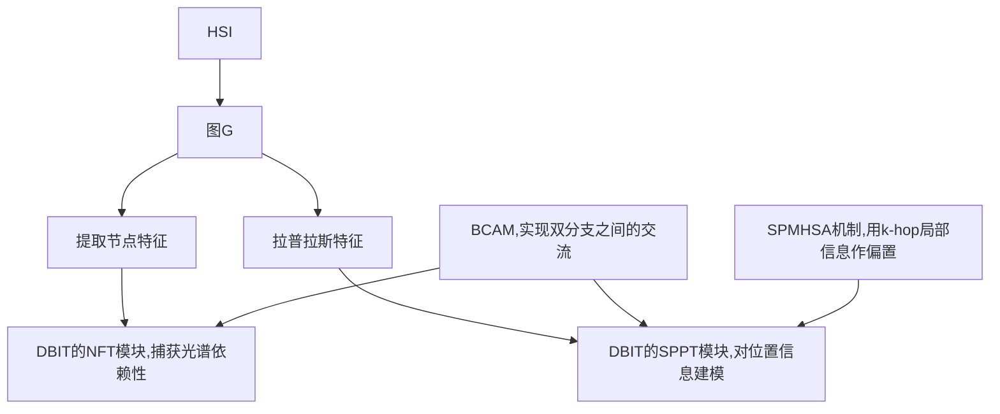

# abstract
- 图transformer结合了图的拓扑信息对局部的表示能力和transformer对全局的建模能力
- 本文提出带有拉普拉斯位置编码的结构感知transformer
- SPGformer引入了双分支交互式transformer模块分别处理节点频谱特征和拉普拉斯位置信息
- 提出了结构感知多头自注意力机制,将局部拓扑信息集成到全局
- 提出双向交叉注意力模块,实现两个分支的通信
# introduction
## 主要贡献
- 双路transformer,分别对超像素节点的光谱特征和图拉普拉斯特征向量进行处理
- 提出了局部感知的多头注意力机制,将k-hop局部结构信息作为偏置,使模型捕获全局位置关系和局部连接方式
- 设计了节点特征与位置信息双向交互的BCAM
# conclusion
- 核心创新在于双分支transformer架构,NFT专注于处理光谱信息,SPPT深入图形拓扑连接结构
# methodology
## 总结构
![[overall_spgformer.png]]

